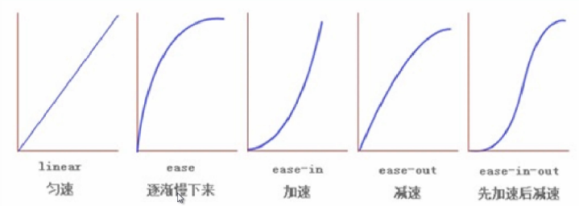

## 过渡

css3的transition允许css的属性值在一定的时间区间内平滑地过渡。这种效果可以在鼠标单击、获得焦点、被点击或对元素有任何改变中触发，并圆滑地以动画效果改变CSS的属性值
使元素从一种样式变换为另一种样式时为元素添加过渡效果；

## 过渡属性

###  transition-property

规定设置过渡效果的CSS属性的名称

属性值：
     none：没有属性会获得过渡效果
     all:所有属性都将获得过渡效果
     property：定义应用过渡效果的css属性名称列表，列表以逗号分隔

### transition-duration

规定完成过渡效果需要花费的时间（以秒或毫秒计）；其默认值是0，也就是变换时是即时的

### transition-timing-function

规定过渡效果的速度曲线

属性值：
    linear	规定以相同速度开始至结束的过渡效果（等于 cubic-bezier(0,0,1,1)）。
    ease	规定慢速开始，然后变快，然后慢速结束的过渡效果（cubic-bezier(0.25,0.1,0.25,1)）。
    ease-in	规定以慢速开始的过渡效果（等于 cubic-bezier(0.42,0,1,1)）。
    ease-out	规定以慢速结束的过渡效果（等于 cubic-bezier(0,0,0.58,1)）。
    ease-in-out	规定以慢速开始和结束的过渡效果（等于 cubic-bezier(0.42,0,0.58,1)）。
    cubic-bezier(n,n,n,n)	在 cubic-bezier 函数中定义自己的值。可能的值是 0 至 1 之间的数值。
    http://cubic-bezier.com/

### transition-delay

定义在过渡效果开始之前需要等待的时间，以秒或毫秒计，默认值为0。作用于所有元素，包括:before和:after伪元素。

###  简写属性

transition: property duration timing-function delay; 设置多个属性的过渡效果时，中间用逗号分隔

:::tip 注意

transition-delay与 transition-duration的值都是时间

所以要区分它们在连写中的位置，一般浏览器会根据先后顺序决定，第一个时间为 transition-duration第二个为transition-delay。

:::

实现过渡效果：
（1）指定要添加效果的CSS属性 ；
（2）指定效果的持续时间；
注意：如果时长未规定，则不会有过渡效果，因为默认值是 0。CSS 属性改变的典型时间是鼠标指针位于元素上时.

`在转换概念当中：是没有display这么一说的，通过改变元素的透明度去实现从无到有；`

