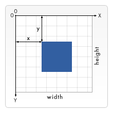

# 变形属性：transform

transform翻译成汉语具有"变换"或者"改变"的意思。该属性允许我们对元素进行旋转、缩放、移动或倾斜。

# 2D

+ 明确一下坐标系

  

1. 默认状态下，x轴是水平的，向右为正。
2. 默认状态下，y轴是垂直的，向下为正，这与传统的数学坐标系不同。

## 2D功能函数

line-height:100%;   表示行高和文字大小相同

如果让盒子上右下左都有阴影，那么前面两个值就设置为0

## translate

### translate(x,y)

元素从其当前位置，根据给定的 x 坐标和 y 坐标位置  参数进行移动，如果第二个参数未提供，则默认为0；

###    translateX(n)

定义 2D 转换，沿着 X 轴移动元素。 +  右  - 左 

###    translateY(n)

定义 2D 转换，沿着 Y 轴移动元素。  + 下   - 上
单位为%，参照的自身的大小

:::warning 注意

相对于其他属性的transition，需要设置两个同名的属性，但是translate不需要

:::

## rotate

rotate(deg)：定义2D旋转，在参数中规定角度;
      正值+： 是顺时针旋转       
      负值-：为逆时针旋转
      例如：transform:rotate(300deg)//顺时针旋转300度

:::tip

如果需要translate和rotate等属性，只需要用空格隔开即可
例子：transform：translate（100px,100px) rotate(360deg)

:::

:::warning 注意

rotate和translate同时使用，当书写顺序不同时，会影响显示效果

:::

## scale

scale(number,number)：指定对象的2D缩放，第一个参数对应X轴，第二个参数对应Y轴，如果第二个参数未提供，则默认取第一个参数的值
	只给一个值，会同时水平和垂直定义，注意这点和translate不同
		空间仍保留
   scaleX(number)：指定对象X轴的（水平方向）缩放
   scaleY(number)：指定对象Y轴的（垂直方向）缩放
	0： 缩小不可见   
	<1: 缩小    
	=1: 大小不变
    >1: 放大       
    负值：镜面翻转 再放大或者缩小

## skew

skew(angle ,angle)：指定对象skew transformation（斜切扭曲）,     

第一个参数对应X轴，第二个参数对应Y轴。如果第二个参数未提供，则默认值为0
    skewX(angle)：指定对象X轴的（水平方向）扭曲，角度是左上角角度的余角
    skewY(angle)：指定对象Y轴的（垂直方向）扭曲
注意：rotate和skew同时使用，当书写顺序不同时，会影响显示效果

## matrix

matrix(n,n,n,n,n,n) 函数
   matrix() 方法把所有 2D 转换方法组合在一起。
   matrix() 方法需要六个参数，包含数学函数，允许：旋转、缩放、移动以及倾斜元素。

## 变形原点

transform-origin:

x-axis  y-axis  z-axis；

属性允许改变被转换元素原点的位置，2D转换元素能够改变元素 x 和 y 轴,3D转换元素还能改变其Z轴

说明：
**该属性只有在设置了transform属性的时候起作用**；
x：left  center right    /  length +px/%
y：top center bottom     /  length +px/%
z：length

旋转、缩放、拉伸倾斜时，原点的位置可以改

