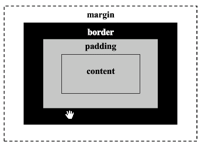

## 盒模型

### 标准盒模型:

**盒模型 = 内容区 +  内填充   +   边框   +    外边距**

盒子宽度：width+左右padding+左右border+左右margin

盒子高度：height+上下padding+上下border+上下margin


### 怪异盒模型：

**把boder和padding属性都包含在内容区中，**

**也就是width  = 内层内容  + 左右内边距 + 左右边框宽度**

**同样，height= 内层内容  + 上下内边距 + 上下边框宽度**




### padding

设置元素所有内边距的宽度

值：

1. value+ px
2.  value%
3. **`不能为auto`**

用法：
      1）用来调整内容在容器中的位置关系。
      2）padding属性需要添加在父元素上。	
      3）padding值是额外加在元素原有大小之上的，如想保证元素大小不变，需从元素宽或高上减掉后添加的padding属性值。
**（border、padding会额外增加宽度**，为了保证看上去大小不变，会缩小内容宽高(宽高是指定的内容的宽、高))
      4）**不允许指定负边距值**。
      5）行内非替换元素上设置的内边距不会影响行高计算；

padding :10px 5px 15px 20px;上- 右 -下- 左
padding :10px 5px 15px;上- 左右 -下
padding :10px 5px;上下- 左右
padding :10px; 上下左右

padding-left： 属性设置元素左内边距（空白）
padding-right：属性设置元素右内边距（空白）
padding-top：属性设置元素上内边距（空白）
padding-bottom：属性设置元素下内边距（空白）

### margin

设置一个元素所有外边距的宽度

值：

1. auto
2.  value + px
3.  value + %
4.  可正可负

功能:	
	1.设置同级元素之间的位置关系
	2.设置子元素和父元素之间的位置关系
注意：
	1.**`上下设置，那么会重叠`**：
	例子：
		如果上面元素设置margin-bottom是70px，下面的元素设置的margin-top是50px，那么由于重叠性，共同的外边距不是120px而是选最大的70px

    没有设置浮动的盒子，之间的边距是会重叠的
    设置浮动的盒子，之间的边距是不重叠的

特殊：
A：给子元素设置margin-top，会影响父元素一起向下移动
	如果父元素设置了边框、父元素设置了float、子元素设置了float不会出现这种情况
B：没有设置浮动的盒子，之间的margin区域会重叠
   设置了浮动的盒子，之间的margin区域不会重叠
C：允许指定负的外边距值，会造成两个标签重叠，  不过使用时要小心
D: 而行内元素实际上不占上下外边距，行内元素的的左右外边距不会合并
	行内上下会出问题，左右不会出问题

margin:10px 5px 15px 20px;上- 右 -下- 左
margin:10px 5px 15px;上- 左右 -下
margin:10px 5px;上下- 左右
margin:10px; 上下左右

margin-left：属性设置元素的左外边距
margin-right：属性设置元素的右外边距
margin-top：属性设置元素的上外边距
margin-bottom：属性设置元素的下外边距

margin应用：
margin:0 auto；margin:auto；可以使一个元素在父元素中水平居中显示

## overflow：

设置溢出容器的内容如何显示（css2）
  属性值：

1. visible: 默认值，内容不会被修剪，会呈现在元素框之外；
2. hidden:  内容会被修剪，并且其余内容是不可见的；
3. scroll:  内容会被修剪，但是浏览器会显示滚动条，以便查看其余的内容;
4. auto:    如果内容被修剪，则浏览器会显示滚动条，以便查看其他的内容;
5. inherit: 规定应该从父元素继承overflow属性的值。

## 高度塌陷

如果父元素没有设置高度，由于块元素会根据内容自动设置高度，但是子元素设置了float：left，就会引起`高度塌陷`
**解决父元素高度塌陷的集中方式**
    1.设置父元素高度，但是此时会将尺寸定死
    2.设置overflow：hidden    

计算自身高度的时候，会把浮动子元素的高度也参与计算

子元素设置margin-top，影响父元素一起下移
1.父元素有border
2.父元素或者子元素浮动
3.父元素设置overflow：hidden；

## white-space

设置如何处理元素内的空白
  属性值：    

1.  normal:   默认值，多余空白会被浏览器忽略只保留一个；
2. pre:      空白会被浏览器保留（类似pre标签）；
3. pre-wrap: 保留一部分空白符序列，但是正常的进行换行；
4. pre-line: 合并空白符序列，但是保留换行符；
5. nowrap:   文本不会换行，文本会在同一行上继续，直到遇到<br/>标签为止;

## text-overflow

设置单行文本溢出是否显示省略号

  属性值：
    clip：不显示省略号（...），而是简单的裁切;
    ellipsis：当对象内文本溢出时，显示省略标记；

## 溢出省略号

 注：必须是单行文本才能设置本文溢出！！！，对多行没用

```css
.container {
    width: 200px; /* 容器宽度 */
    white-space: nowrap; /* 不换行 */
    overflow: hidden; /* 隐藏超出部分 */
    text-overflow: ellipsis; /* 显示省略号 */
}
```

## overflow-x、overflow-y

overflow-x 属性：规定是否对内容的左/右边缘进行裁剪 - 如果溢出元素内容区域的话（css3）。
	属性值与overflow相同

overflow-y 属性：规定是否对内容的上/下边缘进行裁剪 - 如果溢出元素内容区域的话（css3） 。
	属性值与overflow相同

属性值同overflow相同

## 块状元素居中

针对块状元素，使其在其父元素水平居中

```css
margin:0 auto
```

## 文本居中

```css
text-align：center
```

## 格式去除

### 标识默认格式去除

```css
*{
    margin：0px;
    padding：0px；
}
li{
	list-style:none;
}
a{
 text-decoration:none;
}
b,i,em,stong{
    font-weight:normal;
    font-style:normal;
}
```

### 图片间隙:

把图片放到块状元素中，在块状元素没有设置高度的情况下，盒子高度可能会比图片大3~5个像素
解决方法：

将图片转成块级元素，使用display：block

```css
display：block
```

### 让边框不占大小

```css
box-sizing:border-box;
```

### 设置鼠标指针形状

```less
cursor：pointer    //  pointer是手型
```

