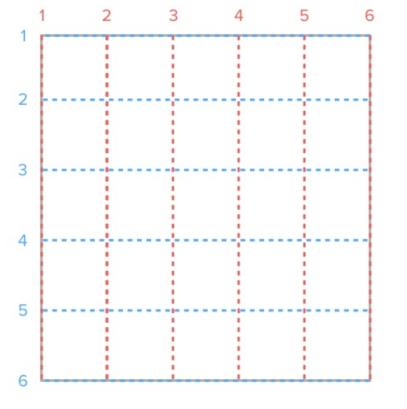

# GRID布局

```txt
网格是一组相交的水平线和垂直线，它定义了网格的列和行,可以将网格元素放置在与这些行和列相关的位置上,可以任意组合不同的网格，做出各种各样的布局

Grid 布局与 Flex 布局有一定的相似性，都可以指定容器内部多个项目的位置。但是，它们也存在重大区别。
Flex 布局是轴线布局，只能指定"项目"针对轴线的位置，可以看作是一维布局。
Grid 布局则是将容器划分成"行"和"列"，产生单元格，然后指定"项目所在"的单元格，可以看作是二维布局。
```


## GRID 名词

```
网格容器：设置网格布局的元素
网格项目：设置网格布局的元素的子元素
行：容器里面的水平区域称为"行"（row）
列：垂直区域称为"列"（column）
单元格：行和列的交叉区域，称为"单元格"（cell）
网格线：划分网格的线，称为"网格线"（grid line）
       水平网格线划分出行，垂直网格线划分出列
网格轨道:两条相邻网格线之间的空间为网格轨道(Grid Track)。
```

+ 行和列

  

  
  
+ 单元格

  

  
  
+ 网格线

  

  ```txt
  划分网格的线，称为"网格线"。水平网格线划分出行，垂直网格线划分出列。
  ```

## GRID属性

#### 容器属性:添加在容器元素

1.  all

   ```
   display
   grid-template-columns
   grid-template-rows
   grid-template-areas
   grid-template
   grid-column-gap
   grid-row-gap
   grid-gap
   justify-items
   align-items
   place-items
   justify-content
   align-content
   place-content
   grid-auto-columns
   grid-auto-rows
   grid-auto-flow
   grid
   ```
   
2.  启动网格布局

   ```css
   display:设置元素为网格容器
     属性值：
   	 grid : 为块状网格容器 （容器自上而下排列）
   	 line-grid : 为内联网格容器（容器横向排列）
   ```

3. 行 列的设置

   ```css
   grid-template-columns:属性定义网格列的行名称和大小。
   grid-template-rows:属性定义网格行的行名称和大小。
   说明：行数和列数根据属性值的个数而定
        行和列的大小根据属性值而定
     属性值：
      （1）length单位
          grid-template-rows:200px 100px 200px;
   			表示第一列200，第二列100，第三列200
   
      （2）百分比percentage
   	   grid-template-rows:33.33% 33.33% 33.33%
   
      （3）fr关键字(fraction片段)
         为了方便表示比例关系，网格布局提供了fr关键字             grid-template-columns:1fr 3fr 1fr;
   		比例为1：3：1
   
      （4）功能函数
        A：repeat(参数1，参数2)：参数1 ：重复的次数，
   							参数2：重复的数值或者重复的模式
         参数1：number
   
         参数2：auto-fill关键字，自动填充：有时单元格的大小是固定的，但是容器的大小不确定。如果希望每一行（或每一列）容纳尽可能多的单元格，这时可以使用auto-fill关键字表示自动填充。    
     例如：
      grid-template-columns: repeat(2,20px 80px);
      grid-template-columns: repeat(auto-fill, 80px);
   
        B:minmax(参数1，参数2)：函数产生一个长度范围，表示长度就在这个范围之中（1最小值，2最大值）,如果max值小于min值，则该值会被视为min值。最大值可以设置为网格轨道系数值fr，但最小值则不行;
    
   例如：     
     grid-template-columns: 1fr minmax(100px, 1fr);  
   
      （5）auto关键字表示由浏览器自己决定长度
         grid-template-columns:30px auto 20px;
   
      （6）max-content关键字表示网格的大小根据最大内容而定
          min-content关键字表示网格的大小根据最大的最小内容而定 
   
   网格线名称设置
      1) 网格线会自动分配正数和负数名称
      2) 可以明确的指定网格线(Grid Line)名称
     grid-template-columns: [c1] 100px [c2] 100px [c3];
        一条网格线(Grid Line)可以有多个名称
     grid-template-rows: [r1] 100px [r2] 100px [r3 fifth-three];
   指定网格布局为3行x2列，有3根垂直网格线和4根水平网格线。方括号里面依次是这七根线的名字;
   ```

   

   

4. 设置行间距 || 列间距

   ```css
   row-gap:设置行与行的间距 
   column-gap:设置列与列的间距 
   gap:属性是column-gap和row-gap的合并简写形式，如果省略了第二个值，浏览器认为第二个值等于第一个值。
   说明：
     新版本已经省略grid-前缀，老写法为grid-row-gap\grid-column-gap\grid-gap
   ```

5. 指定"区域"（area），一个区域由单个或多个单元格组成。

   ```css
   grid-template-areas : 属性用于定义区域。
       网格布局允许指定"区域"（area），一个区域由单个或多个单元格组成。
   
   grid-template-areas: "header header header"
                        "main main sidebar"
                        "footer footer footer";
   将整个网格容器分为4个区域，每个区域对应一个单元格通过grid-area指定项目名称。如果某些区域不需要利用，则使用"点"（.）表示。
   grid-template-areas: 'a . c'
                        'd . f'
                        'g . i';
   上面代码中，中间一列为点，表示没有用到该单元格，或者该单元格不属于任何区域。
   然后再子元素
   li：nth-child（1）{
       grid-area:head;
   }
   对于没有指定的，多余的会自动创建隐式轨道去放它
   
      说明：区域的命名会影响到网格线,每个区域的起始网格线，会自动命名为区域名-start，终止网格线自动命名为区域名-end。
      比如：区域名为header，则起始位置的水平网格线和垂直网格线叫做header-start，终止位置的水平网格线和垂直网格线叫做header-end。
   ```

6. 设置单元格内容在单元格内 水平 | 垂直 的对齐方式

   ```css
   justify-items: start | end | center | stretch;属性设置单元格内容的水平位置（左中右）
   align-items: start | end | center | stretch;属性设置单元格内容的垂直位置（上中下）。
   place-items:  <justify-items>  <align-items> 简写，如果省略第二个值，则浏览器认为与第一个值相等；
    属性值：
   	start：对齐单元格的起始边缘。
       end：对齐单元格的结束边缘。
       center：单元格内部居中。
       stretch：拉伸，占满单元格的整个宽度（默认值）。
   ```

7. 设置整个内容区域在容器里面的水平 | 垂直 对齐方式

   ```css
   justify-content:start | end | center | stretch | space-around | space-between | space-evenly;属性是整个内容区域在容器里面的水平位置（左中右）
   align-content: start | end | center | stretch | space-around | space-between | space-evenly;属性是整个内容区域的垂直位置（上中下）。
   place-content:<align-content>  <justify-content>   简写，如果省略第二个值，浏览器就会假定第二个值等于第一个值。
   
   属性值：
   	start - 对齐容器的起始边框。
   	end - 对齐容器的结束边框。
   	center - 容器内部居中。
   	stretch - 项目大小没有指定时，拉伸占据整个网格容器。
   	space-around - 每个项目两侧的间隔相等。所以，项目之间的间隔比项目与容器边框的间隔大一倍。
   	space-between - 项目与项目的间隔相等，项目与容器边框之间没有间隔。
   	space-evenly - 项目与项目的间隔相等，项目与容器边框之间也是同样长度的间隔。
   ```

8. 设置多余网格的列宽和行高

   ```
   grid-auto-columns & grid-auto-rows 
       指定任何自动生成的网格轨道(grid tracks)的大小。当网格中的网格项多于单元格时，或者当网格项位于显式网格之外时，就会创建隐式轨道。
       取值：长度值，百分比，或者等份网格容器中可用空间的分数（使用 fr 单位）
   ```

9. 规划子元素放置的顺序（默认为先排行后排列）

   ```
   grid-auto-flow: column | row;
      属性值：
         row：默认放置顺序是先行后列,先排满行，在排列，多的放到列上
         column：放置顺序是先列后行 
         row dense，column dense：这两个值主要用于，某些项目指定位置以后，剩下的项目怎么自动放置，比如网格只有3列，但是某一个项目指定在第5行。这时，浏览器会自动生成多余的网格，以便放置项目。
   ```

   

10. 简写形式

   ```
   grid-template属性：是grid-template-columns、grid-template-rows和grid-template-areas这三个属性的合并简写形式。
   1）grid-template:none-设置为初始值；
   
   2）grid-template:grid-template-rows/grid-template-columns
   
   3）grid-template:
       "a a a" 25px
       [row2-start] "b b b" 25px [row2-end]
       / auto 50px auto;
   
   
   grid属性是grid-template-rows、grid-template-columns、grid-template-areas、 grid-auto-rows、grid-auto-columns、grid-auto-flow这六个属性的合并简写形式。
   1）none-初始值
   2）grid-template-rows/grid-template-columns
   3）auto-flow(row)/grid-template-columns
      auto-flow(row) grid-auto-rows/ grid-template- columns
      
      grid-template-rows/auto-flow(column)
      grid-template-rows/auto-flow(column) grid-auto-columns
      
       "a a a" 25px
       [row2-start] "b b b" 25px [row2-end]
       / auto 50px auto;
      
   ```


#### 项目属性：添加在子元素上面

1.  all

   ```
   grid-column-start
   grid-column-end
   grid-row-start
   grid-row-end
   grid-column
   grid-row
   grid-area
   justify-self
   align-self
   place-self
   ```

2. 指定项目的四个边框，分别定位在哪根网格线

   ```css
   grid-row-start属性：上边框所在的水平网格线
   grid-row-end属性：下边框所在的水平网格线
   grid-column-start属性：左边框所在的垂直网格线
   grid-column-end属性：右边框所在的垂直网格线
   grid-column属性是grid-column-start和grid-column-end的合并简写形式
   grid-row属性是grid-row-start属性和grid-row-end的合并简写形式。
   grid-area属性是grid-row-start、grid-column-start、grid-row-end、grid-column-end简写，指定元素位置;
   }
   
   例如：.item-1 {
     grid-row-start: 1;
     grid-row-end: 2;
     grid-column-start: 2;
     grid-column-end: 4;
     grid-row: 1 / 2;----------简写
     grid-column: 2 / 4;-------简写
     grid-area:1 / 2 / 2 / 4---简写 水平起点/垂直起点/水平终点/垂直终点
   }，
   1号项目的上面是第一根水平网格线，下面是第二根水平网格线，左边是第二根垂直网格线，右边是第四根垂直网格线。
   ```


2. ### grid-area 属性

   ```
   grid-area属性：为网格项目定义名称，指定项目放在哪一个区域。
    属性值
         name：域名称
         row-start/ column-start / row-end / column-end：数字或分隔线名称
   
       例如：
           li:nth-child(1) {
             grid-area: e;
           }
   ```

   

3. justify-self 属性， align-self 属性， place-self 属性      （这些是设置在子元素上）

   ```
   justify-self属性设置单元格内容的水平位置（左中右），跟  justify-items属性的用法完全一致，但只作用于单个项目。
   
   align-self属性设置单元格内容的垂直位置（上中下），跟align-items属性的用法完全一致，也是只作用于单个项目。
   
   属性值：
           start：对齐单元格的起始边缘。
           end：对齐单元格的结束边缘。
           center：单元格内部居中。
           stretch：拉伸，占满单元格的整个宽度（默认值）。
   
   place-self属性是align-self属性和justify-self属性的合并简写形式。
   
   属性值：
         auto:	初始值
         align-self justify-self：第一个值设置 align-self属性，第二个值设置justify-self属性。如果省略第二个值，则将第一个值同时分配给这两个属性。
     
   ```


