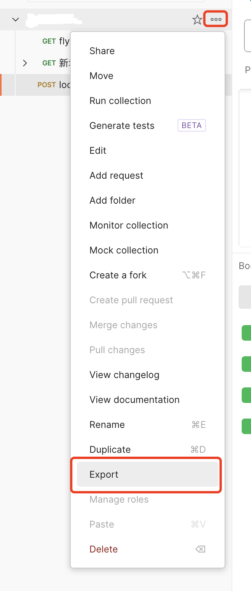
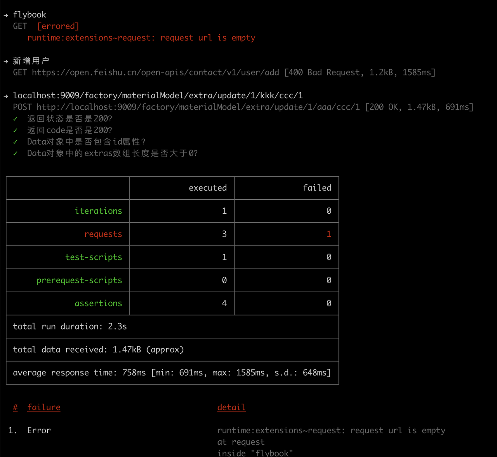

## 编写入口


## 语法参考

```js
pm.test("返回状态是否是200？", function () {
    pm.response.to.have.status(200);
});

pm.test("返回code是否是200？", function () {
    var json = pm.response.json();
    pm.expect(json.code).to.equal(200);
});

pm.test("Data对象中是否包含id属性？", function () {
    var json = pm.response.json();
    pm.expect(json.data).to.have.property('id');
});

pm.test("Data对象中的extras数组长度是否大于0？", function () {
    var json = pm.response.json();
    pm.expect(json.data.extras).to.be.an('array').that.is.not.empty;
});

pm.test("Response Content-Type is application/json", function () {
    pm.expect(pm.response.headers.get("Content-Type")).to.include("application/json");
});

pm.test("Name and code must be non-empty strings", function () {
    const responseData = pm.response.json();
    
    pm.expect(responseData).to.be.an('object');
    pm.expect(responseData.data.name).to.be.a('string').and.to.have.lengthOf.at.least(1, "Name should not be empty");
    pm.expect(responseData.data.code).to.be.a('string').and.to.have.lengthOf.at.least(1, "Code should not be empty");
});

pm.test("ModelNumber and unitName in the response data are not null", function () {
    const responseData = pm.response.json();
    
    pm.expect(responseData).to.be.an('object');
    pm.expect(responseData.data.modelNumber).to.not.be.null;
    pm.expect(responseData.data.unitName).to.not.be.null;
});

pm.test("Create date should be in a valid format", function () {
    const responseData = pm.response.json();
    
    pm.expect(responseData.createDate).to.match(/^\d{4}-\d{2}-\d{2}T\d{2}:\d{2}:\d{2}\.\d{3}Z$/);
});

pm.test("Extras array contains the expected number of elements", function () {
    const responseData = pm.response.json();
    
    pm.expect(responseData.data.extras).to.be.an('array');
    pm.expect(responseData.data.extras).to.have.lengthOf(1);
});

pm.test("Properties array in the response data should be empty", function () {
    const responseData = pm.response.json();
    pm.expect(responseData.data.properties).to.be.an('array').that.is.empty;
});
```

:::tip

其他语法参考：https://learning.postman.com/docs/tests-and-scripts/write-scripts/test-scripts/

:::

## newman的使用

### 导出接口的json文件



### 安装

```sh
npm config set registry http://registry.npm.taobao.org
npm install -g newman
```

:::tip

淘宝最新的镜像地址：npm config set registry https://registry.npmmirror.com 

:::

### 运行

```sh
newman run testDemo.postman_collection.json
```




