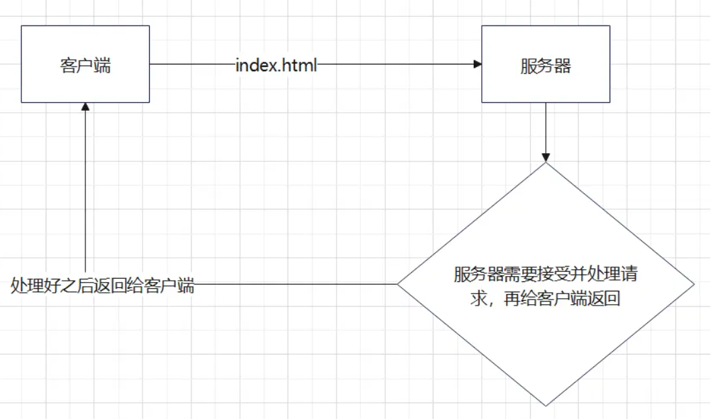
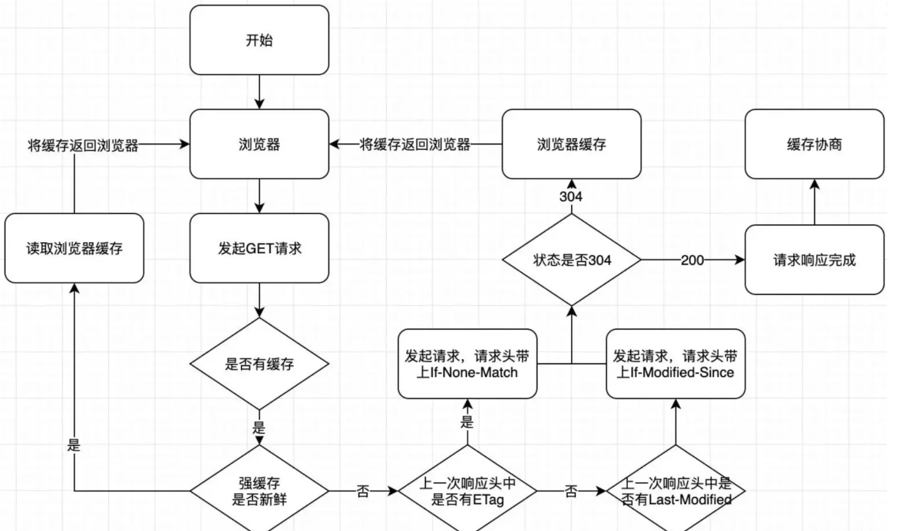

## web缓存定义

Web 缓存是可以自动保存常见文档副本的 HTTP 设备。当 Web 请求抵达缓存时， 如果本地有“已缓存的”副本，就可以从本地存储设备而不是原始服务器中提取这 个文档

普通请求方式

:::warning

注意，我们的缓存主要是针对html,css,img等静态资源，常规情况下，我们不会去缓存一些动态资源，因为缓存动态资源的话，数据的实时性就不会不太好，所以我们一般都只会去缓存一些不太容易被改变的静态资源

:::

## 缓存的优缺点

### 优点

- **减少不必要的网络传输，节约宽带（就是省钱）**
- **更快的加载页面（就是加速）**
- **减少服务器负载，避免服务器过载的情况出现。（就是减载）**

### 缺点

- 占内存（有些缓存会被存到内存中）

## 分类

缓存流程图

### 强缓存

### 协商缓存

## 强制缓存原理

## 协商缓存原理

