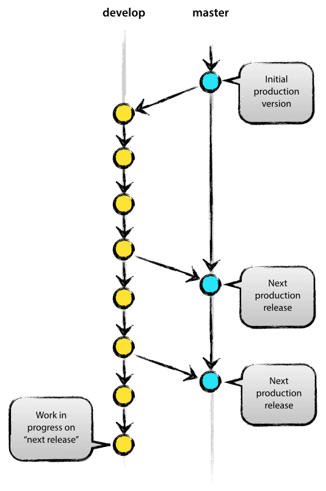
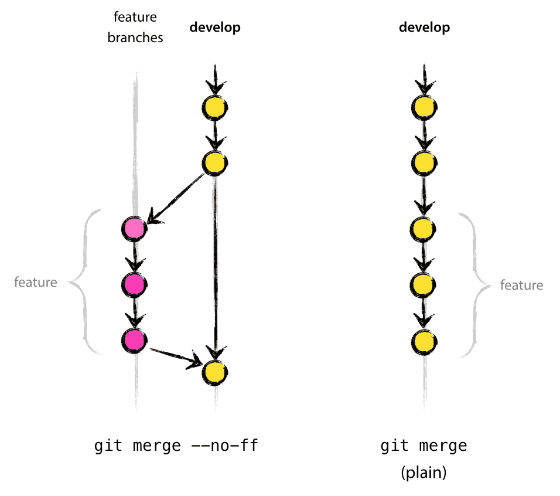
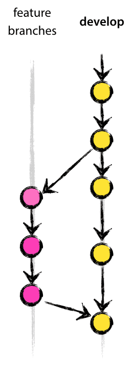

## 分支策略-Git flow

关于Git分支策略最早的见于Vincent在2010年发表的一篇博文《A successful Git branching model》


## 分支分类

在这种模式下，主要维护了两类分支：

### 主要分支

1. master
2. develop

### 辅助分支

1. feature branch (功能分支)
2. release branch (预发布分支)
3. hotfix branch (热修复分支)

## 分支作用

### master

首先，代码库应该有一个、且仅有一个主分支。master 分支的代码永远是稳定的，可以随时发布到生产环境。

### develop

develop 分支用于日常开发，保存了开发过程中最新的代码。

当 develop 分支上的代码达到稳定，并且具备发版状态时，需要将 develop 的代码合并到 master，并且打一个带有发布版本号的 tag。



### 从master创建dev，并合并到master

创建 develop 分支：

```sh
git checkout -b develop master
```

将 develop 合并到 master：

```sh
# 切换到 master 分支
git checkout master
 
# 对 develop 分支进行合并
git merge --no-ff develop
```

`--no-ff` 参数的作用是使当前的合并操作总是创建一个新的 commit 对象，即使该合并被执行为快进式（fast-forward）合并。

这样可以避免丢失掉该功能分支的历史信息，并且将针对该功能的所有提交都集中到一起。这样解释也并不是很易懂，通过下图来对比一下就比较明显了：



### feature功能分支

- 分支来源：develop
- 合并到分支：develop
- 分支命名约定：feature-*

功能分支，在开发某一个新功能时，从 develop 分支分出来，开发完之后，再合并回 develop 分支。

功能分支通常只存在于开发者的本地仓库中，并不包含在远程库中。



创建一个功能分支：

```sh
git checkout -b feature-x develop
```

开发完成后，将功能分支合并到 develop 分支：

```sh
git checkout develop
 
git merge --no-ff feature-x
```

删除 feature 分支：

```sh
git branch -d feature-x
```

### release

分支来源：develop
合并到分支：develop，master
分支命名约定：release-*
预发布分支，它是指发布正式版本之前，我们可能需要有一个预发布的版本测试，并且可以在上面做一些较小 bug 的修复。

预发布分支是从 develop 分支上分出来的，预发布结束以后，必须合并进 develop 和 master 分支。

创建一个预发布分支：

```sh
git checkout -b release-1.2 develop
```

确认没有问题后，合并到 master 分支：

```sh
git checkout master
 
git merge --no-ff release-1.2
 
# 对合并生成的新节点，做一个标签
git tag -a 1.2
```

最后，删除预发布分支：

```sh
git branch -d release-1.2
```

### hotfix

分支来源：master
合并到分支：develop，master
分支命名约定：hotfix-*
最后一种是修复 bug 分支。软件正式发布以后，难免会出现 bug。这时就需要创建一个分支，进行 bug 修复。

修复 bug 分支是从 master 分支上分出来的。修复结束以后，再合并进 master 和 develop 分支。


创建一个修复 bug 分支

```sh
git checkout -b hotfix-0.1 master
```

修复结束后，合并到 master 分支：

```sh
git checkout master
 
git merge --no-ff hotfix-0.1
 
git tag -a 0.1.1
```

再合并到 develop 分支：

```sh
git checkout develop
 
git merge --no-ff hotfix-0.1
```

最后，删除修复 bug 分支：

```sh
git branch -d hotfix-0.1
```

小结

优点：各分支权责分明，清晰可控，是很多分支管理策略的启蒙模型。

缺点：

合并冲突：同时长期存在的分支可能会很多：master、develop、release、hotfix、若干并行的 feature 分支。两两之间都有可能发生冲突。频繁手动解决冲突不仅增加工作量，而且增大了出错的风险。
功能分离：功能并行开发时，合并分支前无法测试组合功能，而且合并后可能会出现互相影响。
无法持续交付：Git flow 更倾向于按计划发布，一个 feature 要经历很多步骤才能发布到正式环境，难以达到持续交付的要求。
无法持续集成：持续集成鼓励更加频繁的代码集成和交互，尽早解决冲突，而 Git flow 的分支策略隔离了代码，尽可能推迟代码集成。


