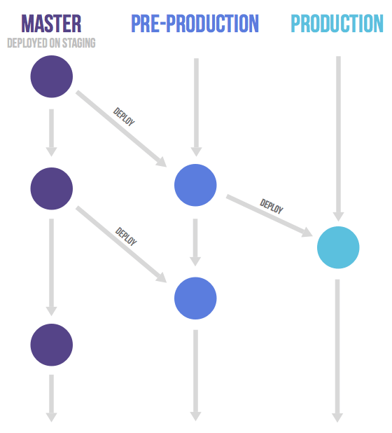

## 背景

它是 Git flow 与 Github flow 的综合。吸取了两者的优点，既有适应不同开发环境的弹性，又有单一主分支的简单和便利。

Gitlab flow 和 Github flow 之间的最大区别是 Gitlab flow 支持环境分支。

Gitlab flow 的最大原则叫做"上游优先"（upsteam first），即只存在一个主分支 master，它是所有其他分支的"上游"。只有上游分支采纳的代码变化，才能应用到其他分支。

Gitlab flow 分成两种情形来应付不同的开发流程：

1. 持续发布

2. 版本发布

## 持续发布

对于持续发布的项目，它建议在 master 分支以外，再建立不同的环境分支，每个环境都有对应的分支。比如，开发环境的分支是 master，预发环境的分支是 pre-production，生产环境的分支是 production。

开发分支 master 用于发布到测试环境，该分支为受保护的分支。
预发分支 pre-production 用于发布到预发环境，上游分支为 master。
正式分支 production 用于发布到正式环境，上游分支为 pre-production。
如果生产环境（production）发生错误，则要建一个新分支修改完后合并到最上游的开发分支（master）此时就是（Upstream first），且经过测试，再继续往 pre-production 合并，要经过测试没有问题了才能够再往下合并到生产环境。

## 版本发布

对于版本发布的项目，建议的做法是每一个稳定版本，都要从 master 分支拉出一个分支，比如 2-3-stable、2-4-stable 等。

在出现 bug 后，根据对应的 release branch 创建一个修复分支，修复工作完成后，一样要按照上游优选的原则，先合并到 master 分支，经过测试才能够合并到 release 分支，并且此时要更新小版本号。

## 小结

优点：

可以区分不同的环境部署。
对持续交付和持续集成友好。
缺点：

分支多，流程管理复杂。
