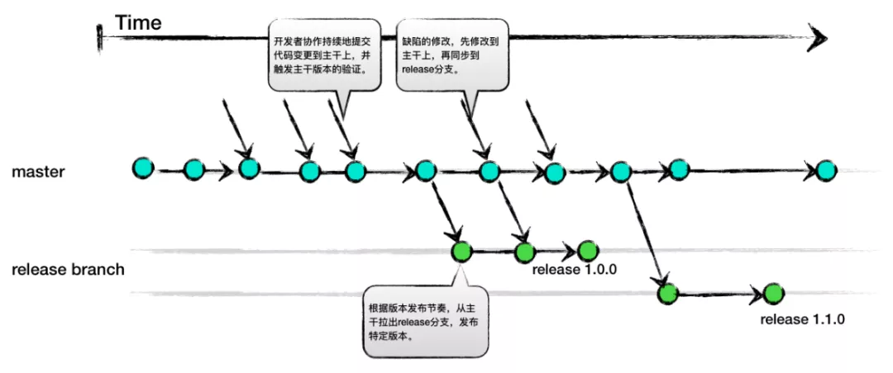

## 背景

主干开发，是指开发人员直接向主干（习惯上主干分支通常为：trunk 或 master）提交/推送代码。通常，开发团队的成员1天至少1次地将代码提交到主干分支。在到达发布条件时，从主干拉出发布分支（通常为 release），用于发布。若发现缺陷，直接在主干上修复，并根据需要 cherry pick 到对应版本的发布分支。

## 优点：

分支模型简单高效，开发人员易于掌握不容易出现错误操作

避免了分支合并、冲突解决的困扰

随时拥有可发布的版本

有利于持续集成和持续交付

## 缺点：

基础架构要求高：合入到主干的代码若质量不过关将直接阻塞整个团队的开发工作，因此需要高效的持续集成平台进行把关；

自动化测试要求高：需有完备单元测试代码，确保在代码合入主干前能在获得快速和可靠的质量反馈；

最好有代码评审：若代码质量要求高，需要配套代码评审（CR）机制，在代码提交到主干时，触发CR，通过 Peer Review 后才能正式合入；

最好有特性开关：主干开发频发合入主干的情况下，特性拆分得很小，可能是半成品特性，需要配套特性开关（Feature Toggle），只有当特性整体开发完才通过灰度发布等手段逐步打开；

## 适用环境：

对迭代速度要求高，希望需求快速交付上线

基础架构强，持续集成工具高效；

团队成员习惯TDD（测试驱动开发），代码自动化测试覆盖率高（至少增量代码的自动化测试覆盖率高）；
