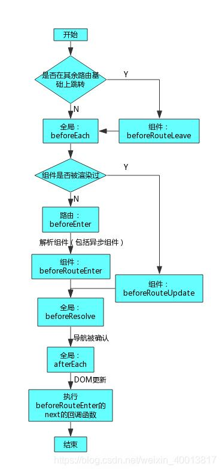

## 生命周期



## 路由分类

### hash模式

1. hash,明显特征就是有个#
2. 本质是改变window.location的href属性
3. 可以通过直接赋值location.hash来改变href，但是页面不发生刷新
4. hash兼容性好，在老版的IE中都可以运行

### history模式

有六种模式，改变URL而不刷新页面

1. replaceState: 替换原来的路径
2. pushState:使用新的路径，相当于压栈
3. popState:路径的回退，相当于出站
4. go:向前或向后改变路径，可以使用go(-1)，go(-2)
5. forward: 向前改变路径
6. back:向后改变路径

## vue2版本安装使用

### 安装并注入到vue

1. 安装vue-router

   ```javascript
   npm install vue-router// vue2 一般安装3.x版本  npm install vue-router@3.5.2
   ```

2. 在`main.js`中导入`router`，并在vue实例中使用路由

   ```js
   import router from './router/index'
   new Vue({
     render: h => h(App),
     router
   }).$mount('#app')
   ```

### 基础使用

1. 新建router文件夹,并在里面新建index.js

   :::tip

   如果要使用懒加载，记得使用使用import()来包裹url

   :::

   ```javascript
   import Vue from 'vue'
   import VueRouter from 'vue-router'
   Vue.use(VueRouter)
   const routes =[
     {
       path: '/',
       name:'index',
       component: () => import('../views/pageOne/index.vue')
     },
     {
       path: '/pageOne',
       name: 'pageOne',
       component: () => import('../views/pageOne/index.vue')
     },
     {
       path: '/pageTwo',
       name: 'pageTwo',
       component: () => import('../views/pageTwo/index.vue')
     },
   ]
   const router = new VueRouter({
     routes
   })
   export default router
   ```

2. 在App.vue文件中写入router-link和router-view

   ```vue
   <template>
     <div id="app">
       <h1>Vue Router Demo</h1>
       <nav>
         <router-link to="/pageOne">pageOne</router-link>
         <router-link to="/pageTwo">PageTwo</router-link>
       </nav>
       <router-view></router-view>
     </div>
   </template>
   
   <script>
   export default {
     name: 'App'
   };
   </script>
   
   <style>
   nav {
     margin-bottom: 20px;
   }
   nav a {
     margin: 0 10px;
   }
   </style>
   
   ```

### 嵌套使用

1. 定义路由文件

   :::warning

   子路由是`不需要加上/`的

   vue-router会自动的和父级的path进行拼接的

   :::

   ```js
   import Vue from 'vue'
   import VueRouter from 'vue-router'
   Vue.use(VueRouter)
   const routes =[
     {
       path: '/',
       name:'index',
       component: () => import('../views/pageOne/index.vue')
     },
     {
       path: '/pageOne',
       name: 'pageOne',
       component: () => import('../views/pageOne/index.vue')
       children:[
         {
             path: 'innerPageOne',
             name: 'innerPageOne',
             component: () => import('../views/innerPageOne/index.vue')
         },
       ]
     },
   ]
   const router = new VueRouter({
     routes
   })
   export default router
   ```

2. 在外层的index.vue文件，要写上router-view,和route-link

   ```vue
   <template>
     <div>
       外层嵌套
       <router-link to="/pageOne/innerPageOne">One | </router-link>
       <router-view/>
     </div>
   </template>
   
   <script>
   export default {
     components: {
   
     },
     data() {
       return {
   
       }
     },
     created() {
   
     },
     mounted() {
   
     },
     methods: {
   
     }
   }
   </script>
   
   <style scoped lang="less">
   
   </style>
   
   ```

## vue3使用方法

### 使用

#### 安装vue-router

```shell
npm install vue-router@4 -S
```

#### 写路由信息，定义路由文件

```js
import { createRouter， createWebHashHistory } from 'vue-router'
// 如果需要history模式，可以解构createWebHistory
const routes = [
    {
        path: '/home',
        component: () => import('@/views/home')
    },
    {
        path: '/index',
        component: () => import('@/views/index'),
        children: [
            {
				path: 'detail',
        		 component: () => import('@/views/detail')
            }
        ]
    }
]
const router = createRouter({
    routes,
    history: createWebHashHistory()
})
export defalut router

```

#### vue中使用路由

```js
//通过插件形式,使用路由，在main.js中使用插件
import { createApp } from 'vue'
import App from './App.vue'
import router from './router'
import store from './store'

// 可以使用分步
const app = createApp(app)
app.use(router)
app.mount('#app')
//可以使用链式调用
createApp(App).use(store).use(router).mount('#app')
```

#### 使用

在页面中使用`router-link`和`router-view`进行路由跳转

## 嵌套路由

如果使用嵌套路由，应注意以下几点

- `嵌套路由代码要写在children中`
- `子路由不需要以斜线开头`，如果以斜线开头，就不能拼接在父路由后面了，而是直接拼接在根路由上
- `如果使用嵌套路由`，如下，那么index文件中，也`应该添加一个<router-view>标签`，方可显示内容

```js
const routes = [
    {
        path: '/home',
        component: () => import('@/views/home')
    },
    {
        path: '/index',
        component: () => import('@/views/index'),
        children: [
            {
				path: 'detail',
        		 component: () => import('@/views/detail')
            }
        ]
    }
]
```

## 路由懒加载

1. 组件引用可以使用懒加载形式，提高渲染效率
2. 懒加载可以在webpack打包时，实现分包，不需要打包到一个app.js文件下，造成app过大，进而影响请求和渲染效率

```js
const routes =[
    {path: '/', redirect: '/home'},
    {path: '/home', component:() => import('../pages/Home.vue')},
    // 懒加载会造成分包，可以在引用时，写上注释，注释会被webpack解析
    {path: '/user', component:() => import(/* weboackChunkName: user-chunk*/'../pages/User.vue')}
]
```

## route-link的使用

### router-link

- to属性

  是一个字符串，或者对象

- replace属性

  设置replace属性的话，当点击时，会调用router.replace()，而不是router.push()

- active-class

  设置`激活a元素后应用的class`，默认是`router-link-active`,`可以改成其他名字`

- exact-active-class属性

  链接精准激活时，应用于渲染的<a>的class，默认时route-link-exact-active

  eg: 如果路径是嵌套路由，如/home/detail, 

  那么`父路由/home会增加active-class属性`，

  `子路由的/home/detail`会`同时增加acitve-class和exact-acitve-class两个属性`

- `tag已弃用`，如果需要，使用slot方式

  插槽内部可以是任何标签，也可以是个组件

  ```html
  <!--普通写法-->
  <router-link to="/index">首页</router-link>
  <!--使用插槽写法-->
  	<!--这种写法依然是个a标签，只不过是在a标签里面新增了一个strong标签-->
  <router-link to="/index">
      <strong>首页</strong>
  </router-link>
  ```

### router-link中的v-slot

props有以下参数

1. href, 跳转的链接
2. route对象，包含很多路由信息，如fullPath，path，params，query等
3. navigate，触发导航的函数
4. isActive，是否匹配的状态
5. isExactActive，是否精准匹配状态

```html
<router-link to="/index" v-slot="prop">
    <button>{{prop.href}}</button>
</router-link>
```


## route的属性

1. path： 用来定义路由路径
2. component： 可以用来引入组件，书写方式可以使用路由懒加载
3. meta: 路由元信息， 可以通过this.$route.meta
4. name: name就相当于给你的path取个别名，方便使用，路由并不是一定要设置name值,不设置name，vue-router默认name值为 default

```js
const routes =[
    {
        path: '/',
     	redirect: '/home',
        component:() => import('../pages/Home.vue'),
        meta: {
        	age: 10,
        	name: '张三'
    	}
    },
]
```


## 动态路由

### 普通用法

使用冒号规定动态字段

在定义路由文件时，`/users/johnny`， `johnny就变成了动态参数`，

如果需要获取，可以`使用this.$route.params.id获取`

```js
const routes = [
  // 动态字段以冒号开始
  { path: '/users/:id', component: User },
    // 传递两个参数,
  { path: '/users/:id/:username', component: Login },
]
```

```vue
<script>
    import { useRouter } from 'vue-router'
	export default {
        created(){
            console.log(this.$route.params.id)
        },
        setup() {
            const route = useRoute()
            console.log(route.params.id)
        }
    }
</script>
```

### patchMatch

当匹配到一个不存在的路径时，显示404NotFound

patchMatch(.*)表示`匹配所有，括号里的是正则表达式`

​	使用`$route.params.pathMatch`获取到路径信息, 返回的是/user/123456/789456

patchMatch(.*)\*表示`匹配所有，括号里的是正则表达式`

​	依然使用`$route.params.pathMatch`获取到路径信息，但是返回的数据会分割后放到数组中，如`[‘user’,’123456’,’789456’]`

```js
const routes = [
  // .*表示所有路径，vue是排他性路由，所以当上面的都匹配不到，就会走这条路径
 // 路径信息以字符串形式展示
  { path: '/:pathMatch(.*)', component: NotFound },
  // 在后面再加一个*,路径信息以数组展示[‘user’,’123456’,’789456’]
   { path: '/:pathMatch(.*)*', component: NotFound }
  // 将匹配以 `/user-` 开头的所有内容，并将其放在 `$route.params.afterUser` 下
  { path: '/user-:afterUser(.*)', component: UserGeneric },
]
```

tips: `并不一定叫pathMatch，也可以叫其他名字，但是取值的时候，也要变成相同的名字才能取到`

### 正则

#### 自定义正则

```js
const routes = [
  // /:orderId -> 仅匹配数字,如/25
  { path: '/:orderId(\\d+)' },
  // /:productName -> 匹配其他任何内容
  { path: '/:productName' },
]
```

tips： `为确保转移反斜杠，需要再加一个\`, 

#### 可重复参数

```js
const routes = [
  // /:chapters+ ->  匹配 /one, /one/two, /one/two/three, 等
  { path: '/:chapters+' },
  // /:chapters* -> 匹配 /, /one, /one/two, /one/two/three, 等
  { path: '/:chapters*' },
]
```

#### Sensitive 与 strict 路由配置

- strict 末尾的斜杠
- sensitive 大小写

默认情况下，所有路由是不区分大小写的，并且能匹配带有或不带有尾部斜线的路由,`/users` 将匹配 `/users`、`/users/`、甚至 `/Users/`

```js
const router = createRouter({
  history: createWebHistory(),
  routes: [
    // 将匹配 /users/posva 而非：
    // - /users/posva/ 当 strict: true
    // - /Users/posva 当 sensitive: true
    { path: '/users/:id', sensitive: true },
    // 将匹配 /users, /Users, 以及 /users/42 而非 /users/ 或 /users/42/
    { path: '/users/:id?' },
  ]
  strict: true, // applies to all routes
})
```

#### 可选参数

可以通过使用 `?` 修饰符(0 个或 1 个)将一个参数标记为可选

```js
const routes = [
  // 匹配 /users 和 /users/posva
  { path: '/users/:userId?' },
  // 匹配 /users 和 /users/42
  { path: '/users/:userId(\\d+)?' },
]
```

## 编程式导航

### push的使用

使用`this.$router.push`，如果是`vue3，从vue-route中解构useRouter`

```js
import { useRouter } from 'vue-router'
// 然后实例化路由对象
const router = useRouter()
// 然后通过实例化对象操作路由
router.push()
```

1. 可以传递一个字符串
2. 可以传递一个对象

```js
<script>
    import { useRouter } from 'vue-router'
	export default {
        methods: {
            // vue2 字符串写法
            goToHome() {
                this.$router.push('/home')
            },
            // vue2 对象写法
            goToObjectHome() {
                this.$router.push({
                    path: '/home',
                    query: {
                        name: 'zhangsan'
                    }
                })
            }
        }
        // vue3字符串写法
        setup() {
            const route = useRoute()
            console.log(route.params.id)
        }
    }
</script>
```

### 其他操作方法

1. go， 后面跟数字，可正可负，表示向前或者向后n步

2. replace，替换路由

   ```js
   router.replace({ path: '/home' })
   ```

3. forward() 表示向前一步走，一定要有历史记录才能使用

4. back() 表示后退一步

   ```js
   router.forward()
   router.replace()
   ```

## 路由守卫

## 点击相同path报错

1. 方法一：修改push方法，捕获异常

   ```js
   const routerPush = Router.prototype.push;
   Router.prototype.push = function push(location) {
     return routerPush.call(this, location).catch((error) => error);
   };
   ```

   

