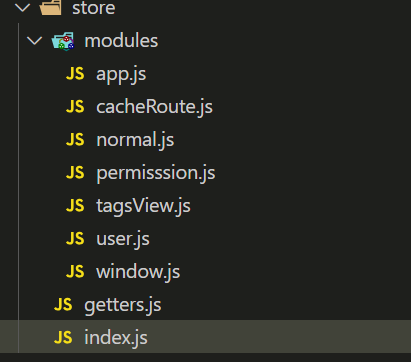

## state

### 定义

#### 单个文件定义

```js
export default new Vuex.Store({
  state: {
    name: '张三',
    age: 21,
  },
  mutations: {},
  actions: {},
  modules: {},
})
```

#### 分模块定义

目录结构如下



```js
// index.js
import Vue from 'vue'
import Vuex from 'vuex'
import app from './modules/app'
import normal from './modules/normal'
import user from './modules/user'
import tagsView from './modules/tagsView'
import getters from './getters'
import window from './modules/window'
import permission from './modules/permisssion'
import cacheRoute from './modules/cacheRoute'

Vue.use(Vuex)

const store = new Vuex.Store({
  modules: {
    app,
    normal,
    user,
    tagsView,
    permission,
    window,
    cacheRoute
  },
  getters
})

export default store

```

```js
// normal.js
const normal = {
  state: {
    changeMaterialData: {}
  },
  // 同步修改state
  mutations: {
    SET_CHANGEMATERIALDATA: (state, data) => {
      state.changeMaterialData = data
    }
  },
  // 用于异步操作
  actions: {
    setChangeMaterialData: ({ commit }, data) => {
      commit('SET_CHANGEMATERIALDATA', data)
    }
  }
}

export default normal

```

### 读取

state用来存储数据，通过this.$store.state访问

### mapState

mapState相当于一个计算属性，是一个对象，包含计算后的属性

## mutation

更改 Vuex 的 store 中的状态的唯一方法是提交 mutation

使用`this.$store.commit('函数名', payload)` 来触发

### 提交载荷

```js
mutations: {
  increment (state, payload) {
    state.count += payload.amount
  }
}
```

```js
store.commit('increment', {
  amount: 10
})
```

### 对象风格的提交

1. 定义方法

   ```js
   mutations: {
     increment (state, payload) {
       state.count += payload.amount
     }
   }
   ```

2. 触发

   ```js
   store.commit({
     type: 'increment',
     amount: 10
   })
   ```

## action

`Action` 同样也是用来处理任务，不过它处理的是异步任务，异步任务必须要使用 `Action`，通过 `Action` 触发 `Mutation` 间接改变状态，不能直接使用 `Mutation` 直接对异步任务进行修改

:::tip

1. action中定义的函数，第一个是store上下文，

   - 如果希望在异步方法调用后，直接触发state改变，可以为了方便，直接从里面结构commit，通过commit触发mutation改变

2. 第二个参数是，在使用this.$store.dispatch调用action时，传入的值

   如下面代码的调用方式就是

   ```js
   this.$store.dispatch('setChangeMaterialData', {a:123})
   ```

:::

```js
// normal.js
const normal = {
  state: {
    changeMaterialData: {}
  },
  // 同步修改state
  mutations: {
    SET_CHANGEMATERIALDATA: (state, data) => {
      state.changeMaterialData = data
    }
  },
  // 用于异步操作
  actions: {
    setChangeMaterialData: ({ commit }, data) => {
      commit('SET_CHANGEMATERIALDATA', data)
    }
  }
}

export default normal
```

### 触发方式

1. `this.$store.dispatch()`
2. `mapActions`

## getter

### getter基本使用

getter可以认为是store的计算属性

1. 在index.js中定义getters

   ```js
   getters: {
     reverseMsg(state) {
         return state.msg.split('').reverse().join('')
     }
   }
   ```

2. 然后在文件中，使用这个定义的方法

   ```js
   computed() {
       reverseMsg() {
           return this.$store.getters.reverseMsg
       }
   }
   ```

:::tip

如果定义的方法里面，需要传递多个参数，第一个一定要用state占位

```js
reverseMsg2(state, getters) {
    retrun getters.reverseMsg + '!!!'
}
```

:::

### getter传参

1. 第一个参数永远是state

2. 里面的一层参数，才是调用时传递的参数

   如第二个何况，传递的id就是2

   ```js
   getters:{
       getTodoById:(state) => (id) => {
           return state.todos.find(todo => todo.id == id)
       }
   }
   ```

## module

分模块时用得到

如上面1.1.2的index.js的代码