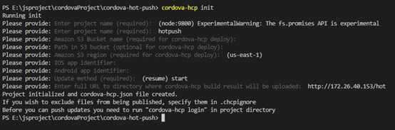
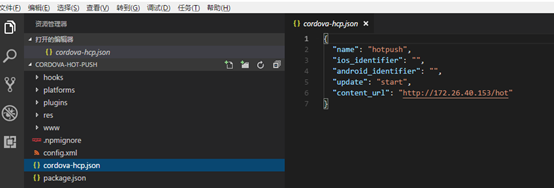
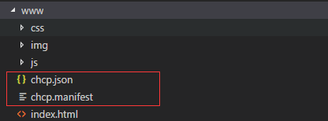
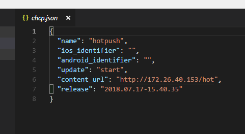
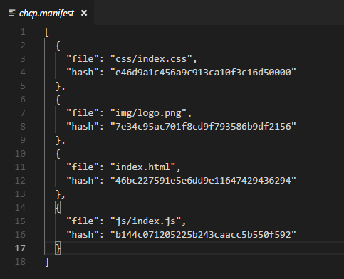
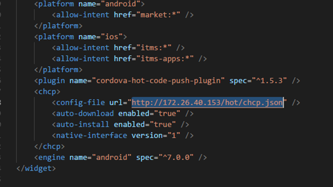

https://www.cnblogs.com/coder-axin/p/9330589.html

## 全局安装cordova

``` sh
npm install cordova@11 -g # node14版本对应的是11
```

## 全局安装热更新cli

```sh
npm install -g cordova-hot-code-push-cli
```

## 热更新步骤

### 创建cordova项目

```sh
cordova create cordova-hot-push
```

### 项目安装更新插件

```sh
cordova plugin add cordova-hot-code-push-plugin
```

### 添加热更新配置文件

```sh
cordova-hcp init
```



执行时将要求您从命令行中填写一些项目首选项：

- Project name: 你现在的项目名称所需.
- Amazon S3 Bucket name:亚马逊上的S3桶的名字。可以跳过。
- Amazon S3 region: 亚马逊S3地区。可以跳过。
- iOS app identifier: 应用程序商店的应用程序ID。App升级是跳转应用商店进行升级。
- Android app identifier: 可以App在应用商城的地址，或者是apk的下载地址。
- Update method: 何时执行更新。
  - start: 在启动应用程序时安装更新。
  - resume: 在恢复应用程序(从背景移动到前景状态)或启动时，安装更新；默认使用。
  - now: 从服务器加载更新后立即安装。

最后生成的文件



说明

- Name ：项目名字
- Update：何时触发热更新，有几个选项(start(应用启动),resume(应用从后台恢复),now(下载更新后自动执行))
- Content_url:此项配置非常重要。这是www目录存放的网络位置，当有更新的时候，应用会去这个目录下载对应文件。我的做法是在iis上新建一个hot虚拟目录，把www的内容复制进去。

### 生成文件映射配置文件

```sh
cordova-hcp build
```

文件映射配置文件生成后，会在www目录下生成两个文件

1. chcp.json
2. chcp.manifest



可以看到，里面是每个文件的hash映射。

#### 第一个chcp.json文件



### 第二个chcp.manifest文件



### Config.xml配置

在文件中添加如下配置

```html
<chcp>
    <config-file url="http://172.26.40.153/hot/chcp.json" />
    <auto-download enabled="true" />
    <auto-install enabled="true" />
    <native-interface version="1" />
</chcp>
<platform name="android">
    <edit-config file="AndroidManifest.xml" mode="merge" target="/manifest/application" xmlns:android="http://schemas.android.com/apk/res/android">
        <activity android:usesCleartextTraffic="true" />
    </edit-config>
    <!--  android:usesCleartextTraffic="true"是必须的    -->
</platform>
<!--    跨域cors    -->
<preference name="AndroidInsecureFileModeEnabled" value="true" />
```



### 添加安卓平台

```sh
cordova platform add android
```

### 打包

```sh
cordova build android
```

## 更新原理

当app启动的时候，会去检查本地的版本(release)和服务器上的release(chcp.json)是否一样。不一样的话就去对比文件hash，进行相应的文件更新。

所以我们要做的是，先把更新后的代码重新生成文件映射配置文件

```sh
cordova-hcp build
```

可以看到我们的版本号变了。

接下来把www下面的文件拷贝到之前配置的热更新代码存放点(http://172.26.40.153/hot)的对应目录。(第一次拷贝所有文件，以后只需要拷贝修改过的文件到对应目录替换以及两个chcp相关的文件即可)

## 注意

生成热更新配置文件的时候，update选项设置为start，一定要启动两次app才生效。根据我的推测，第一次是下载文件，第二次才生效。把Update配置项改成now不知道会不会立马生效，但是如果需要更新的文件较多，不知道会不会影响用户的使用，待测试。

 经过测试，安卓好像只支持http协议，不支持https协议的热更新

### 延长时间

如果您使用代理或网络较慢，可以通过在 `gradle.properties` 文件中增加以下配置来延长 Gradle 的下载超时时间：

```sh
systemProp.org.gradle.internal.http.connectionTimeout=60000
systemProp.org.gradle.internal.http.socketTimeout=60000
```

### 设置为阿里云

```sh
maven { url 'http://maven.aliyun.com/repository/google' }
maven { url 'http://maven.aliyun.com/repository/jcenter' }
```

## 快捷安装方式

打开电脑命令行，输入

```sh
adb install -r
```

然后把打包生成的文件拖进命令行

然后回车即可

