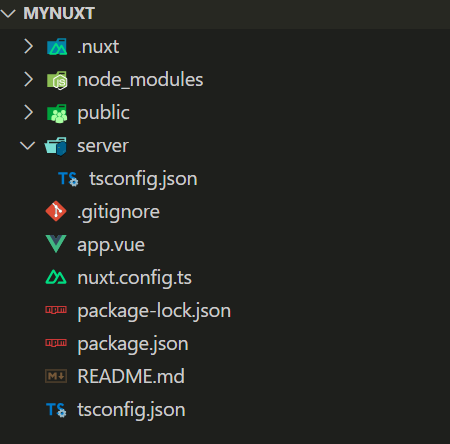

## 创建项目

```sh
pnpm dlx nuxi@latest init <project-name>
```

如果是需要一步一步安装其他依赖，可以使用如下命令构建项目

```shell
npx create-nuxt-app <project name>
```

## 目录结构



```
nuxt-app/

├── .nuxt/

├── .output/

├── assets/

├── components/

├── composables/

├── content/

├── layouts/

├── middleware/

├── node_modules/

├── pages/

├── plugins/

├── public/

└── server/

    ├── api/ 

   ├── routes/ 

   └── middleware/

├── .gitignore

├── .nuxtignore

├── app.config.ts

├── app.vue

├── nuxt.config.ts

├── package.json

└── tsconfig.json
```

### `.nuxt`目录

开发环境下由 Nuxt 产生出 Vue 的网站，.nuxt 目录是`自动产生`的，你不应该任意的调整里面文件。

### `.output`目录

当你的网站準备部署至正式环境时，每次编译建构专案时，皆会`自动重新产生`这个目录，你不应该任意的调整里面文件。

### `assets`目录

顾名思义，这是静态资源文件所放置的位置，目录内通常包含以下类型的文件：

CSS 样式文件 (CSS、SASS 等...)字型图片

这些静态资源，最终在专案编译建构时，由 Vite 或 webpack 进行编译打包。

### `components`目录

放置 Vue 元件的地方，Nuxt 会自动载入这个目录中的任何组件。

### `composables`目录

组合式函数放置的目录，简单来说可以把常用或通用的功能写成一个共用的函数或 JS 文件，放置在这个目录视为组合式函数，Nuxt 也会自动载入这些组合式函数，让需要使用的页面或元件可以直接做使用。

### `content`目录

通过使用 Nuxt Content，我们可以在这个目录下建立 .md、.yml、.csv 和 .json 文件，Nuxt Content 会读取并解析这些文件并进行渲染，用来建立基于文件的 CMS。

### `layouts`目录

用于放置通用或可能重複使用到的布局模板，提供程式码的可重复使用性。

### `middleware`目录

Nuxt 3 提供了路由中间件的概念，用以在导航到下一个页面之前执行一些程式码如权限验证。

### `node_modules`目录

通常有使用 Node.js 的套件管理，例如 NPM，对此目录应该有一些印象，使用 Nuxt 3 及专案所需要的相依套件都会存放在这个目录。

### `pages`目录

这个目录主要是用来配置我们的页面，你也可以只使用 app.vue 来完成你的网站，但如果建立了`pages`这个目录，Nuxt 3 会自动整合`vue-router`，并会依据目录及文件结构规则来`自动产生出对应路由`，也是 Nuxt3 产生路由的方式。

### `plugins`目录

Nuxt 会自动载入这个目录文件，作为插件使用，在文件名称可以使用后缀`.server`或`.client`，例如，`plugin.server.ts`或`plugin.client.ts`来决定只让伺服器端或客户端载入这个插件。

### `public`目录

这个目录主要用于伺服器根目录提供的文件，包含必须固定的文件名称如`robots.txt`或不太会变动的`favicon.ico`。

### `server`目录

用于建立任何后端的逻辑如后端 API，这个目录下还包含了`api`、`server`和`middleware`来区分功能，不具有自动载入，但支援 HMR。

### `.gitignore`文件

在使用 Git 版本控制时，可以设置一些不需要或忽略关注变动的文件及目录。

### `.nuxtignore`文件

可以设置让 Nuxt 编译建构时，一些不需要或忽略文件。

### `app.config.ts`文件

提供服务运行时暴露给客户端使用的设定，因此，请不要在 app.config.ts 文件中添加任何机密资讯。

#### `app.vue`文件

Nuxt 3 网站的入口点元件。

### `nuxt.config.ts`文件

用于配置 Nuxt 专案的设定档。

### `package.json`文件

这个文件里面定义了专案资讯、脚本、相依套件及版本号，通常有使用 Node.js 套件管理工具建置的专案都会包含此文件。

### `tsconfig.json`文件

Nuxt 3 会在 .nuxt 目录下`自动产生`一个`tsconfig.json`文件，其中已经包含了一些解析别名等预设配置；你可以透过专案目录下的`tsconfig.json`来配置扩展或覆盖 Nuxt 3 预设的 TypeScript 设定档。


