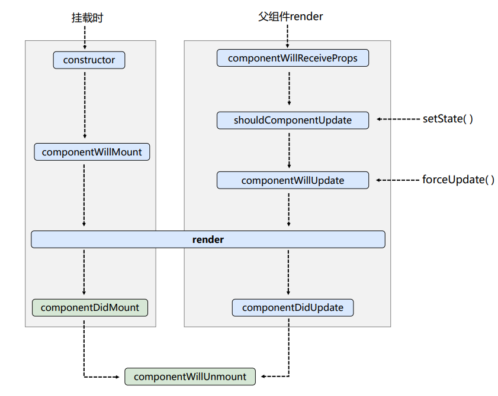
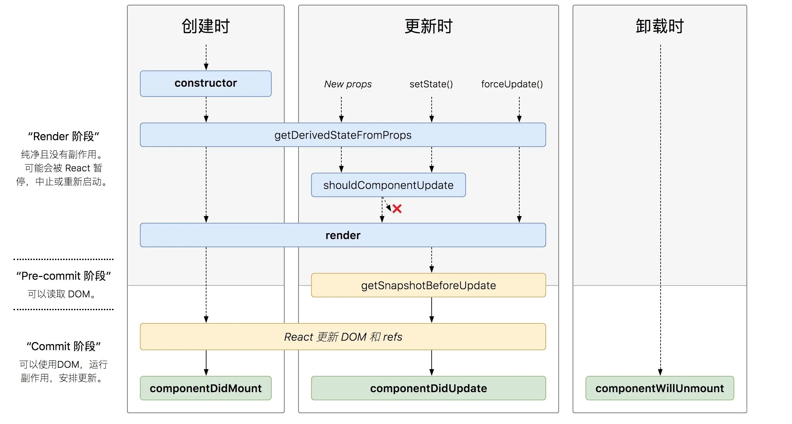

## 生命周期

### reacr16生命周期



### react17生命周期



React中组件也有生命周期，也就是说也有很多钩子函数供我们使用, 组件的生命周期，我们会分为四个阶段，初始化、运行中、销毁、错误处理(16.3之后)

### 初始化

在组件初始化阶段会执行 

1. constructor 

2. static getDerivedStateFromProps()

3. componentWillMount() / UNSAFE_componentWillMount() 

4. render() 

5. componentDidMount()

### 更新阶段

`props`或`state`的改变可能会引起组件的更新，组件重新渲染的过程中会调用以下方法： 

1. componentWillReceiveProps() / UNSAFE_componentWillReceiveProps() 
2. static getDerivedStateFromProps()
3. shouldComponentUpdate() 
4. componentWillUpdate() / UNSAFE_componentWillUpdate() 
5. render() 
6. getSnapshotBeforeUpdate() 
7. componentDidUpdate()

### 卸载阶段

1. componentWillUnmount()

### 错误处理

1. componentDidCatch()

## 各生命周期详解

**(1) constructor(props)**

React组件的构造函数在挂载之前被调用。在实现`React.Component`构造函数时，需要先在添加其他内容前，调用`super(props)`，用来将父组件传来的`props`绑定到这个类中，使用`this.props`将会得到。

官方建议不要在`constructor`引入任何具有副作用和订阅功能的代码，这些应当使用`componentDidMount()`。

`constructor`中应当做些初始化的动作，如：初始化`state`，将事件处理函数绑定到类实例上，但也不要使用`setState()`。如果没有必要初始化state或绑定方法，则不需要构造`constructor`，或者把这个组件换成纯函数写法。

当然也可以利用`props`初始化`state`，在之后修改`state`不会对`props`造成任何修改，但仍然建议大家提升状态到父组件中，或使用`redux`统一进行状态管理。

```jsx
constructor(props) {
  super(props);
  this.state = {
    isLiked: props.isLiked
  };
}
```

**(2) static getDerivedStateFromProps(nextProps, prevState)**

React 的 16.3 版本中对生命周期进行了较大的调整，这是为了开发者能正确地使用生命周期，避免误解其概念而造成反模式。

本节将重点介绍 getDerivedStateFromProps 这个生命周期。要注意的是，React 16.3 的版本中 getDerivedStateFromProps 的触发范围是和 16.4^ 是不同的，主要区别是在 `setState` 和 `forceUpdate` 时会不会触发，具体可以看这个[生命全周期图](http://projects.wojtekmaj.pl/react-lifecycle-methods-diagram/) 。

可能的使用场景有两个：

- 无条件的根据 prop 来更新内部 state，也就是只要有传入 prop 值， 就更新 state
- 只有 prop 值和 state 值不同时才更新 state 值。

我们接下来看几个例子。

假设我们有个一个表格组件，它会根据传入的列表数据来更新视图。

```jsx
class Table extends React.Component {
    state = {
        list: []
    }
    static getDerivedStateFromProps (props, state) {
        return {
            list: props.list
        }
    }
    render () {
        .... // 展示 list
    }
}
```

上面的例子就是第一种使用场景，但是无条件从 prop 中更新 state，我们完全没必要使用这个生命周期，直接对 prop 值进行操作就好了，无需用 state 值类保存。


再看一个例子，这个例子是一个颜色选择器，这个组件能选择相应的颜色并显示，同时它能根据传入 prop 值显示颜色。

```jsx
Class ColorPicker extends React.Component {
    state = {
        color: '#000000'
    }
    static getDerivedStateFromProps (props, state) {
        if (props.color !== state.color) {
            return {
                color: props.color
            }
        }
        return null
    }
    ... // 选择颜色方法
    render () {
        .... // 显示颜色和选择颜色操作
    }
}
```

现在我们可以这个颜色选择器来选择颜色，同时我们能传入一个颜色值并显示。但是这个组件有一个 bug，如果我们传入一个颜色值后，再使用组件内部的选择颜色方法，我们会发现颜色不会变化，一直是传入的颜色值。

这是使用这个生命周期的一个常见 bug。为什么会发生这个 bug 呢？在开头有说到，在 React 16.4^ 的版本中 `setState` 和 `forceUpdate` 也会触发这个生命周期，所以内部 state 变化后，又会走 getDerivedStateFromProps 方法，并把 state 值更新为传入的 prop。

接下里我们来修复这个bug。

```jsx
Class ColorPicker extends React.Component {
    state = {
        color: '#000000',
        prevPropColor: ''
    }
    static getDerivedStateFromProps (props, state) {
        if (props.color !== state.prevPropColor) {
            return {
                color: props.color
                prevPropColor: props.color
            }
        }
        return null
    }
    ... // 选择颜色方法
    render () {
        .... // 显示颜色和选择颜色操作
    }
}
```

通过保存一个之前 prop 值，我们就可以在只有 prop 变化时才去修改 state。这样就解决上述的问题。

这里小结下 getDerivedStateFromProps 方法使用的注意点：

- 在使用此生命周期时，要注意把传入的 prop 值和之前传入的 prop 进行比较。
- 因为这个生命周期是静态方法，同时要保持它是纯函数，不要产生副作用。

我们应该谨慎地使用 getDerivedStateFromProps 这个生命周期。使用时要注意下面几点：

- 因为这个生命周期是静态方法，同时要保持它是纯函数，不要产生副作用。
- 在使用此生命周期时，要注意把传入的 prop 值和之前传入的 prop 进行比较（这个 prop 值最好有唯一性，或者使用一个唯一性的 prop 值来专门比较）。
- 不使用 getDerivedStateFromProps，可以改成组件保持完全不可控模式，通过初始值和 key 值来实现 prop 改变 state 的情景。

**(3) componentWillMount() / UNSAFE_componentWillMount()**

`componentWillMount()`将在React未来版本(官方说法 17.0)中被弃用。`UNSAFE_componentWillMount()`在组件挂载前被调用，在这个方法中调用`setState()`不会起作用，是由于他在`render()`前被调用。

为了避免副作用和其他的订阅，官方都建议使用`componentDidMount()`代替。这个方法是用于在服务器渲染上的唯一方法。这个方法因为是在渲染之前被调用，也是惟一一个可以直接同步修改state的地方。

**(4) render()**

render()方法是必需的。当他被调用时，他将计算`this.props`和`this.state`，并返回以下一种类型： 

- React元素。通过jsx创建，既可以是dom元素，也可以是用户自定义的组件。 
- 字符串或数字。他们将会以文本节点形式渲染到dom中。 
- Portals。react 16版本中提出的新的解决方案，可以使组件脱离父组件层级直接挂载在DOM树的任何位置。 
- null，什么也不渲染 
- 布尔值。也是什么都不渲染。

当返回`null`,`false`,`ReactDOM.findDOMNode(this)`将会返回null，什么都不会渲染。

`render()`方法必须是一个纯函数，他不应该改变`state`，也不能直接和浏览器进行交互，应该将事件放在其他生命周期函数中。 
如果`shouldComponentUpdate()`返回`false`，`render()`不会被调用。

**(5) componentDidMount**

`componentDidMount`在组件被装配后立即调用。初始化使得DOM节点应该进行到这里。

**通常在这里进行ajax请求**

如果要初始化第三方的dom库，也在这里进行初始化。只有到这里才能获取到真实的dom.

**(6) componentWillReceiveProps()/UNSAFE_componentWillReceiveProps(nextProps)**

官方建议使用`getDerivedStateFromProps`函数代替`componentWillReceiveProps`。当组件挂载后，接收到新的`props`后会被调用。如果需要更新`state`来响应`props`的更改，则可以进行`this.props`和`nextProps`的比较，并在此方法中使用`this.setState()`。

如果父组件会让这个组件重新渲染，即使`props`没有改变，也会调用这个方法。

React不会在组件初始化props时调用这个方法。调用`this.setState`也不会触发。

**(7) shouldComponentUpdate(nextProps, nextState)**

调用`shouldComponentUpdate`使React知道，组件的输出是否受`state`和`props`的影响。默认每个状态的更改都会重新渲染，大多数情况下应该保持这个默认行为。

在渲染新的`props`或`state`前，`shouldComponentUpdate`会被调用。默认为`true`。这个方法不会在初始化时被调用，也不会在`forceUpdate()`时被调用。返回`false`不会阻止子组件在`state`更改时重新渲染。

如果`shouldComponentUpdate()`返回`false`，`componentWillUpdate`,`render`和`componentDidUpdate`不会被调用。

> 官方并不建议在`shouldComponentUpdate()`中进行深度查询或使用`JSON.stringify()`，他效率非常低，并且损伤性能。

**(8) UNSAFE_componentWillUpdate(nextProps, nextState)**

在渲染新的`state`或`props`时，`UNSAFE_componentWillUpdate`会被调用，将此作为在更新发生之前进行准备的机会。这个方法不会在初始化时被调用。

*不能在这里使用this.setState()*，也不能做会触发视图更新的操作。如果需要更新`state`或`props`，调用`getDerivedStateFromProps`。

**(9) getSnapshotBeforeUpdate()**

在react `render()`后的输出被渲染到DOM之前被调用。它使您的组件能够在它们被潜在更改之前捕获当前值（如滚动位置）。这个生命周期返回的任何值都将作为参数传递给componentDidUpdate（）。

**(10) componentDidUpdate(prevProps, prevState, snapshot)**

在更新发生后立即调用`componentDidUpdate()`。此方法不用于初始渲染。当组件更新时，将此作为一个机会来操作DOM。只要您将当前的props与以前的props进行比较（例如，如果props没有改变，则可能不需要网络请求），这也是做网络请求的好地方。

如果组件实现`getSnapshotBeforeUpdate()`生命周期，则它返回的值将作为第三个“快照”参数传递给`componentDidUpdate()`。否则，这个参数是`undefined`。

**(11) componentWillUnmount()**

在组件被卸载并销毁之前立即被调用。在此方法中执行任何必要的清理，例如使定时器无效，取消网络请求或清理在`componentDidMount`中创建的任何监听。

**(12) componentDidCatch(error, info)**

错误边界是React组件，可以在其子组件树中的任何位置捕获JavaScript错误，记录这些错误并显示回退UI，而不是崩溃的组件树。错误边界在渲染期间，生命周期方法以及整个树下的构造函数中捕获错误。

如果类组件定义了此生命周期方法，则它将成错误边界。在它中调用`setState()`可以让你在下面的树中捕获未处理的JavaScript错误，并显示一个后备UI。只能使用错误边界从意外异常中恢复; 不要试图将它们用于控制流程。

错误边界只会捕获树中下面组件中的错误。错误边界本身不能捕获错误。

## PureComponent

`PureComponnet`里如果接收到的新属性或者是更改后的状态和原属性、原状态相同的话，就不会去重新render了
在里面也可以使用`shouldComponentUpdate`，而且。是否重新渲染以`shouldComponentUpdate`的返回值为最终的决定因素。

```jsx
import React, { PureComponent } from 'react'

class YourComponent extends PureComponent {
  ……
}
```

## ref

React提供的这个`ref`属性，表示为对组件真正实例的引用，其实就是`ReactDOM.render()`返回的组件实例,`ref`可以挂载到组件上也可以是dom元素上。

- 挂到组件(`class`声明的组件)上的ref表示对组件实例的引用。**不能**在函数式组件上使用 ref 属性，因为它们没有实例：
- 挂载到dom元素上时表示具体的dom元素节点。

在React 最新的版本中，要使用`ref`, 需要使用`React.createRef`方法先生成一个`ref`。

```jsx
import React, { Component, createRef } from 'react'
import ReactDOM from 'react-dom'

class App extends Component {
  constructor() {
    super()
    // 创建inputRef
    this.inputRef = createRef()
  }
  componentDidMount () {
    console.log(this.inputRef.current) // <input type="text">
  }
  render () {
    return (
  		<div>
        {/* 关联ref和dom */}
        <input type="text" ref={this.inputRef} />
      </div>
  	)
  }
}
ReactDOM.render(
	<App/>,
  document.getElementById('root')
)
```

## 组件通信

**父组件与子组件通信**

- 父组件将自己的状态传递给子组件，子组件当做属性来接收，当父组件更改自己状态的时候，子组件接收到的属性就会发生改变

- 父组件利用`ref`对子组件做标记，通过调用子组件的方法以更改子组件的状态,也可以调用子组件的方法..

**子组件与父组件通信**

- 父组件将自己的某个方法传递给子组件，在方法里可以做任意操作，比如可以更改状态，子组件通过`this.props`接收到父组件的方法后调用。

**跨组件通信**

在react没有类似vue中的事件总线来解决这个问题，我们只能借助它们共同的父级组件来实现，将非父子关系装换成多维度的父子关系。react提供了`context` api来实现跨组件通信, React 16.3之后的`context`api较之前的好用。

实例，使用`context` 实现购物车中的加减功能

```jsx
// counterContext.js
import React, { Component, createContext } from 'react'

const {
  Provider,
  Consumer: CountConsumer
} = createContext()

class CountProvider extends Component {
  constructor () {
    super()
    this.state = {
      count: 1
    }
  }
  increaseCount = () => {
    this.setState({
      count: this.state.count + 1
    })
  }
  decreaseCount = () => {
    this.setState({
      count: this.state.count - 1
    })
  }
  render() {
    return (
      <Provider value={{
        count: this.state.count,
        increaseCount: this.increaseCount,
        decreaseCount: this.decreaseCount
      }}
      >
        {this.props.children}
      </Provider>
    )
  }
}

export {
  CountProvider,
  CountConsumer
}
```

```jsx
// 定义CountButton组件
const CountButton = (props) => {
  return (
    <CountConsumer>
      // consumer的children必须是一个方法
      {
        ({ increaseCount, decreaseCount }) => {
          const { type } = props
          const handleClick = type === 'increase' ? increaseCount : decreaseCount
          const btnText = type === 'increase' ? '+' : '-'
          return <button onClick={handleClick}>{btnText}</button>
        }
      }
    </CountConsumer>
  )
}
```

```jsx
// 定义count组件，用于显示数量
const Count = (prop) => {
  return (
    <CountConsumer>
      {
        ({ count }) => {
          return <span>{count}</span>
        }
      }
    </CountConsumer>
  )
}
```

```jsx
// 组合
class App extends Component {
  render () {
    return (
  		<CountProvider>
        <CountButton type='decrease' />
        <Count />
        <CountButton type='increase' />
      </CountProvider>
  	)
  }
}
```

> 复杂的非父子组件通信在react中很难处理，多组件间的数据共享也不好处理，在实际的工作中我们会使用flux、redux、mobx来实现

## HOC(高阶组件)

Higher-Order Components就是一个函数，传给它一个组件，它返回一个新的组件。

```jsx
const NewComponent = higherOrderComponent(YourComponent)
```

比如，我们想要我们的组件通过自动注入一个版权信息。

```jsx
// withCopyright.js 定义一个高阶组件
import React, { Component, Fragment } from 'react'

const withCopyright = (WrappedComponent) => {
  return class NewComponent extends Component {
    render() {
      return (
        <Fragment>
          <WrappedComponent />
          <div>&copy;版权所有 千锋教育 2019 </div>
        </Fragment>
      )
    }
  }
}
export default withCopyright
```

```jsx
// 使用方式
import withCopyright from './withCopyright'

class App extends Component {
  render () {
    return (
  		<div>
        <h1>Awesome React</h1>
        <p>React.js是一个构建用户界面的库</p>
      </div>
  	)
  }
}
const CopyrightApp = withCopyright(App)
```

这样只要我们有需要用到版权信息的组件，都可以直接使用withCopyright这个高阶组件包裹即可。

在这里要讲解在CRA 中配置装饰器模式的支持。

## Portal

Portals 提供了一个最好的在父组件包含的DOM结构层级外的DOM节点渲染组件的方法。

```javascript
ReactDOM.createPortal(child,container);
```

第一个参数child是可渲染的react子项，比如元素，字符串或者片段等。第二个参数container是一个DOM元素。

### 用法

普通的组件，子组件的元素将挂载到父组件的DOM节点中。

```javascript
render() {
  // React 挂载一个div节点，并将子元素渲染在节点中
  return (
    <div>
      {this.props.children}
    </div>
  );
}
```

有时需要将元素渲染到DOM中的不同位置上去，这是就用到的portal的方法。

```javascript
render(){
    // 此时React不再创建div节点，而是将子元素渲染到Dom节点上。domNode，是一个有效的任意位置的dom节点。
    return ReactDOM.createPortal(
        this.props.children,
        domNode
    )
}
```

一个典型的用法就是当父组件的dom元素有 `overflow:hidden`或者`z-inde`样式，而你又需要显示的子元素超出父元素的盒子。举例来说，如对话框，悬浮框，和小提示。

### 在protal中的事件冒泡

虽然通过portal渲染的元素在父组件的盒子之外，但是渲染的dom节点仍在React的元素树上，在那个dom元素上的点击事件仍然能在dom树中监听到。

```react
import React, { Component } from 'react';
import ReactDOM from 'react-dom';

const getDiv = () => {
    const div = document.createElement('div');
    document.body.appendChild(div);
    return div;
};

const withPortal = (WrappedComponent) => {
    class AddPortal extends Component {
        constructor(props) {
            super(props);
            this.el = getDiv();
        }

        componentWillUnmount() {
            document.body.removeChild(this.el);
        }

        render(props) {
            return ReactDOM.createPortal(<WrappedComponent {...props} />, this.el);
        }
    }
    return AddPortal;
};

class Modal extends Component {
    render() {
        return (
            <div>
                <div>amodal content</div>
                <button type="button">Click</button>
            </div>
        );
    }
}

const PortalModal = withPortal(Modal);

class Page extends Component {
    constructor(props) {
        super(props);
        this.state = { clicks: 0 };
        this.handleClick = this.handleClick.bind(this);
    }

    handleClick() {
        this.setState(state => ({
            clicks: state.clicks + 1
        }));
    }


    render() {
        return (
            <div onClick={this.handleClick}>
                <h3>ppppppppp</h3>
                <h3>num: {this.state.clicks}</h3>
                <PortalModal />
            </div>
        );
    }
}

export default Page;
```

## 状态管理

### 什么是MVC

`MVC`的全名是`Model View Controller`，是模型(model)－视图(view)－控制器(controller)的缩写，是一种软件设计典范。

`V`即View视图是指用户看到并与之交互的界面。

`M`即Model模型是管理数据 ，很多业务逻辑都在模型中完成。在MVC的三个部件中，模型拥有最多的处理任务。

`C`即Controller控制器是指控制器接受用户的输入并调用模型和视图去完成用户的需求，控制器本身不输出任何东西和做任何处理。它只是接收请求并决定调用哪个模型构件去处理请求，然后再确定用哪个视图来显示返回的数据。

**MVC只是看起来很美**

MVC框架的数据流很理想，请求先到Controller, 由Controller调用Model中的数据交给View进行渲染，但是在实际的项目中，又是允许Model和View直接通信的。然后就出现了这样的结果：

### Flux

在2013年，Facebook让`React`亮相的同时推出了Flux框架，`React`的初衷实际上是用来替代`jQuery`的，`Flux`实际上就可以用来替代`Backbone.js`，`Ember.js`等一系列`MVC`架构的前端JS框架。

其实`Flux`在`React`里的应用就类似于`Vue`中的`Vuex`的作用，但是在`Vue`中，`Vue`是完整的`mvvm`框架，而`Vuex`只是一个全局的插件。

`React`只是一个MVC中的V(视图层)，只管页面中的渲染，一旦有数据管理的时候，`React`本身的能力就不足以支撑复杂组件结构的项目，在传统的`MVC`中，就需要用到Model和Controller。Facebook对于当时世面上的`MVC`框架并不满意，于是就有了`Flux`, 但`Flux`并不是一个`MVC`框架，他是一种新的思想。

- View： 视图层
- ActionCreator（动作创造者）：视图层发出的消息（比如mouseClick）
- Dispatcher（派发器）：用来接收Actions、执行回调函数
- Store（数据层）：用来存放应用的状态，一旦发生变动，就提醒Views要更新页面

Flux的流程：

1. 组件获取到store中保存的数据挂载在自己的状态上
2. 用户产生了操作，调用actions的方法
3. actions接收到了用户的操作，进行一系列的逻辑代码、异步操作
4. 然后actions会创建出对应的action，action带有标识性的属性
5. actions调用dispatcher的dispatch方法将action传递给dispatcher
6. dispatcher接收到action并根据标识信息判断之后，调用store的更改数据的方法
7. store的方法被调用后，更改状态，并触发自己的某一个事件
8. store更改状态后事件被触发，该事件的处理程序会通知view去获取最新的数据

### Redux

React 只是 DOM 的一个抽象层，并不是 Web 应用的完整解决方案。有两个方面，它没涉及。

- 代码结构 
- 组件之间的通信

2013年 Facebook 提出了 Flux 架构的思想，引发了很多的实现。2015年，Redux 出现，将 Flux 与[函数式编程](<https://llh911001.gitbooks.io/mostly-adequate-guide-chinese/content/>)结合一起，很短时间内就成为了最热门的前端架构。

如果你不知道是否需要 Redux，那就是不需要它

只有遇到 React 实在解决不了的问题，你才需要 Redux

简单说，如果你的UI层非常简单，没有很多互动，Redux 就是不必要的，用了反而增加复杂性。

- 用户的使用方式非常简单
- 用户之间没有协作
- 不需要与服务器大量交互，也没有使用 WebSocket
- 视图层（View）只从单一来源获取数据

**需要使用Redux的项目:**

- 用户的使用方式复杂
- 不同身份的用户有不同的使用方式（比如普通用户和管理员）
- 多个用户之间可以协作
- 与服务器大量交互，或者使用了WebSocket
- View要从多个来源获取数据

**从组件层面考虑，什么样子的需要Redux：**

- 某个组件的状态，需要共享
- 某个状态需要在任何地方都可以拿到
- 一个组件需要改变全局状态
- 一个组件需要改变另一个组件的状态

**Redux的设计思想：**

1. Web 应用是一个状态机，视图与状态是一一对应的。
2. 所有的状态，保存在一个对象里面（唯一数据源）。

> 注意：flux、redux都不是必须和react搭配使用的，因为flux和redux是完整的架构，在学习react的时候，只是将react的组件作为redux中的视图层去使用了。

**Redux的使用的三大原则：**

- Single Source of Truth(唯一的数据源)
- State is read-only(状态是只读的)
- Changes are made with pure function(数据的改变必须通过纯函数完成)-
- 纯函数： 如果相同的入参，那么一定是相同的返回值
- 不能改变入参

### (1) 自己实现Redux

这个部分，不使用react，直接使用原生的html/js来写一个简易的的redux

**基本的状态管理及数据渲染：**

```html
<!DOCTYPE html>
<html lang="en">
<head>
  <meta charset="UTF-8">
  <meta name="viewport" content="width=device-width, initial-scale=1.0">
  <meta http-equiv="X-UA-Compatible" content="ie=edge">
  <title>Redux principle 01</title>
</head>
<body>
  <h1>redux principle</h1>
  <div class="counter">
    <span class="btn" onclick="dispatch({type: 'COUNT_DECREMENT', number: 10})">-</span>
    <span class="count" id="count"></span>
    <span class="btn" id="add" onclick="dispatch({type: 'COUNT_INCREMENT', number: 10})">+</span>
  </div>
  <script>
    // 定义一个计数器的状态
    const countState = {
      count: 10
    }

    // 定一个方法叫changeState，用于处理state的数据，每次都返回一个新的状态
    const changeState = (action) => {
      switch(action.type) {
        // 处理减
        case 'COUNT_DECREMENT':
          countState.count -= action.number
          break;
        // 处理加        
        case 'COUNT_INCREMENT':
          countState.count += action.number
          break;
        default:
          break;
      }
    }

    // 定义一个方法用于渲染计数器的dom
    const renderCount = (state) => {
      const countDom = document.querySelector('#count')
      countDom.innerHTML = state.count
    }
  
    // 首次渲染数据
    renderCount(countState)

    // 定义一个dispatch的方法，接收到动作之后，自动调用
    const dispatch = (action) => {
      changeState(action)
      renderCount(countState)
    }

  </script>
</body>
</html>
```

**创建createStore方法**

```html
<!DOCTYPE html>
<html lang="en">
<head>
  <meta charset="UTF-8">
  <meta name="viewport" content="width=device-width, initial-scale=1.0">
  <meta http-equiv="X-UA-Compatible" content="ie=edge">
  <title>Redux principle 02</title>
</head>
<body>
  <h1>redux principle</h1>
  <div class="counter">
    <span class="btn" onclick="store.dispatch({type: 'COUNT_DECREMENT', number: 10})">-</span>
    <span class="count" id="count"></span>
    <span class="btn" id="add" onclick="store.dispatch({type: 'COUNT_INCREMENT', number: 10})">+</span>
  </div>
  <script>
    // 定义一个方法，用于集中管理state和dispatch
    const createStore = (state, changeState) => {
      // getState用于获取状态
      const getState = () => state
      
      // 定义一个监听器，用于管理一些方法
      const listeners = []
      const subscribe = (listener) => listeners.push(listener)

       // 定义一个dispatch方法，让每次有action传入的时候返回render执行之后的结果
      const dispatch = (action) => {
        // 调用changeState来处理数据
        changeState(state, action)
        // 让监听器里的所以方法运行
        listeners.forEach(listener => listener())
      }
      return {
        getState,
        dispatch,
        subscribe
      }
    }
    // 定义一个计数器的状态
    const countState = {
      count: 10
    }
    // 定一个方法叫changeState，用于处理state的数据，每次都返回一个新的状态
    const changeState = (state, action) => {
      switch(action.type) {
        // 处理减
        case 'COUNT_DECREMENT':
          state.count -= action.number
          break;
        // 处理加        
        case 'COUNT_INCREMENT':
          state.count += action.number
          break;
        default:
          break;
      }
    }

    // 创建一个store
    const store = createStore(countState, changeState)
    // 定义一个方法用于渲染计数器的dom
    const renderCount = () => {
      const countDom = document.querySelector('#count')
      countDom.innerHTML = store.getState().count
    }
    // 初次渲染数据
    renderCount()
    // 监听，只要有dispatch，这个方法就会自动运行
    store.subscribe(renderCount)
  </script>
</body>
</html>
```

**让changeState方法变为一个纯函数**

```html
<!DOCTYPE html>
<html lang="en">
<head>
  <meta charset="UTF-8">
  <meta name="viewport" content="width=device-width, initial-scale=1.0">
  <meta http-equiv="X-UA-Compatible" content="ie=edge">
  <title>Redux principle 03</title>
</head>
<body>
  <h1>redux principle</h1>
  <div class="counter">
    <span class="btn" onclick="store.dispatch({type: 'COUNT_DECREMENT', number: 10})">-</span>
    <span class="count" id="count"></span>
    <span class="btn" id="add" onclick="store.dispatch({type: 'COUNT_INCREMENT', number: 10})">+</span>
  </div>
  <script>
    // 定义一个方法，用于集中管理state和dispatch
    const createStore = (state, changeState) => {
      // getState用于获取状态
      const getState = () => state
      
      // 定义一个监听器，用于管理一些方法
      const listeners = []
      const subscribe = (listener) => listeners.push(listener)

      // 定义一个dispatch方法，让每次有action传入的时候返回render执行之后的结果
      const dispatch = (action) => {
        // 调用changeState来处理数据
        state = changeState(state, action)
        // 让监听器里的所有方法运行
        listeners.forEach(listener => listener())
      }
      return {
        getState,
        dispatch,
        subscribe
      }
    }
    // 定义一个计数器的状态
    const countState = {
      count: 10
    }
    // 定一个方法叫changeState，用于处理state的数据，每次都返回一个新的状态
    const changeState = (state, action) => {
      switch(action.type) {
        // 处理减
        case 'COUNT_DECREMENT':
          return {
            ...state,
            count: state.count - action.number
          }
        // 处理加        
        case 'COUNT_INCREMENT':
          return {
            ...state,
            count: state.count + action.number
          }
        default:
          return state
      }
    }

    // 创建一个store
    const store = createStore(countState, changeState)
    // 定义一个方法用于渲染计数器的dom
    const renderCount = () => {
      const countDom = document.querySelector('#count')
      countDom.innerHTML = store.getState().count
    }
    // 初次渲染数据
    renderCount()
    // 监听，只要有dispatch，这个方法就会自动运行
    store.subscribe(renderCount)
  </script>
</body>
</html>
```

**合并state和changeState(最终版)**

```html
<!DOCTYPE html>
<html lang="en">
<head>
  <meta charset="UTF-8">
  <meta name="viewport" content="width=device-width, initial-scale=1.0">
  <meta http-equiv="X-UA-Compatible" content="ie=edge">
  <title>Redux principle 04</title>
</head>
<body>
  <h1>redux principle</h1>
  <div class="counter">
    <span class="btn" onclick="store.dispatch({type: 'COUNT_DECREMENT', number: 10})">-</span>
    <span class="count" id="count"></span>
    <span class="btn" id="add" onclick="store.dispatch({type: 'COUNT_INCREMENT', number: 10})">+</span>
  </div>
  <script>
    // 定义一个方法，用于集中管理state和dispatch, changeState改名了，专业的叫法是reducer
    const createStore = (reducer) => {
      // 定义一个初始的state
      let state = null
      // getState用于获取状态
      const getState = () => state
      
      // 定义一个监听器，用于管理一些方法
      const listeners = []
      const subscribe = (listener) => listeners.push(listener)

      // 定义一个dispatch方法，让每次有action传入的时候返回reducer执行之后的结果
      const dispatch = (action) => {
        // 调用reducer来处理数据
        state = reducer(state, action)
        // 让监听器里的所有方法运行
        listeners.forEach(listener => listener())
      }
      //  初始化state
      dispatch({})
      return {
        getState,
        dispatch,
        subscribe
      }
    }
    // 定义一个计数器的状态
    const countState = {
      count: 10
    }
    // 定一个方法叫changeState，用于处理state的数据，每次都返回一个新的状态
    const changeState = (state, action) => {
      // 如果state是null, 就返回countState
      if (!state) return countState
      switch(action.type) {
        // 处理减
        case 'COUNT_DECREMENT':
          return {
            ...state,
            count: state.count - action.number
          }
        // 处理加        
        case 'COUNT_INCREMENT':
          return {
            ...state,
            count: state.count + action.number
          }
        default:
          return state
      }
    }

    // 创建一个store
    const store = createStore(changeState)
    // 定义一个方法用于渲染计数器的dom
    const renderCount = () => {
      const countDom = document.querySelector('#count')
      countDom.innerHTML = store.getState().count
    }
    // 初次渲染数据
    renderCount()
    // 监听，只要有dispatch，renderCount就会自动运行
    store.subscribe(renderCount)
  </script>
</body>
</html>
```


### (2) 使用Redux框架

**Redux的流程：**


- store通过reducer创建了初始状态

- view通过store.getState()获取到了store中保存的state挂载在了自己的状态上

- 用户产生了操作，调用了actions 的方法

- actions的方法被调用，创建了带有标示性信息的action

- actions将action通过调用store.dispatch方法发送到了reducer中

- reducer接收到action并根据标识信息判断之后返回了新的state

- store的state被reducer更改为新state的时候，store.subscribe方法里的回调函数会执行，此时就可以通知view去重新获取state

**Reducer必须是一个纯函数：**

Reducer 函数最重要的特征是，它是一个纯函数。也就是说，只要是同样的输入，必定得到同样的输出。Reducer不是只有Redux里才有，之前学的数组方法`reduce`, 它的第一个参数就是一个reducer

纯函数是函数式编程的概念，必须遵守以下一些约束。

- 不得改写参数

- 不能调用系统 I/O 的API

- 不能调用Date.now()或者Math.random()等不纯的方法，因为每次会得到不一样的结果

由于 Reducer 是纯函数，就可以保证同样的State，必定得到同样的 View。但也正因为这一点，Reducer 函数里面不能改变 State，必须返回一个全新的对象，请参考下面的写法。

```js
// State 是一个对象
function reducer(state = defaultState, action) {
  return Object.assign({}, state, { thingToChange });
  // 或者
  return { ...state, ...newState };
}

// State 是一个数组
function reducer(state = defaultState, action) {
  return [...state, newItem];
}
```

最好把 State 对象设成只读。要得到新的 State，唯一办法就是生成一个新对象。这样的好处是，任何时候，与某个 View 对应的 State 总是一个不变(immutable)的对象。

我们可以通过在createStore中传入第二个参数来设置默认的state，但是这种形式只适合于只有一个reducer的时候。

**划分reducer**:

因为一个应用中只能有一个大的state，这样的话reducer中的代码将会特别特别的多，那么就可以使用combineReducers方法将已经分开的reducer合并到一起

> 注意：
>
> 1. 分离reducer的时候，每一个reducer维护的状态都应该不同
> 2. 通过store.getState获取到的数据也是会按照reducers去划分的
> 3. 划分多个reducer的时候，默认状态只能创建在reducer中，因为划分reducer的目的，就是为了让每一个reducer都去独立管理一部分状态

*最开始一般基于计数器的例子讲解redux的基本使用即可*。

关于action/reducer/store的更多概念，请查看[官网](<https://www.redux.org.cn/>)

**Redux异步**

通常情况下，action只是一个对象，不能包含异步操作，这导致了很多创建action的逻辑只能写在组件中，代码量较多也不便于复用，同时对该部分代码测试的时候也比较困难，组件的业务逻辑也不清晰，使用中间件了之后，可以通过actionCreator异步编写action，这样代码就会拆分到actionCreator中，可维护性大大提高，可以方便于测试、复用，同时actionCreator还集成了异步操作中不同的action派发机制，减少编码过程中的代码量

常见的异步库：

- Redux-thunk
- Redux-saga
- Redux-effects
- Redux-side-effects
- Redux-loop
- Redux-observable
- …

基于Promise的异步库：

- Redux-promise
- Redux-promises
- Redux-simple-promise
- Redux-promise-middleware
- …


### (3) 容器组件（Smart/Container Components）和展示组件（Dumb/Presentational Components）

|                | 展示组件                   | 容器组件                           |
| -------------: | :------------------------- | :--------------------------------- |
|           作用 | 描述如何展现（骨架、样式） | 描述如何运行（数据获取、状态更新） |
| 直接使用 Redux | 否                         | 是                                 |
|       数据来源 | props                      | 监听 Redux state                   |
|       数据修改 | 从 props 调用回调函数      | 向 Redux 派发 actions              |
|       调用方式 | 手动                       | 通常由 React Redux 生成            |

### (4) 使用react-redux

可以先结合`context`来手动连接react和redux。

react-redux提供两个核心的api：

- Provider: 提供store

- connect: 用于连接容器组件和展示组件

  - Provider

    根据单一store原则 ，一般只会出现在整个应用程序的最顶层。

  - connect

    语法格式为

    `connect(mapStateToProps?, mapDispatchToProps?, mergeProps?, options?)(component)`

    一般来说只会用到前面两个，它的作用是：

    - 把`store.getState()`的状态转化为展示组件的`props`
    - 把`actionCreators`转化为展示组件`props`上的方法

>特别强调：
>
>官网上的第二个参数为mapDispatchToProps, 实际上就是actionCreators

只要上层中有`Provider`组件并且提供了`store`, 那么，子孙级别的任何组件，要想使用`store`里的状态，都可以通过`connect`方法进行连接。如果只是想连接`actionCreators`，可以第一个参数传递为`null`


