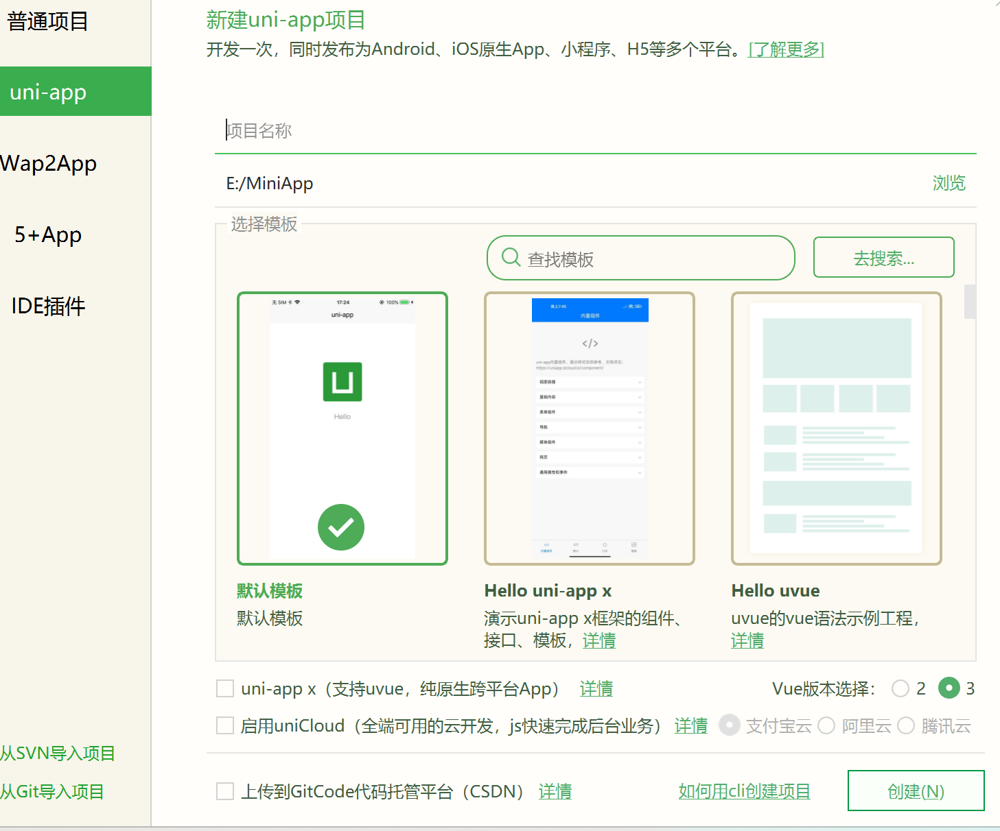

## 创建项目

1. 创建项目时，如果需要开发原生app，则勾选下面的uni-app x
2. 如果想用vue3的语法，则勾选下面的vue3



## 项目目录

```bash
┌─uniCloud              云空间目录，支付宝小程序云为uniCloud-alipay，阿里云为uniCloud-aliyun，腾讯云为uniCloud-tcb（详见uniCloud）
│─components            符合vue组件规范的uni-app x组件目录
│  └─comp-a.vue         可复用的a组件
├─utssdk                存放uts文件（已废弃）
├─pages                 业务页面文件存放的目录
│  ├─index
│  │  └─index.uvue      index页面
│  └─list
│     └─list.uvue       list页面
├─static                存放应用引用的本地静态资源（如图片、字体、音视频等）的目录，注意：静态资源都应存放于此目录  详见
├─uni_modules           存放uni_module 详见
├─platforms             存放各平台专用页面的目录，详见
├─nativeResources       App端原生资源目录
│  ├─android            Android原生资源目录 详见
|  └─ios                iOS原生资源目录 详见
├─harmonyConfig         HarmonyOS 端原生资源目录 详见
├─hybrid                App端存放web-view组件使用的本地html文件的目录，详见
├─wxcomponents          微信小程序平台wxml组件专用目录
├─unpackage             非工程代码，一般存放运行或发行的编译结果、App自定义基座。默认应配置git忽略
├─main.uts              Vue初始化入口文件
├─App.uvue              应用配置，用来配置App全局样式以及监听 详见
├─pages.json            配置页面路由、导航条、选项卡等页面类信息，详见
├─manifest.json         配置应用名称、appid、logo、版本等打包信息，详见
├─AndroidManifest.xml   Android原生应用清单文件 详见
├─Info.plist            iOS原生应用配置文件 详见
└─uni.scss              内置的常用样式变量
```

## 安装小程序工具

1. [微信小程序工具](https://developers.weixin.qq.com/miniprogram/dev/devtools/download.html)
2. [支付宝小程序工具](https://opendocs.alipay.com/mini/ide/download)
3. [抖音小程序工具](https://developer.open-douyin.com/docs-page)


