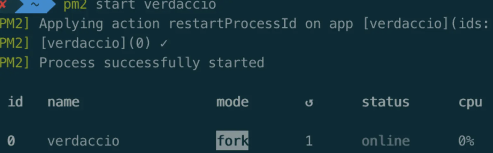
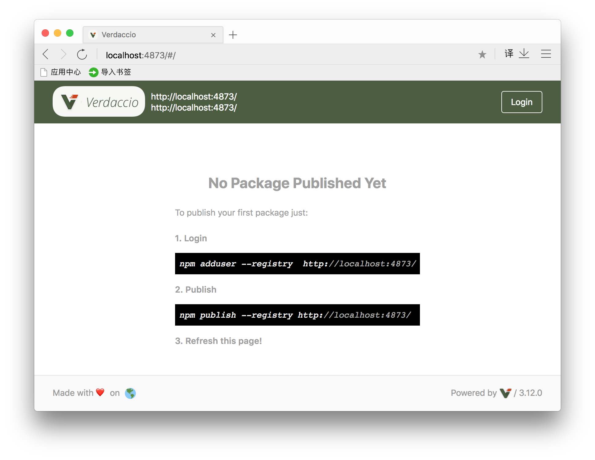
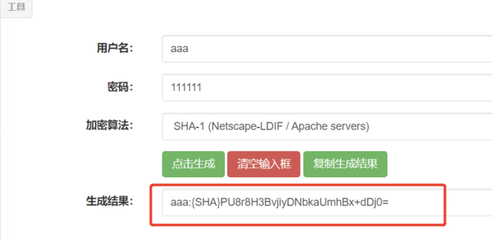
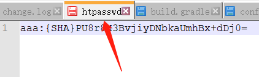
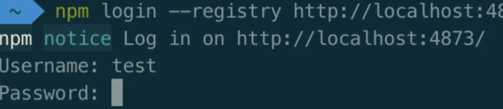
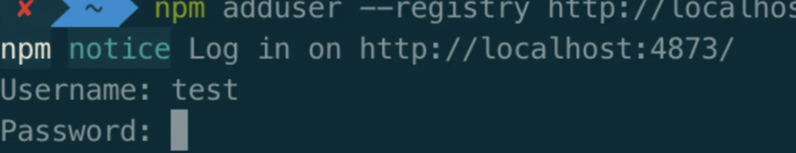
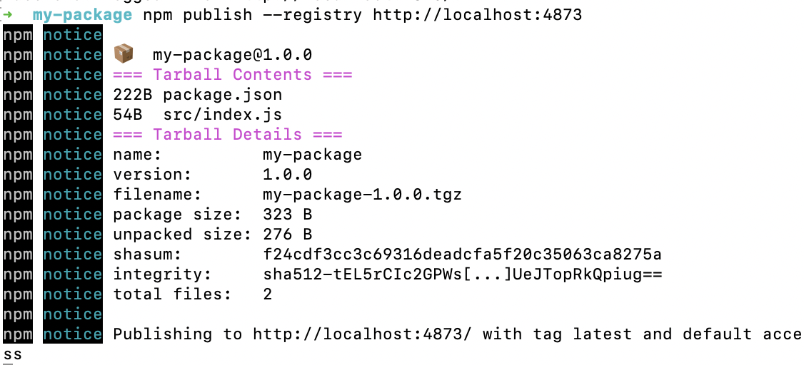
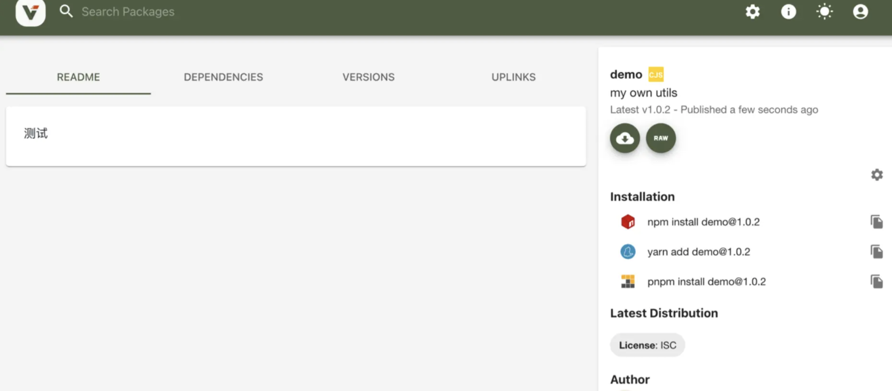
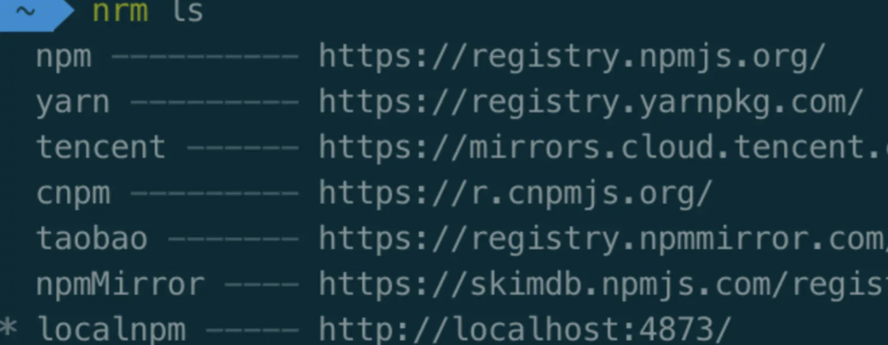
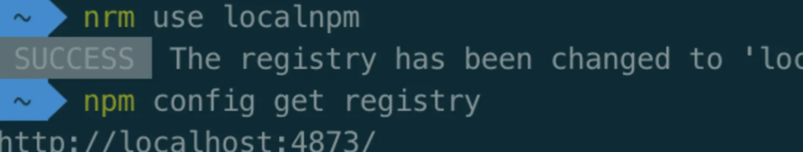

## 简介

### 为什么要搭建npm 服务器

-  公司内部开发的私有包，统一管理，方便开发和使用，也可以使用npm 的付费服务。

- 安全性：由于公司内部开发的模块和一些内容并不希望其他无关人员能够看到，但是又希望内部能方便使用。

### Verdaccio是什么

`Verdaccio`是一个 Node.js创建的轻量的私有npm代理注册源（proxy registry）。

通过Verdaccio搭建私有npm服务器有着以下优势：

- 零配置：无需安装数据库，基于[nodejs](https://link.juejin.cn/?target=https%3A%2F%2Fwww.zhihu.com%2Fsearch%3Fq%3Dnodejs%26search_source%3DEntity%26hybrid_search_source%3DEntity%26hybrid_search_extra%3D%7B%22sourceType%22%3A%22answer%22%2C%22sourceId%22%3A2745540660%7D)，安装及运行。
- 使用方便：将内部高复用的代码进行提取，方便在多个项目中引用。
- 安全性：仓库搭建在局域网内部，只针对内部人员使用。
- 权限管理：对发布和下载npm包配置权限管理。
- 加速包下载：将下载过的依赖包进行缓存，再次下载加快下载速度。

## 服务端搭设

### 安装Verdaccio以及pm2

1. 安装Verdacccio

   ```sh
   npm install  -g verdaccio
   ```

2. 安装pm2

   1. 通过命令行启动的话，如果终端停止了，那我们的服务器也就停止了，因此一般我们通过pm2启动守护进程

   2. ```sh
      npm install -g pm2
      pm2 start verdaccio
      ```

      

### 允许服务端通过任何IP访问

1. Verdaccio可能只绑定到`localhost`。修改配置文件（`~/.config/verdaccio/config.yaml`）

   ```sh
   # 将监听地址改为0.0.0.0（所有网络接口）
   listen: 0.0.0.0:4873
   ```

2. 保存后重启Verdaccio

   ```sh
   killall verdaccio  # 终止现有进程
   verdaccio          # 重新启动
   ```

   

### 设置防火墙

#### **如果是云服务器（如AWS/Azure/阿里云）**：

- 确保安全组（Security Group）开放了`4873`端口（入站规则）。

#### **本地服务器或物理机**：

- 关闭防火墙或开放端口（以Ubuntu为例）：

  ```sh
  sudo ufw allow 4873/tcp   # 允许4873端口
  sudo ufw reload           # 重新加载规则
  ```

- CentOS/RHEL：

  ```sh
  sudo firewall-cmd --zone=public --add-port=4873/tcp --permanent
  sudo firewall-cmd --reload
  ```

## 使用

1. 针对某个依赖安装时选用自己的源地址(推荐使用)

   ```sh
   # 例如安装demo依赖
   npm install demo --registry http://服务器IP地址:4873
   ```

2. 将项目源设置为本地服务器

   ```sh
   # 设置npm使用的源为本地私服
   npm set registry http://服务器IP地址:4873/
   ```

## 配置文件说明

在启动的时候，可以看到，进入配置文件【config.yaml 】的路径，其内容和说明如下：

```sh
#
# #号后面是注释

# 这是默认的配置文件。
# 它允许所有用户做任何事，所以不要在生产系统上使用它。
#
# 这里有更多配置文件的例子:
# https://github.com/verdaccio/verdaccio/tree/master/conf
#

# 所有包的缓存目录
storage: /Users/chenzimin/.local/share/verdaccio/storage
# 插件目录
plugins: ./plugins


#开启web 服务,能够通过web 访问
web:
  title: Verdaccio
  # 注释掉以禁用gravatar支持
  # gravatar: false
  # 默认情况下，包是orderer ascendant (asc|desc)
  # sort_packages: asc
  # 将你的UI转换成黑暗模式
  # darkMode: true
  # logo: http://somedomain/somelogo.png
  # 网站图标(favicon): http://somedomain/favicon.ico | /path/favicon.ico
  # rateLimit:
  #   windowMs: 1000
  #   max: 10000


#验证信息
auth:
  htpasswd:
    # 用户信息存储目录
    file: ./htpasswd
    # 允许注册的最大用户数，默认为“+inf”。
    # 您可以将此设置为-1以禁用注册。
    # max_users: 1000

# 可以联系的其他已知存储库列表
#公有仓库配置
uplinks:
  npmjs:
    url: https://registry.npmjs.org/

packages:
  '@*/*':
    # scoped packages
    access: $all
    publish: $authenticated
    unpublish: $authenticated
    
    #代理 表示没有的仓库会去这个npmjs 里面去找 ,
    #npmjs 又指向  https://registry.npmjs.org/ ,就是上面的 uplinks 配置
    proxy: npmjs

  '**':
    # 权限配置说明：
    # 允许所有用户(包括未经身份验证的用户)读取和发布所有包
    #
    # 你也可以指定用户名/组名配置访问权限，根据你的auth插件或者使用以下关键字配置权限：
    # "$all"， "$anonymous"， "$authenticated"
    access: $all

    # 发布package 的权限
    publish: $authenticated
    unpublish: $authenticated

    # 如果package 不存在,就向代理的上游服务发起请求
    proxy: npmjs

# You can specify HTTP/1.1 server keep alive timeout in seconds for incoming connections.
# A value of 0 makes the http server behave similarly to Node.js versions prior to 8.0.0, which did not have a keep-alive timeout.
# WORKAROUND: Through given configuration you can workaround following issue https://github.com/verdaccio/verdaccio/issues/301. Set to 0 in case 60 is not enough.
server:
  keepAliveTimeout: 60

middlewares:
  audit:
    enabled: true

# 监听的端口 ,重点, 不配置这个,只能本机能访问
listen: 0.0.0.0:4873
# http_proxy: http://代理服务器ip:8080
# https_proxy: http://代理服务器ip:8080
# no_proxy: localhost,127.0.0.1  #不适用代理的iP

# log settings
logs: { type: stdout, format: pretty, level: http }
```

### 常用配置详解

- $all 表示所有人(已注册、未注册)都可以执行对应的操作
- $authenticated 表示只有通过验证的人(已注册)可以执行对应操作，注意，任何人都可以去注册账户。
- $anonymous 表示只有匿名者可以进行对应操作（通常无用）
- 或者也可以指定对应于之前我们配置的用户表 htpasswd 中的一个或多个用户，这样就明确地指定哪些用户可以执行匹配的操作

### 端口和主机名

- localhost:4873 　　　　#默认
- 0.0.0.0:4873　　　　　#表示在所有网卡监听

### 修改配置文件后需重启

```sh
verdaccio -c config.yml
```

## 账号注册

### 说明

账号管理在 htpasswd文件中，和config.yaml的同一个目录，注册的账号都记录在该目录下。

### 添加账号

#### 在线生成器注册账号

因为添加账号只需要在线生成一个账号，账号管理在 htpasswd文件中和config.yaml的同一个目录下，添加账号只需要在线生成一个账号，加入到htpasswd中即可。

1. 生成

   htpasswd在线生成器：http://www.ab173.com/enc/htpasswd.php，加密算法选择 SHA-1 加密方式

   

2. 添加结果

   把生成结果加入到htpasswd

   

3. 登录

   ```sh
   npm login --registry http://localhost:4873
   ```

   

#### 命令行模式添加

但是大家都可以添加，不好管理（不推荐使用）

```sh
npm adduser --registry http://npm.szy.com:4873/
```

输入 username、password 以及 Email 即可。



## 上传私有包

### 上传

1. 在当前私有库下执行如下命令

   ```sh
   # 在当前私有仓库下执行
   npm publish --registry http://localhost:4873
   ```

   

2. 注意：

   - 当前私有仓库必须包含 package.json 文件
   - 每次发布的时候，都需要使用`npm version v1.x.x `更新版本，并且保证仓库是干净的

3. 上传成功后可在网页中，查看到上传的包

   

## 移除包

命令 `npm unpublish <package-name> --force` 用于从 npm 注册表中删除一个包。`--force` 标志允许你强制卸载，即使该包已发布超过 72 小时

```sh
// 删除特定版本
npm unpublish <package-name>@<version>

// 删除整个包（谨慎使用）：
npm unpublish <package-name> --force
```

请注意，如果你要删除整个包，必须使用 `--force` 标志。

**`从 npm 注册表中删除一个包意味着将该包从 npm 的在线存储库中移除，使其不再可供下载和使用。这意味着任何依赖于该包的项目将无法再获取或安装该包的版本。删除包通常用于修复错误或安全问题，但要谨慎操作，以免影响使用该包的其他开发者。`**

## 包名规范

在npm（Node Package Manager）中，包名前面带有`@`符号表示该包是一个范围包或者组织包

## 范围包（Scoped Packages）

当一个npm包以`@scope/name`的形式出现时，它标识这是一个有命名空间的包。`scope`是可选的命名空间前缀，用于区分不同组织、项目或个人的包。例如，`@mycompany/my-package`表明这个包属于`mycompany`这个组织或团队，并且包的实际名称是`my-package`。通过这种方式，可以避免全局包名空间中的命名冲突。

## 组织包（Organization Packages）

类似地，许多开源组织或公司在npm上拥有自己的组织账户，发布的包也会带有组织名作为前缀，比如 `@angular/router` 或 `@vue/cli` 等。这些包都是相应组织管理并发布的官方组件或工具。

因此，`@`符号在npm中不仅用作版本控制时指定版本范围（如 `npminstall react-router@2.8.1`），还用来创建和管理具有特定命名空间的包。 

## nrm管理镜像源地址

我们想切换到淘宝或者其他的镜像地址，来回切换过于麻烦。

我们可以通过`nrm`这个工具来管理我们的源地址，可以查看和切换地址

```
npm install -g nrm
```

安装后我们可以通过`nrm add [name] [address]`这个命令来新增一个源地址：

```
# 例如增加名为localnpm的源地址http://localhost:4873/
nrm add localnpm http://localhost:4873/
```

使用`nrm ls`可以查看我们使用的所有源地址，带`*`是正在使用的地址



通过`nrm use [name]`来切换地址




