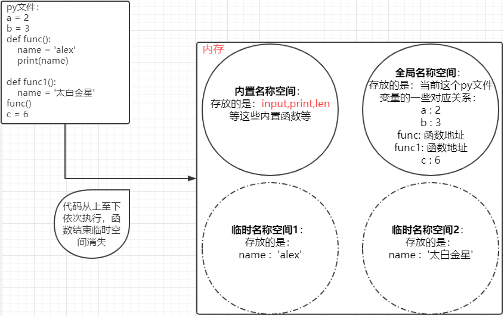
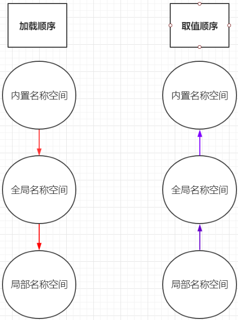

## 函数结构

1. def 关键词开头，空格之后接函数名称和圆括号()，最后还有一个":"。
2. def 是固定的，不能变，他就是定义函数的关键字。
3. 空格 为了将def关键字和函数名分开，必须空(四声)，当然可以空2格、3格或者你想空多少都行，一般是空1格。
4. 函数名：函数名只能包含字符串、下划线和数字且不能以数字开头。虽然函数名可以随便起，但我们给函数起名字还是要尽量简短，并且要具有可描述性
5. 括号：是必须加的
6. 下面的函数体一定全部都要缩进，这代表是这个函数的代码。

```python
def 函数名():

    函数体
```

## 调用

使用函数名加小括号就可以调用了

```python
def printInfo():
    print("这是你所要输出的信息")
printInfo()
```

## 返回值

使用return关键字进行返回

:::tip

1. 遇到return,函数结束,return下面的（函数内）的代码不会执行。
2. return 会给函数的执行者返回值。
   1. 如果return后面什么都不写，或者函数中没有return,则返回的结果是None
   2. 如果return后面写了一个值,返回给调用者这个值
   3. 如果return后面写了多个结果,,返回给调用者一个tuple(元组),调用者可以直接使用元组的解构获取多个变量。

:::

## 参数

函数的传参就是函数将实际参数交给形式参数的过程.

### 分类

#### 实参

在函数调用的时候给函数传递的值.加实参,实际执行的时候给函数传递的信息.表示给函数xxx

#### 形参

写在函数声明的位置的变量叫形参,形式上的一个完整.表示这个函数需要xxx

```python
def date(sex):  # 函数定义时(参数) 这个就是形参
    print('设置筛选条件：性别: %s' %sex)

date('女')  # 函数执行时(参数) 这个就是参
```

### 实参

#### 位置参数

位置参数就是从左至右，实参与形参一一对应。

```python
def date(sex, age, hobby):
    print('设置筛选条件：性别: %s，年龄：%s,爱好：%s' %(sex, age, hobby))
date('女','25~30','唱歌')
```

#### 关键字参数

相对于位置参数需要一一对应，关键字参数不需要记住每个参数的位置. 只要记住每个参数的名字就可以了

```python
def date(sex, age, hobby):
    print('设置筛选条件：性别: %s，年龄：%s,爱好：%s' %(sex, age, hobby))
date(hobby='唱歌',sex='女',age='25~30',)
```

#### 混合参数

可以把位置参数和关键字参数混着用，也就是说在调用函数的时候即可以给出位置参数, 也可以指定关键字参数.

**混合参数一定要记住：关键字参数一定在位置参数后面。**

```python
def date(sex, age, hobby):
    print('设置筛选条件：性别: %s，年龄：%s,爱好：%s' %(sex, age, hobby))
date('女',hobby='唱歌',age='25~30',)
```

:::tip 总结

1. 位置参数 
2. 关键字参数 
3. 混合参数,  位置参数必须在关键字参数前面

:::

### 形参

#### 位置参数

```python
def date(sex, age, hobby):
    print('设置筛选条件：性别: %s，年龄：%s,爱好：%s' %(sex, age, hobby))
date('女','25~30','唱歌')
```

#### 默认值参数

```python
def stu_info(name, age, sex='男'):   
    print("录入学生信息")
    print(name, age, sex)   
    print("录入完毕")
stu_info("张强", 18)
```

:::tip 注意

必须先声明在位置参数,才能声明关键字参数

综上:在形参的角度来看

1. 位置参数
2. 默认认值参数(大多数传进来的参数都是一样的, 一般用默认参数)

**无论是位置参数，还是默认参数，函数调用时传入多少实参，我必须写等数量的形参去对应接收， 如果不这样，那么就会报错**

```python
def eat(a,b,c,):
print('我请你吃：',a,b,c) 
eat('蒸羊羔','蒸熊掌','蒸鹿尾儿','烧花鸭') # 报错
```

:::

#### 动态参数

动态参数分为两种:动态接受位置参数 *args，动态接收关键字参数**kwargs.

##### **动态接收位置参数：*args**

可以接收多个实参，并返回一个包含这些实参的元组

```python
def eat(*args):
	print('我请你吃：',args)
eat('蒸羊羔儿','蒸熊掌','蒸鹿尾儿','烧花鸭','烧雏鸡','烧子鹅')
# 运行结果：
#我请你吃： ('蒸羊羔儿', '蒸熊掌', '蒸鹿尾儿', '烧花鸭', '烧雏鸡', '烧子鹅')
```

:::tip 说明

首先来说args，args就是一个普通的形参，但是如果你在args前面加一个星号，那么就拥有了特殊的意义：

在python中除了表示乘号，他是有魔法的。*+args，这样设置形参，那么这个形参会将实参所有的位置参数接收，放置在一个元组中，并将这个元组赋值给args这个形参，

**`这里起到魔法效果的是 * 而不是args，a也可以达到刚才效果`**，

但是我们PEP8规范中规定就使用args，约定俗成的。

:::

练习：传入函数中数量不定的int型数据，函数计算所有数的和并返回

```python
def my_max(*args):
  n = 0
  for i in args:
    n += i
return n
```

##### **动态接收关键字参数: \**kwargs**

 实参角度有位置参数和关键字参数两种，python中既然有*args可以接受所有的位置参数那么肯定也有一种参数接受所有的关键字参数，那么这个就是**kwargs，同理这个**是具有魔法用法的，kwargs约定俗成使用作为形参。举例说明：**kwargs，是接受所有的关键字参数然后将其转换成一个字典赋值给kwargs这个形参

```python
def func(**kwargs):
  print(kwargs) # {'name': '太白金星', 'sex': '男'}
func(name='太白金星',sex='男')
```

```python
def func(*args,**kwargs):
    print(args) # ('蒸羊羔儿', '蒸熊掌', '蒸鹿尾儿')
    print(kwargs) # {'name': '太白金星', 'sex': '男'}
func('蒸羊羔儿', '蒸熊掌', '蒸鹿尾儿',name='太白金星',sex='男')
```

如果一个参数设置了动态参数，那么他可以接受所有的位置参数，以及关键字参数，这样就会大大提升函数拓展性，针对于实参参数较多的情况下，解决了一一对应的麻烦。

#### 仅限关键字参数

仅限关键字参数是python3x更新的新特性，他的位置要放在*args后面，**kwargs前面（如果有**kwargs），也就是默认参数的位置，它与默认参数的前后顺序无所谓，它只接受关键字传的参数：

```python
# 这样传参是错误的，因为仅限关键字参数c只接受关键字参数
def func(a,b,*args,c):
  print(a,b) # 1 2
  print(args) # (4, 5)
# func(1, 2, 3, 4, 5)
# 这样就正确了：
def func(a,b,*args,c):
  print(a,b) # 1 2
  print(args) # (3, 4)
  print(5)
func(1, 2, 3, 4, c=5)
```

这个仅限关键字参数从名字定义就可以看出他只能通过关键字参数传参，其实可以把它当成不设置默认值的默认参数而且必须要传参数，不传就报错。

所以形参角度的所有形参的最终顺序为：**位置参数，\*args，默认参数，仅限关键字参数，\**kwargs。**

```python
课间考一道题：
def foo(a,b,*args,c,sex=None,**kwargs):
  print(a,b)
  print(c)
  print(sex)
  print(args)
  print(kwargs)
# foo(1,2,3,4,c=6)
# foo(1,2,sex='男',name='alex',hobby='old_woman')
# foo(1,2,3,4,name='alex',sex='男')
# foo(1,2,c=18)
# foo(2, 3, [1, 2, 3],c=13,hobby='喝茶')
# foo(*[1, 2, 3, 4],**{'name':'太白','c':12,'sex':'女'})
```

### *的其他使用

#### 聚合

给其前面加一个* 那么args可以接受多个实参，并且返回一个元组

**kwargs也是同理将多个关键字参数转化成一个字典返回

所以在函数的定义时： *起到的是聚合的作用

#### 打散

将每个实参传过来的参数，进行打散，然后再传递，相当于数组的一维化

```python
s1 = 'alex'
l1 = [1, 2, 3, 4]
tu1 = ('武sir', '太白', '女神',)
def func(*args):
    print(args) # ('a', 'l', 'e', 'x', 1, 2, 3, 4, '武sir', '太白', '女神')
func(*s1,*l1,*tu1)
```

如果不加*号，直接传，就是如下结果

```python
s1 = 'alex'
l1 = [1, 2, 3, 4]
tu1 = ('武sir', '太白', '女神',)
def func(*args):
    print(args) # ('alex', [1, 2, 3, 4], ('武sir', '太白', '女神'))
func(s1,l1,tu1)
```

我将你位置参数的实参（可迭代类型）前面加上，相当于将这些实参给拆解成一个一个的组成元素当成位置参数，然后传给args,这时候这个好像取到的是打散的作用。所以在函数的执行时：，**起到的是打散的作用

```python
dic1 = {'name': '太白', 'age': 18}
dic2 = {'hobby': '喝茶', 'sex': '男'}
def func(**kwargs):
    print(kwargs) # {'name': '太白', 'age': 18, 'hobby': '喝茶', 'sex': '男'}
func(**dic1,**dic2)
```

#### 处理剩下的元素

*除了在函数中可以这样打散，聚合外，函数外还可以灵活的运用：

```python
# 之前讲过的分别赋值
a,b = (1,2)
print(a, b) # 1 2
# 其实还可以这么用：
a,*b = (1, 2, 3, 4,)
print(a, b) # 1 [2, 3, 4]
*rest,a,b = range(5)
print(rest, a, b) # [0, 1, 2] 3 4
print([1, 2, *[3, 4, 5]]) # [1, 2, 3, 4, 5]
```

### 形参的顺序

首先，位置参数，与默认参数他两个的顺序我们昨天已经确定了，**`位置参数必须在前面，即 ：位置参数，默认参数`**。

那么动态参数*args，**kwargs放在哪里呢？

动态参数*args，肯定不能放在位置参数前面，这样我的位置参数的参数就接收不到具体的实参了：

```python
# 这样位置参数a,b始终接收不到实参了，因为args全部接受完了
def func(*args,a,b,sex='男'):
  print(args)
  print(a,b)
func(1, 2, 3, 4, 5)
```

那么动态参数必须在位置参数后面，他可以在默认参数后面么？

```python
# 这样也不行，我的实参的第三个参数始终都会将sex覆盖掉，这样失去了默认参数的意义。
def func(a,b,sex='男',*args,):
  print(args) # (4, 5)
  print(sex) # 3
  print(a,b) # 1 2
func(1, 2, 3, 4, 5)
```

所以*args一定要在位置参数与默认值参数中间：**位置参数，\*args，默认参数**。

那么我的**kwargs放在哪里？**kwargs可以放在默认参数前面么？

```python
# 直接报错：因为**kwargs是接受所有的关键字参数，如果你想改变默认参数sex，你永远也改变不了，因为
# 它会先被**kwargs接受。
def func(a,b,*args,**kwargs,sex='男',):
    print(args) # (4, 5)
    print(sex) # 3
    print(a,b) # 1 2
    print(kwargs)
func(1, 2, 3, 4, 5)
```

:::tip 参数的位置顺序

所以截止到此：所有形参的顺序为：**位置参数，\*args，默认参数，\**kwargs。**

:::

## 名称空间

### 分类

从Python解释器开始执行之后，就在内存中开辟里一个空间，每当遇到一个变量的时候，就把变量名和值之间对应的关系记录下来，但是当遇到函数定义的时候，解释器只是象征性的将函数名读如内存，表示知道这个函数存在了，至于函数内部的变量和逻辑，解释器根本不关心。

 等执行到函数调用的时候，Python解释器会再开辟一块内存来储存这个函数里面的内容，这个时候，才关注函数里面有哪些变量，而函数中的变量回储存在新开辟出来的内存中，函数中的变量只能在函数内部使用，并且会随着函数执行完毕，这块内存中的所有内容也会被清空。

我们给这个‘存放名字与值的关系’的空间起了一个名字-------**命名空间**。

代码在运行伊始，创建的存储“变量名与值的关系”的空间叫做**全局命名空间**；

在函数的运行中开辟的临时的空间叫做局部命名空间也叫做**临时名称空间**

其实python还有一个空间叫做**内置名称空间**：内置名称空间存放的就是一些内置函数等拿来即用的特殊的变量：input，print，list等等



:::tip总结

1. 全局命名空间--> 我们直接在py文件中, 函数外声明的变量都属于全局命名空间

2. 局部命名空间--> 在函数中声明的变量会放在局部命名空间

3. 内置命名空间--> 存放python解释器为我们提供的名字, list, tuple, str, int这些都是内置命名空间

:::

### 加载顺序

这三个空间的加载顺序为：内置命名空间(程序运行伊始加载)->全局命名空间(程序运行中：从上到下加载)->局部命名空间(程序运行中：调用时才加载)

### 取值顺序

1. 如果你在全局名称空间引用一个变量，先从全局名称空间引用，全局名# 称空间如果没有，才会向内置名称空间引用。
2. 如果你在局部名称空间引用一个变量，先从局部名称空间引用，
3. 局部名称空间如果没有，才会向全局名称空间引用，全局名称空间在没有，就会向内置名称空间引用。

所以空间的取值顺序与加载顺序是相反的，取值顺序满足的就近原则，从小范围到大范围一层一层的逐步引用。

```python
# 如果你在全局名称空间引用一个变量，先从全局名称空间引用，全局名# 称空间如果没有，才会向内置名称空间引用。
input = 666
print(input) # 666
# 如果你在局部名称空间引用一个变量，先从局部名称空间引用，
# 局部名称空间如果没有，才会向全局名称空间引用，全局名称空间在没有，就会向内置名称空间引用。
input = 666
print(input) # 666
input = 666
def func():
    input = 111
    print(input) # 111
func()
```



## 作用域

作用域就是作用范围, 按照生效范围来看分为全局作用域和局部作用域

全局作用域: 包含内置命名空间和全局命名空间. 在整个文件的任何位置都可以使用(遵循 从上到下逐⾏执行).

局部作用域: 在函数内部可以使用.

作⽤域命名空间:

 **1. 全局作用域: 全局命名空间 + 内置命名空间**

 **2. 局部作⽤域: 局部命名空间**

### 内置函数globals(),locals()

这两个内置函数放在这里讲是在合适不过的，他们就直接可以反映作用域的内容，有助于我们理解作用域的范围。

globals(): 以字典的形式返回全局作用域所有的变量对应关系。

locals(): 以字典的形式返回当前作用域的变量的对应关系。

```python
# 在全局作用域下打印，则他们获取的都是全局作用域的所有的内容。
a = 2
b = 3
print(globals())
print(locals())
'''
{'__name__': '__main__', '__doc__': None, '__package__': None,
'__loader__': <_frozen_importlib_external.SourceFileLoader object at 0x000001806E50C0B8>, 
'__spec__': None, '__annotations__': {},
'__builtins__': <module 'builtins' (built-in)>, 
'__file__': 'D:/lnh.python/py project/teaching_show/day09~day15/function.py',
'__cached__': None, 'a': 2, 'b': 3}
'''

# 在局部作用域中打印。
a = 2
b = 3
def foo():
    c = 3
    print(globals()) # 和上面一样，还是全局作用域的内容
    print(locals()) # {'c': 3}
foo()
```

## 函数的嵌套

```python
# 例1：
def func1():
    print('in func1')
    print(3)
def func2():
    print('in func2')
    print(4)
func1()
print(1)
func2()
print(2)

# 例2：
def func1():
    print('in func1')
    print(3)
def func2():
    print('in func2')
    func1()
    print(4)
print(1)
func2()
print(2)
# 例3：
def fun2(): 
    print(2) 
    def fun3(): 
        print(6) 
    print(4) 
    fun3() 
    print(8)
print(3)
fun2()
print(5)
```

##  关键字：global、nonlocal

### global

局部作用域对全局作用域的变量（此变量只能是不可变的数据类型）只能进行引用，而不能进行改变，只要改变就会报错，但是有些时候，我们程序中会遇到局部作用域去改变全局作用域的一些变量的需求，这怎么做呢？这就得用到关键字global：
global第一个功能：在局部作用域中可以更改全局作用域的变量

```python
count = 1
def search():
    global count
    count = 2
search()
print(count)
```

利用global在局部作用域也可以声明一个全局变量。

```python
def func():
    global a
    a = 3
func()
print(a)
```

:::tip global关键字的两个作用

1. 声明一个全局变量。
2. 在局部作用域想要对全局作用域的全局变量进行修改时，需要用到 global(限于字符串，数字)

:::

#### nonlocal

nonlocal是python3x新加的功能，与global用法差不多，就是在局部作用域如果想对父级作用域的变量进行改变时，需要用到nonlocal，当然这个用的不是很多，了解即可。

```python
def add_b():
    b = 42
    def do_global():
        b = 10
        print(b)
        def dd_nonlocal():
            nonlocal b
            b = b + 20
            print(b)
        dd_nonlocal()
        print(b)
    do_global()
    print(b)
add_b()

nonlocal关键字举例
```

:::tip nonlocal的总结：

1. 不能更改全局变量。
2. 在局部作用域中，对父级作用域（或者更外层作用域非全局作用域）的变量进行引用和修改，并且引用的哪层，从那层及以下此变量全部发生改变。

:::


