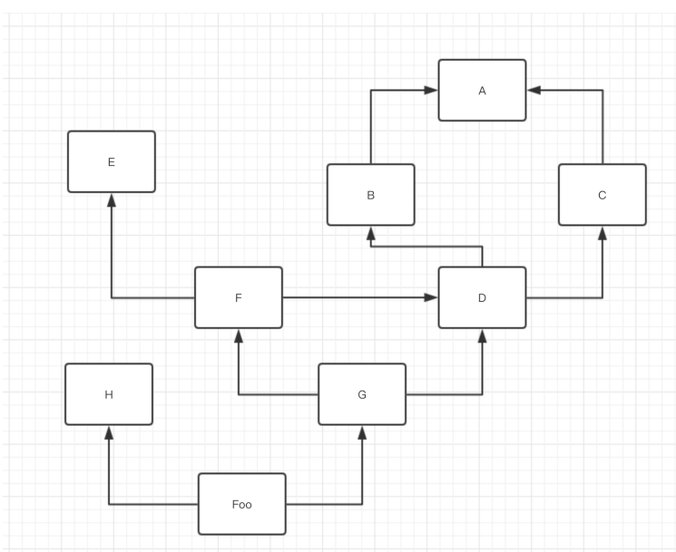
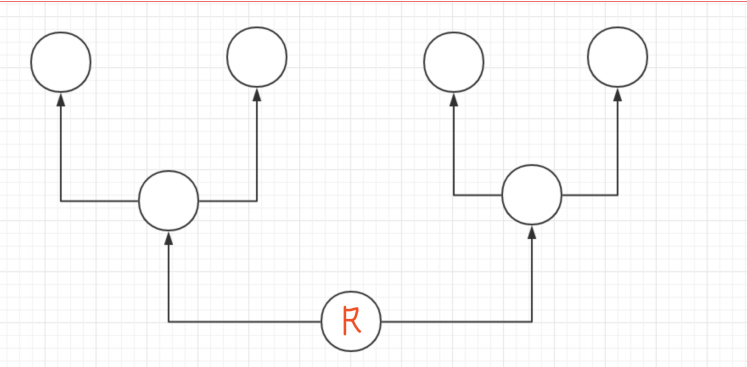
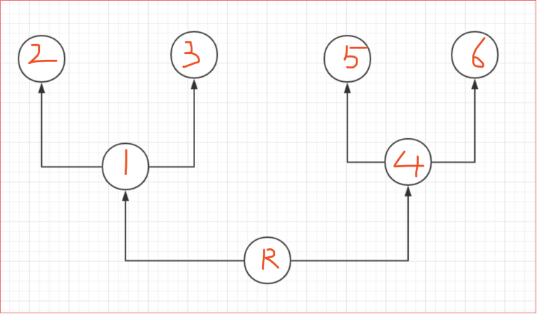
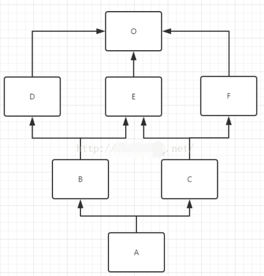

## 前言

**python面向对象的三大特性：继承，封装，多态。**

**1. 封装:** 
把很多数据封装到⼀个对象中. `把固定功能的代码封装到⼀个代码块, 函数, 对象, 打包成模块`. 这都属于封装的思想. 
在⾯向对象思想中. 是把⼀些看似⽆关紧要的内容组合到⼀起统⼀进⾏存储和使⽤. 这就是封装. 

**2. 继承:** 
`⼦类可以⾃动拥有⽗类中除了私有属性外的其他所有内容`. 说⽩了, ⼉⼦可以随便⽤父类的东⻄.
 ⼀定要认清楚⼀个事情. `必须先有爹, 后有⼉⼦. 顺序不能乱`, 
在python中`实现继承非常简单. 在声明类的时候, 在类名后⾯添加⼀个⼩括号,就可以完成继承关系`. 

那么什么情况可以使⽤继承呢? 单纯的从代码层⾯上来看. 两个类具有相同的功能或者特征的时候. 可以采⽤继承的形式. 提取⼀个⽗类, 这个⽗类中编写着两个类相同的部分. 然后两个类分别取继承这个类就可以了. 

这样写的好处是我们可以避免写很多重复的功能和代码. 如果从语义中去分析的话. 会简单很多. 如果语境中出现了x是⼀种y. 这时, y是⼀种泛化的概念. x比y更加具体. 那这时x就是y的⼦类. 

比如. 猫是⼀种动物. 猫继承动物. 动物能动. 猫也能动. 这时猫在创建的时候就有了动物的"动"这个属性. 

再比如, ⽩骨精是⼀个妖怪. 妖怪天⽣就有⼀个比较不好的功能叫"吃⼈", ⽩骨精⼀出⽣就知道如何"吃⼈". 此时 ⽩骨精继承妖精.

**3. 多态:** 

同⼀个对象, 多种形态. 
这个在python中其实是很不容易说明⽩的. 因为我们⼀直在⽤. 只是没有具体的说. 
比如. 我们创建⼀个变量a = 10 , 我们知道此时a是整数类型. 
但是我们可以通过程序让a = "alex", 这时, a⼜变成了字符串类型. 这是我们都知道的. 
但是, 我要告诉你的是. 这个就是多态性. 同⼀个变量a可以是多种形态。

## 继承

比较官方的说法就是：

继承（英语：inheritance）是面向对象软件技术当中的一个概念。如果一个类别A“继承自”另一个类别B，就把这个A称为“B的子类别”，而把B称为“A的父类别”也可以称“B是A的超类”。

继承可以使得子类别具有父类别的各种属性和方法，而不需要再次编写相同的代码。

在令子类别继承父类别的同时，可以重新定义某些属性，并重写某些方法，即覆盖父类别的原有属性和方法，使其获得与父类别不同的功能。

另外，为子类别追加新的属性和方法也是常见的做法。 一般静态的面向对象编程语言，继承属于静态的，意即在子类别的行为在编译期就已经决定，无法在执行期扩充。

字面意思就是：子承父业，合法继承家产，就是如果你是独生子，而且你也很孝顺，不出意外，你会继承你父母所有家产，他们的所有财产都会由你使用（败家子儿除外）。

那么用一个例子来看一下继承：

```python
# 继承的用法：
class Aniaml(object):
    def __init__(self, name, sex, age):
        self.name = name
        self.age = age
        self.sex = sex


class Person(Aniaml):
    def __init__(self, name, sex, age, className='暂未分配班级'):
        super().__init__(name, sex, age)
        self.className = className


p1 = Person('张三', '男', 12, '一班')
print(p1.name)
print(p1.className)

```

继承的优点也是显而易见的：

1，增加了类的耦合性（耦合性不宜多，宜精）。

2，减少了重复代码。

3，使得代码更加规范化，合理化。

## 继承的分类

### 说明

继承：可以分**单继承，多继承**。

这里需要补充一下python中类的种类（继承需要）：

在python2x版本中存在两种类.：

1. ⼀个叫**经典类**. 在python2.2之前. ⼀直使⽤的是经典类. 经典类在基类的根如果什么都不写.
2. ⼀个叫**新式类**. 在python2.2之后出现了新式类. 新式类的特点是基类的根是object类。

python3x版本中只有一种类：

1. python3中使⽤的都是**新式类**. 如果基类谁都不继承. 那这个类会默认继承 object

| 继承类型     | 写法                             | 关键点                     |
| :----------- | :------------------------------- | :------------------------- |
| **单继承**   | `class Child(Parent):`           | 使用 `super().__init__()`  |
| **多继承**   | `class Child(Parent1, Parent2):` | 注意多重继承顺序(MRO)      |
| **多层继承** | `class GrandChild(Child):`       | 多层 `super()` 调用        |
| **抽象基类** | `class Child(ABC):`              | 必须实现 `@abstractmethod` |

### 单继承

#### 基础使用

1. 用法

   1. 使用`class Child(Parent):`定义
   2. 使用 `super().__init__()`调用父类初始化方法

2. 代码

   ```python
   # 继承的用法：
   class Aniaml(object):
       def __init__(self, name, sex, age):
           self.name = name
           self.age = age
           self.sex = sex
   
   
   class Person(Aniaml):
       def __init__(self, name, sex, age, className='暂未分配班级'):
           super().__init__(name, sex, age)
           self.className = className
   
   p1 = Person('张三', '男', 12, '一班')
   print(p1.name)
   print(p1.className)
   ```

#### 子类没有、调用父类方法

```python
# 1
class Base:
    def __init__(self, num):
        self.num = num
    def func1(self):
        print(self.num)

class Foo(Base):
    pass
obj = Foo(123)
obj.func1() # 123 运⾏的是Base中的func1  
```

#### 子类有，优先用子类

```python
# 2      
class Base:
    def __init__(self, num):
        self.num = num
    def func1(self):
        print(self.num)
class Foo(Base):
    def func1(self):
        print("Foo. func1", self.num)
obj = Foo(123)
obj.func1() # Foo. func1 123 运⾏的是Foo中的func1   
```

#### 父(子)类有，子(父)类没有

```python
# 4
class Base:
    def __init__(self, num):
        self.num = num
    def func1(self):
        print(self.num)
        self.func2()
    def func2(self):
        print("Base.func2")
class Foo(Base):
    def func2(self):
    print("Foo.func2")
obj = Foo(123)
obj.func1() # 123 Foo.func2 func1是Base中的 func2是⼦类中的 
```

#### 函数名当作元素

```python
# 再来
class Base:
    def __init__(self, num):
        self.num = num
    def func1(self):
        print(self.num)
        self.func2()
    def func2(self):
        print(111, self.num)
class Foo(Base):
    def func2(self):
        print(222, self.num)
lst = [Base(1), Base(2), Foo(3)]
for obj in lst:
    obj.func2() # 111 1 | 111 2 | 222 3
```

#### 链式调用

```python
# 再来
class Base:
    def __init__(self, num):
        self.num = num
    def func1(self):
        print(self.num)
        self.func2()
    def func2(self):
        print(111, self.num)
class Foo(Base):
    def func2(self):
        print(222, self.num)
lst = [Base(1), Base(2), Foo(3)]
for obj in lst:
 obj.func1()
```

### 多继承

```python
class ShenXian: # 神仙
    def fei(self):
        print("神仙都会⻜")
class Monkey: # 猴
    def chitao(self):
        print("猴⼦喜欢吃桃⼦")
class SunWukong(ShenXian, Monkey): # 孙悟空是神仙, 同时也是⼀只猴
    pass
sxz = SunWukong() # 孙悟空
sxz.chitao() # 会吃桃⼦
sxz.fei() # 会⻜
```

此时, 孙悟空是⼀只猴⼦, 同时也是⼀个神仙. 那孙悟空继承了这两个类. 孙悟空⾃然就可以执⾏这两个类中的⽅法. 多继承⽤起来简单. 也很好理解. 但是多继承中, 存在着这样⼀个问题. 当两个⽗类中出现了重名⽅法的时候. 这时该怎么办呢? 这时就涉及到如何查找⽗类⽅法的这么⼀个问题.即MRO(method resolution order) 问题. 在python中这是⼀个很复杂的问题. 因为在不同的python版本中使⽤的是不同的算法来完成MRO的.

这里需要补充一下python中类的种类（继承需要）：

在python2x版本中存在两种类.：
　　⼀个叫**经典类**. 在python2.2之前. ⼀直使⽤的是经典类. 经典类在基类的根如果什么都不写.
　　⼀个叫**新式类**. 在python2.2之后出现了新式类. 新式类的特点是基类的根是object类。
python3x版本中只有一种类：
python3中使⽤的都是**新式类**. 如果基类谁都不继承. 那这个类会默认继承 object

### 经典类的多继承

虽然在python3中已经不存在经典类了. 但是经典类的MRO最好还是学⼀学. 这是⼀种树形结构遍历的⼀个最直接的案例. 在python的继承体系中. 我们可以把类与类继承关系化成⼀个树形结构的图. 来, 上代码:

```python
class A:
    pass
class B(A):
    pass
class C(A):
    pass
class D(B, C):
    pass
class E:
    pass
class F(D, E):
    pass
class G(F, D):
    pass
class H:
    pass
class Foo(H, G):
    pass
```

对付这种mro画图就可以：



继承关系图已经有了. 那如何进⾏查找呢? 记住⼀个原则. 在经典类中采⽤的是深度优先，遍历⽅案. 什么是深度优先. 就是⼀条路走到头. 然后再回来. 继续找下⼀个.



图中每个圈都是准备要送鸡蛋的住址. 箭头和⿊线表⽰线路. 那送鸡蛋的顺序告诉你入⼝在最下⾯R. 并且必须从左往右送. 那怎么送呢?



如图. 肯定是按照123456这样的顺序来送. 那这样的顺序就叫深度优先遍历. ⽽如果是142356呢? 这种被称为⼴度优先遍历. 好了. 深度优先就说这么多. 那么上⾯那个图怎么找的呢? MRO是什么呢? 很简单. 记住. 从头开始. 从左往右. ⼀条路跑到头, 然后回头. 继续⼀条路跑到头. 就是经典类的MRO算法. 

类的MRO: Foo-> H -> G -> F -> E -> D -> B -> A -> C. 你猜对了么?

### 新式类的多继承

#### mro序列

MRO是一个有序列表L，在类被创建时就计算出来。
通用计算公式为：

```python
mro(Child(Base1，Base2)) = [ Child ] + merge( mro(Base1), mro(Base2), [ Base1, Base2] )
（其中Child继承自Base1, Base2）
```

如果继承至一个基类：class B(A)
这时B的mro序列为

```python
mro( B ) = mro( B(A) )
= [B] + merge( mro(A) + [A] )
= [B] + merge( [A] + [A] )
= [B,A]
```

如果继承至多个基类：class B(A1, A2, A3 …)
这时B的mro序列

```python
mro(B) = mro( B(A1, A2, A3 …) )
= [B] + merge( mro(A1), mro(A2), mro(A3) ..., [A1, A2, A3] )
= ...
```

计算结果为列表，列表中至少有一个元素即类自己，如上述示例[A1,A2,A3]。merge操作是C3算法的核心。

#### 表头和表尾

表头：
　　列表的第一个元素

表尾：
　　列表中表头以外的元素集合（可以为空）

示例
　　列表：[A, B, C]
　　表头是A，表尾是B和C

#### **列表之间的+操作**

+操作：

[A] + [B] = [A, B]
（以下的计算中默认省略）
\---------------------

merge操作示例：

```python
如计算merge( [E,O], [C,E,F,O], [C] )
有三个列表 ：  ①      ②          ③

1 merge不为空，取出第一个列表列表①的表头E，进行判断                              
   各个列表的表尾分别是[O], [E,F,O]，E在这些表尾的集合中，因而跳过当前当前列表
2 取出列表②的表头C，进行判断
   C不在各个列表的集合中，因而将C拿出到merge外，并从所有表头删除
   merge( [E,O], [C,E,F,O], [C]) = [C] + merge( [E,O], [E,F,O] )
3 进行下一次新的merge操作 ......
```



#### 计算mro(A)方式

```python
mro(A) = mro( A(B,C) )

原式= [A] + merge( mro(B),mro(C),[B,C] )

  mro(B) = mro( B(D,E) )
         = [B] + merge( mro(D), mro(E), [D,E] )  # 多继承
         = [B] + merge( [D,O] , [E,O] , [D,E] )  # 单继承mro(D(O))=[D,O]
         = [B,D] + merge( [O] , [E,O]  ,  [E] )  # 拿出并删除D
         = [B,D,E] + merge([O] ,  [O])
         = [B,D,E,O]

  mro(C) = mro( C(E,F) )
         = [C] + merge( mro(E), mro(F), [E,F] )
         = [C] + merge( [E,O] , [F,O] , [E,F] )
         = [C,E] + merge( [O] , [F,O]  ,  [F] )  # 跳过O，拿出并删除
         = [C,E,F] + merge([O] ,  [O])
         = [C,E,F,O]

原式= [A] + merge( [B,D,E,O], [C,E,F,O], [B,C])
    = [A,B] + merge( [D,E,O], [C,E,F,O],   [C])
    = [A,B,D] + merge( [E,O], [C,E,F,O],   [C])  # 跳过E
    = [A,B,D,C] + merge([E,O],  [E,F,O])
    = [A,B,D,C,E] + merge([O],    [F,O])  # 跳过O
    = [A,B,D,C,E,F] + merge([O],    [O])
    = [A,B,D,C,E,F,O]
```

结果OK. 那既然python提供了. 为什么我们还要如此⿇烦的计算MRO呢? 因为笔
试.......你在笔试的时候, 是没有电脑的. 所以这个算法要知道. 并且简单的计算要会. 真是项⽬
开发的时候很少有⼈这么去写代码.

这个说完了. 那C3到底怎么看更容易呢? 其实很简单. C3是把我们多个类产⽣的共同继
承留到最后去找. 所以. 我们也可以从图上来看到相关的规律. 这个要⼤家⾃⼰多写多画图就
能感觉到了. 但是如果没有所谓的共同继承关系. 那⼏乎就当成是深度遍历就可以了

### 多层继承

1. ElectricCar 继承字Car， Car继承自Vehicle

2. ```python
   class Vehicle:
       """交通工具基类"""
       def __init__(self, brand, model):
           self.brand = brand
           self.model = model
           self.speed = 0
       
       def start(self):
           return f"{self.brand} {self.model} 启动"
       
       def stop(self):
           self.speed = 0
           return "已停止"
   
   class Car(Vehicle):
       """汽车类 - 继承Vehicle"""
       def __init__(self, brand, model, doors):
           super().__init__(brand, model)
           self.doors = doors
           self.fuel = 100
       
       def refuel(self, amount):
           self.fuel += amount
           return f"加油 {amount}L，当前油量: {self.fuel}L"
   
   class ElectricCar(Car):  # 多层继承：ElectricCar → Car → Vehicle
       """电动汽车 - 继承Car"""
       def __init__(self, brand, model, doors, battery_capacity):
           super().__init__(brand, model, doors)
           self.battery_capacity = battery_capacity  # 电池容量 (kWh)
           self.battery_level = 100
       
       def charge(self, percentage):
           """充电方法（ElectricCar特有）"""
           self.battery_level = min(100, self.battery_level + percentage)
           return f"充电至 {self.battery_level}%"
       
       # 重写父类方法
       def start(self):
           return f"⚡ {super().start()}（电动模式）"
       
       # 调用更上层的方法
       def emergency_stop(self):
           # 直接调用Vehicle的stop方法
           return Vehicle.stop(self)
   
   # 使用多层继承
   tesla = ElectricCar("Tesla", "Model 3", 4, 75)
   print(tesla.start())          # ⚡ Tesla Model 3 启动（电动模式）（重写的方法）
   print(tesla.charge(50))       # 充电至 100%
   print(tesla.refuel(0))        # 加油 0L，当前油量: 100L（继承自Car）
   print(tesla.emergency_stop()) # 已停止（调用Vehicle的方法）
   print(f"品牌: {tesla.brand}") # Tesla（继承自Vehicle）
   print(f"车门数: {tesla.doors}") # 4（继承自Car）
   ```

### 抽象基类继承

1. 使用**@abstractmethod**定义， 并且子类要重写该抽象方法

2. 要引入ABC,  abstractmethod

3. ```python
   from abc import ABC, abstractmethod
   
   class PaymentMethod(ABC):  # 抽象基类
       """支付方式抽象类"""
       
       @abstractmethod
       def process_payment(self, amount):
           """处理支付（子类必须实现）"""
           pass
       
       @abstractmethod
       def get_fee(self):
           """获取手续费（子类必须实现）"""
           pass
       
       # 可以有具体实现的方法
       def validate_amount(self, amount):
           """验证金额（所有支付方式通用）"""
           if amount <= 0:
               raise ValueError("金额必须大于0")
           return True
   
   class CreditCardPayment(PaymentMethod):  # 继承抽象基类
       """信用卡支付 - 必须实现所有抽象方法"""
       
       def __init__(self, card_number, expiry_date):
           self.card_number = card_number
           self.expiry_date = expiry_date
           self.transaction_fee = 0.03  # 3%手续费
       
       def process_payment(self, amount):
           """实现抽象方法"""
           self.validate_amount(amount)
           return f"信用卡支付 {amount} 元，卡号: {self.card_number[-4:]}"
       
       def get_fee(self, amount):
           """实现抽象方法"""
           return amount * self.transaction_fee
       
       # 子类特有方法
       def verify_card(self):
           return f"验证信用卡: {self.card_number}"
   
   class AlipayPayment(PaymentMethod):
       """支付宝支付"""
       
       def __init__(self, user_id):
           self.user_id = user_id
           self.transaction_fee = 0.01  # 1%手续费
       
       def process_payment(self, amount):
           self.validate_amount(amount)
           return f"支付宝支付 {amount} 元，用户ID: {self.user_id}"
       
       def get_fee(self, amount):
           return amount * self.transaction_fee
   
   # 使用
   payments = [
       CreditCardPayment("1234567812345678", "12/25"),
       AlipayPayment("user_12345")
   ]
   
   for payment in payments:
       print(payment.process_payment(100))
       print(f"手续费: {payment.get_fee(100):.2f} 元")
       print("-" * 40)
   ```

## 执行顺序

1. 说明

   1. 实例化对象时必须执行__init__方法,类中没有，从父类找，父类没有，从object类中找。
   2. 先要执行自己类中的eat方法，自己类没有才能执行父类中的方法。

2. ```python
   class Aniaml(object):
       type_name = '动物类'
       def __init__(self,name,sex,age):
               self.name = name
               self.age = age
               self.sex = sex
   
       def eat(self):
           print(self)
           print('吃东西')
   
   class Person(Aniaml):
       
       def eat(self):
           print('%s 吃饭'%self.name)
           
   class Cat(Aniaml):
       pass
   
   class Dog(Aniaml):
       pass
   
   p1 = Person('barry','男',18)
   # 实例化对象时必须执行__init__方法,类中没有，从父类找，父类没有，从object类中找。
   p1.eat()
   # 先要执行自己类中的eat方法，自己类没有才能执行父类中的方法。
   ```

## 同时执行类及父类方法

#### 方法一：

如果想执行父类的func方法，这个方法并且子类中也用，那么就在子类的方法中写上：

父类.func(对象,其他参数)

```python
class Aniaml(object):
    type_name = '动物类'
    def __init__(self,name,sex,age):
            self.name = name
            self.age = age
            self.sex = sex

    def eat(self):
        print('吃东西')

class Person(Aniaml):
    def __init__(self,name,sex,age,mind):
        '''
        self = p1
        name = '春哥'
        sex = 'laddboy'
        age = 18
        mind = '有思想'
        '''
        # Aniaml.__init__(self,name,sex,age)  # 方法一
        self.mind = mind

    def eat(self):
        super().eat()
        print('%s 吃饭'%self.name)
class Cat(Aniaml):
    pass

class Dog(Aniaml):
    pass

# 方法一： Aniaml.__init__(self,name,sex,age)
# p1 = Person('春哥','laddboy',18,'有思想')
# print(p1.__dict__)

# 对于方法一如果不理解：
# def func(self):
#     print(self)
# self = 3
# func(self)
```

#### 方法二：

利用super，super().func(参数)

```python
class Aniaml(object):
    type_name = '动物类'
    def __init__(self,name,sex,age):
            self.name = name
            self.age = age
            self.sex = sex

    def eat(self):
        print('吃东西')

class Person(Aniaml):
    def __init__(self,name,sex,age,mind):
        '''
        self = p1
        name = '春哥'
        sex = 'laddboy'
        age = 18
        mind = '有思想'
        '''
        # super(Person,self).__init__(name,sex,age)  # 方法二
        super().__init__(name,sex,age)  # 方法二
        self.mind = mind

    def eat(self):
        super().eat()
        print('%s 吃饭'%self.name)
class Cat(Aniaml):
    pass

class Dog(Aniaml):
    pass
# p1 = Person('春哥','laddboy',18,'有思想')
# print(p1.__dict__)
```

## 类的约束

1. 使用抽象类和方法
2. 在父类人为在方法抛出异常，只有子类重写方法才行，以此来约束子类重写方法


