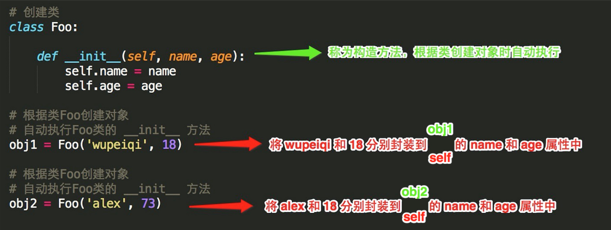
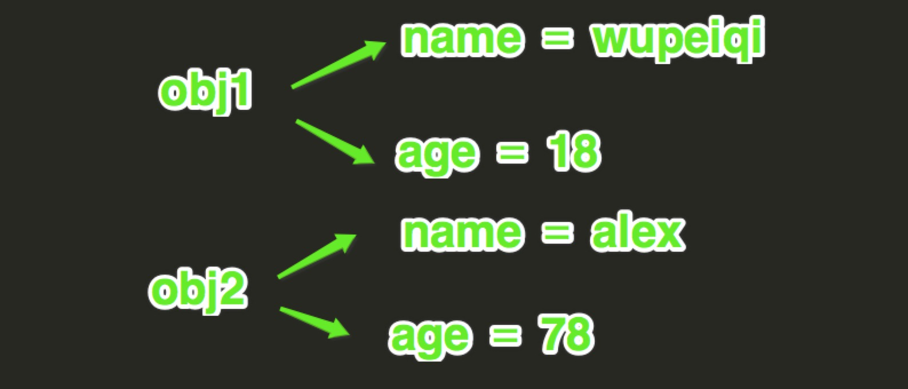

## 封装

封装，顾名思义就是将内容封装到某个地方，以后再去调用被封装在某处的内容。

所以，在使用面向对象的封装特性时，需要：

- 将内容封装到某处
- 从某处调用被封装的内容

**第一步：将内容封装到某处**



self 是一个形式参数，当执行 obj1 = Foo('wupeiqi', 18 ) 时，self 等于 obj1

​               当执行 obj2 = Foo('alex', 78 ) 时，self 等于 obj2

所以，内容其实被封装到了对象 obj1 和 obj2 中，每个对象中都有 name 和 age 属性，在内存里类似于下图来保存。



**第二步：从某处调用被封装的内容**

调用被封装的内容时，有两种情况：

- 通过对象直接调用
- 通过self间接调用

1、通过对象直接调用被封装的内容

上图展示了对象 obj1 和 obj2 在内存中保存的方式，根据保存格式可以如此调用被封装的内容：对象.属性名

```python
class Foo:
 
    def __init__(self, name, age):
        self.name = name
        self.age = age
 
obj1 = Foo('wupeiqi', 18)
print obj1.name    # 直接调用obj1对象的name属性
print obj1.age     # 直接调用obj1对象的age属性
 
obj2 = Foo('alex', 73)
print obj2.name    # 直接调用obj2对象的name属性
print obj2.age     # 直接调用obj2对象的age属性
```

2、通过self间接调用被封装的内容

执行类中的方法时，需要通过self间接调用被封装的内容

```python
class Foo:
  
    def __init__(self, name, age):
        self.name = name
        self.age = age
  
    def detail(self):
        print self.name
        print self.age
  
obj1 = Foo('wupeiqi', 18)
obj1.detail()  # Python默认会将obj1传给self参数，即：obj1.detail(obj1)，所以，此时方法内部的 self ＝ obj1，即：self.name 是 wupeiqi ；self.age 是 18
  
obj2 = Foo('alex', 73)
obj2.detail()  # Python默认会将obj2传给self参数，即：obj1.detail(obj2)，所以，此时方法内部的 self ＝ obj2，即：self.name 是 alex ； self.age 是 78
```

**综上所述，对于面向对象的封装来说，其实就是使用构造方法将内容封装到 对象 中，然后通过对象直接或者self间接获取被封装的内容。**


