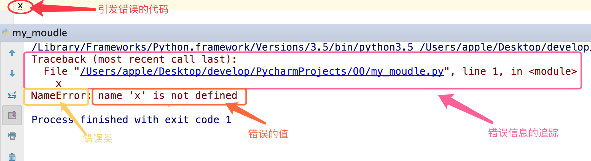

## 错误

### 错误分类

#### 语法错误

这种错误，根本过不了python解释器的语法检测，必须在程序执行前就改正

```python
#语法错误示范一
if

#语法错误示范二
def test:
    pass

#语法错误示范三
print(haha
```

#### 逻辑错误

```python
#用户输入不完整(比如输入为空)或者输入非法(输入不是数字)
num=input(">>: ")
int(num)

#无法完成计算
res1=1/0
res2=1+'str'
```

## 异常

### 定义

异常就是程序运行时发生错误的信号，在python中,错误触发的异常如下



### 分类

在python中不同的异常可以用不同的类型（python中统一了类与类型，类型即类）去标识，不同的类对象标识不同的异常，一个异常标识一种错误

#### 错误举例

```python
# 触发IndexError
l=['egon','aa']
l[3]
# 触发KeyError
dic={'name':'egon'}
dic['age']

#触发ValueError
s='hello'
int(s)
```

#### 常用异常

1. AttributeError 试图访问一个对象没有的树形，比如foo.x，但是foo没有属性x
2. IOError 输入/输出异常；基本上是无法打开文件
3. ImportError 无法引入模块或包；基本上是路径问题或名称错误
4. IndentationError 语法错误（的子类） ；代码没有正确对齐
5. IndexError 下标索引超出序列边界，比如当x只有三个元素，却试图访问x[5]
6. KeyError 试图访问字典里不存在的键
7. KeyboardInterrupt Ctrl+C被按下
8. NameError 使用一个还未被赋予对象的变量
9. SyntaxError Python代码非法，代码不能编译(个人认为这是语法错误，写错了）
10. TypeError 传入对象类型与要求的不符合
11. UnboundLocalError 试图访问一个还未被设置的局部变量，基本上是由于另有一个同名的全局变量，
12. 导致你以为正在访问它
13. ValueError 传入一个调用者不期望的值，即使值的类型是正确的

#### 更多异常

1. ArithmeticError
2. AssertionError
3. AttributeError
4. BaseException
5. BufferError
6. BytesWarning
7. DeprecationWarning
8. EnvironmentError
9. EOFError
10. Exception
11. FloatingPointError
12. FutureWarning
13. GeneratorExit
14. ImportError
15. ImportWarning
16. IndentationError
17. IndexError
18. IOError
19. KeyboardInterrupt
20. KeyError
21. LookupError
22. MemoryError
23. NameError
24. NotImplementedError
25. OSError
26. OverflowError
27. PendingDeprecationWarning
28. ReferenceError
29. RuntimeError
30. RuntimeWarning
31. StandardError
32. StopIteration
33. SyntaxError
34. SyntaxWarning
35. SystemError
36. SystemExit
37. TabError
38. TypeError
39. UnboundLocalError
40. UnicodeDecodeError
41. UnicodeEncodeError
42. UnicodeError
43. UnicodeTranslateError
44. UnicodeWarning
45. UserWarning
46. ValueError
47. Warning
48. ZeroDivisionError

## 异常处理

### 异常定义

异常发生之后，异常之后的代码就不执行了

### 异常处理定义

python解释器检测到错误，触发异常（也允许程序员自己触发异常）

程序员编写特定的代码，专门用来捕捉这个异常（这段代码与程序逻辑无关，与异常处理有关）

如果捕捉成功则进入另外一个处理分支，执行你为其定制的逻辑，使程序不会崩溃，这就是异常处理

### 为什么要异常处理

python解析器去执行程序，检测到了一个错误时，触发异常，异常触发后且没被处理的情况下，程序就在当前异常处终止，后面的代码不会运行，谁会去用一个运行着突然就崩溃的软件。

所以你必须提供一种异常处理机制来增强你程序的健壮性与容错性 

### 如何进行异常处理

**首先须知，异常是由程序的错误引起的，语法上的错误跟异常处理无关，必须在程序运行前就修正**

#### 使用if判断式

1. 正常代码

   ```python
   num1=input('>>: ') #输入一个字符串试试
   int(num1)
   ```

2. 使用if判断进行异常处理

   ```python
   num1=input('>>: ') #输入一个字符串试试
   if num1.isdigit():
       int(num1) #我们的正统程序放到了这里,其余的都属于异常处理范畴
   elif num1.isspace():
       print('输入的是空格,就执行我这里的逻辑')
   elif len(num1) == 0:
       print('输入的是空,就执行我这里的逻辑')
   else:
       print('其他情情况,执行我这里的逻辑')
   
   '''
   问题一：
   使用if的方式我们只为第一段代码加上了异常处理，但这些if，跟你的代码逻辑并无关系，这样你的代码会因为可读性差而不容易被看懂
   
   问题二：
   这只是我们代码中的一个小逻辑，如果类似的逻辑多，那么每一次都需要判断这些内容，就会倒置我们的代码特别冗长。
   '''
   ```

3. 总结

   1. if判断式的异常处理只能针对某一段代码，对于不同的代码段的相同类型的错误你需要写重复的if来进行处理。
   2. 在你的程序中频繁的写与程序本身无关，与异常处理有关的if，会使得你的代码可读性极其的差
   3. if是可以解决异常的，只是存在1,2的问题，所以，千万不要妄下定论if不能用来异常处理。

## 异常处理的定制

**python：为每一种异常定制了一个类型，然后提供了一种特定的语法结构用来进行异常处理**

### 基本语法

1. 基本语法

   ```python
   try:
        被检测的代码块
   except 异常类型：
        try中一旦检测到异常，就执行这个位置的逻辑
   ```

2. 读文件例1

   ```python
   f = open('a.txt')
   
   g = (line.strip() for line in f)
   for line in g:
       print(line)
   else:
       f.close()
   
   ```

3. 读文件例2

   ```python
   try:
       f = open('a.txt')
       g = (line.strip() for line in f)
       print(next(g))
       print(next(g))
       print(next(g))
       print(next(g))
       print(next(g))
   except StopIteration:
       f.close()
   
   '''
   next(g)会触发迭代f，依次next(g)就可以读取文件的一行行内容，无论文件a.txt有多大，同一时刻内存中只有一行内容。
   提示：g是基于文件句柄f而存在的，因而只能在next(g)抛出异常StopIteration后才可以执行f.close()
   '''
   ```

### 异常类只能用来处理指定的异常情况

```python
# 未捕获到异常，程序直接报错
 
s1 = 'hello'
try:
    int(s1)
except IndexError as e:
    print e
```

### 多分支

```python
s1 = 'hello'
try:
    int(s1)
except IndexError as e:
    print(e)
except KeyError as e:
    print(e)
except ValueError as e:
    print(e)
```

### 万能异常:Exception

#### 捕获任意异常

```python
s1 = 'hello'
try:
    int(s1)
except Exception as e:
    print(e)
```

你可能会说既然有万能异常，那么我直接用上面的这种形式就好了，其他异常可以忽略

你说的没错，但是应该分两种情况去看

1. 如果你想要的效果是，无论出现什么异常，我们统一丢弃，或者使用同一段代码逻辑去处理他们，那么骚年，大胆的去做吧，只有一个Exception就足够了。

   ```python
   s1 = 'hello'
   try:
       int(s1)
   except Exception,e:
       '丢弃或者执行其他逻辑'
       print(e)
   
   #如果你统一用Exception，没错，是可以捕捉所有异常，但意味着你在处理所有异常时都使用同一个逻辑去处理（这里说的逻辑即当前expect下面跟的代码块）
   ```

2. 如果你想要的效果是，对于不同的异常我们需要定制不同的处理逻辑，那就需要用到多分支了。

   1. 多分支

      ```python
      s1 = 'hello'
      try:
          int(s1)
      except IndexError as e:
          print(e)
      except KeyError as e:
          print(e)
      except ValueError as e:
          print(e)
      ```

   2. 多分支+ Exception

      ```python
      s1 = 'hello'
      try:
          int(s1)
      except IndexError as e:
          print(e)
      except KeyError as e:
          print(e)
      except ValueError as e:
          print(e)
      except Exception as e:
          print(e)
      
      ```

### 异常的其他机构

```python
s1 = 'hello'
try:
    int(s1)
except IndexError as e:
    print(e)
except KeyError as e:
    print(e)
except ValueError as e:
    print(e)
#except Exception as e:
#    print(e)
else:
    print('try内代码块没有异常则执行我')
finally:
    print('无论异常与否,都会执行该模块,通常是进行清理工作')
```

### 主动触发异常

```python
try:
    raise TypeError('类型错误')
except Exception as e:
    print(e)
```

### 自定义异常

```python
class EvaException(BaseException):
    def __init__(self,msg):
        self.msg=msg
    def __str__(self):
        return self.msg

try:
    raise EvaException('类型错误')
except EvaException as e:
    print(e)
```

### 断言

```python
# assert 条件
 
assert 1 == 1
 
assert 1 == 2
```

### **try..except的方式比较if的方式的好处**

try..except这种异常处理机制就是取代if那种方式，让你的程序在不牺牲可读性的前提下增强健壮性和容错性

异常处理中为每一个异常定制了异常类型（python中统一了类与类型，类型即类），对于同一种异常，一个except就可以捕捉到，可以同时处理多段代码的异常（无需‘写多个if判断式’）减少了代码，增强了可读性 

使用try..except的方式

1：把错误处理和真正的工作分开来
2：代码更易组织，更清晰，复杂的工作任务更容易实现；
3：毫无疑问，更安全了，不至于由于一些小的疏忽而使程序意外崩溃了；

## 什么时候用异常处理

有的同学会这么想，学完了异常处理后，好强大，我要为我的每一段程序都加上try...except，干毛线去思考它会不会有逻辑错误啊，这样就很好啊，多省脑细胞===》2B青年欢乐多

try...except应该尽量少用，因为它本身就是你附加给你的程序的一种异常处理的逻辑，与你的主要的工作是没有关系的
这种东西加的多了，会导致你的代码可读性变差，只有在有些异常无法预知的情况下，才应该加上try...except，其他的逻辑错误应该尽量修正


