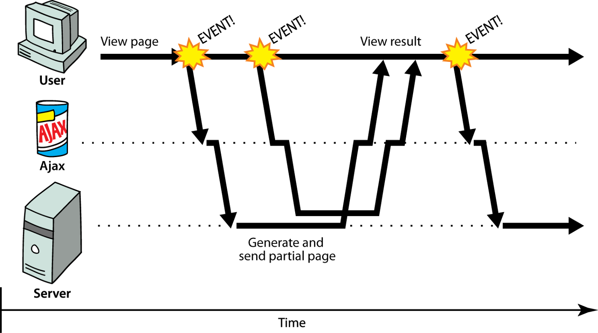

## 静态资源和Ajax请求

### 加载静态资源

如果要在Django项目中使用静态资源，可以先创建一个用于保存静态资源的目录。在`vote`项目中，我们将静态资源置于名为`static`的文件夹中，在该文件夹包含了三个子文件夹：css、js和images，分别用来保存外部CSS文件、外部JavaScript文件和图片资源，如下图所示。


为了能够找到保存静态资源的文件夹，我们还需要修改Django项目的配置文件`settings.py`，如下所示：

```Python
STATICFILES_DIRS = [os.path.join(BASE_DIR, 'static'), ]
STATIC_URL = '/static/'
```

配置好静态资源之后，大家可以运行项目，然后看看之前我们写的页面上的图片是否能够正常加载出来。需要说明的是，在项目正式部署到线上环境后，我们通常会把静态资源交给专门的静态资源服务器（如Nginx、Apache）来处理，而不是有运行Python代码的服务器来管理静态资源，所以上面的配置并不适用于生产环境，仅供项目开发阶段测试使用。使用静态资源的正确姿势我们会在后续的章节为大家讲解。

### Ajax概述

接下来就可以实现“好评”和“差评”的功能了，很明显如果能够在不刷新页面的情况下实现这两个功能会带来更好的用户体验，因此我们考虑使用[Ajax](https://zh.wikipedia.org/wiki/AJAX)技术来实现“好评”和“差评”。Ajax是Asynchronous Javascript And XML的缩写 , 简单的说，使用Ajax技术可以在不重新加载整个页面的情况下对页面进行局部刷新。

对于传统的Web应用，每次页面上需要加载新的内容都需要重新请求服务器并刷新整个页面，如果服务器短时间内无法给予响应或者网络状况并不理想，那么可能会造成浏览器长时间的空白并使得用户处于等待状态，在这个期间用户什么都做不了，如下图所示。很显然，这样的Web应用并不能带来很好的用户体验。


对于使用Ajax技术的Web应用，浏览器可以向服务器发起异步请求来获取数据。异步请求不会中断用户体验，当服务器返回了新的数据，我们可以通过JavaScript代码进行DOM操作来实现对页面的局部刷新，这样就相当于在不刷新整个页面的情况下更新了页面的内容，如下图所示。



在使用Ajax技术时，浏览器跟服务器通常会交换XML或JSON格式的数据，XML是以前使用得非常多的一种数据格式，近年来几乎已经完全被JSON取代，下面是两种数据格式的对比。

XML格式：

```XML
<?xml version="1.0" encoding="utf-8"?>
<message>
	<from>Alice</from>
    <to>Bob</to>
    <content>Dinner is on me!</content>
</message>
```

JSON格式：

```JSON
{
    "from": "Alice",
    "to": "Bob",
    "content": "Dinner is on me!"
}
```

通过上面的对比，明显JSON格式的数据要紧凑得多，所以传输效率更高，而且JSON本身也是JavaScript中的一种对象表达式语法，在JavaScript代码中处理JSON格式的数据更加方便。

### 用Ajax实现投票功能

下面，我们使用Ajax技术来实现投票的功能，首先修改项目的`urls.py`文件，为“好评”和“差评”功能映射对应的URL。

```Python
from django.contrib import admin
from django.urls import path

from vote import views

urlpatterns = [
    path('', views.show_subjects),
    path('teachers/', views.show_teachers),
    path('praise/', views.praise_or_criticize),
    path('criticize/', views.praise_or_criticize),
    path('admin/', admin.site.urls),
]
```

设计视图函数`praise_or_criticize`来支持“好评”和“差评”功能，该视图函数通过Django封装的JsonResponse类将字典序列化成JSON字符串作为返回给浏览器的响应内容。

```Python
def praise_or_criticize(request):
    """好评"""
    try:
        tno = int(request.GET.get('tno'))
        teacher = Teacher.objects.get(no=tno)
        if request.path.startswith('/praise'):
            teacher.good_count += 1
            count = teacher.good_count
        else:
            teacher.bad_count += 1
            count = teacher.bad_count
        teacher.save()
        data = {'code': 20000, 'mesg': '操作成功', 'count': count}
    except (ValueError, Teacher.DoseNotExist):
        data = {'code': 20001, 'mesg': '操作失败'}
    return JsonResponse(data)
```

修改显示老师信息的模板页，引入jQuery库来实现事件处理、Ajax请求和DOM操作。

```HTML
<!DOCTYPE html>
<html lang="en">
<head>
    <meta charset="UTF-8">
    <title>老师信息</title>
    <style>
        #container {
            width: 80%;
            margin: 10px auto;
        }
        .teacher {
            width: 100%;
            margin: 0 auto;
            padding: 10px 0;
            border-bottom: 1px dashed gray;
            overflow: auto;
        }
        .teacher>div {
            float: left;
        }
        .photo {
            height: 140px;
            border-radius: 75px;
            overflow: hidden;
            margin-left: 20px;
        }
        .info {
            width: 75%;
            margin-left: 30px;
        }
        .info div {
            clear: both;
            margin: 5px 10px;
        }
        .info span {
            margin-right: 25px;
        }
        .info a {
            text-decoration: none;
            color: darkcyan;
        }
    </style>
</head>
<body>
    <div id="container">
        <h1>{{ subject.name }}学科的老师信息</h1>
        <hr>
        
            <h2>暂无该学科老师信息</h2>
        
        
        <div class="teacher">
            <div class="photo">
                
            </div>
            <div class="info">
                <div>
                    <span><strong>姓名：{{ teacher.name }}</strong></span>
                    <span>性别：{{ teacher.sex | yesno:'男,女' }}</span>
                    <span>出生日期：{{ teacher.birth }}</span>
                </div>
                <div class="intro">{{ teacher.intro }}</div>
                <div class="comment">
                    <a href="/praise/?tno={{ teacher.no }}">好评</a>&nbsp;&nbsp;
                    (<strong>{{ teacher.good_count }}</strong>)
                    &nbsp;&nbsp;&nbsp;&nbsp;
                    <a href="/criticize/?tno={{ teacher.no }}">差评</a>&nbsp;&nbsp;
                    (<strong>{{ teacher.bad_count }}</strong>)
                </div>
            </div>
        </div>
        
        <a href="/">返回首页</a>
    </div>
    <script src="https://cdn.bootcss.com/jquery/3.4.1/jquery.min.js"></script>
    <script>
        $(() => {
            $('.comment>a').on('click', (evt) => {
                evt.preventDefault()
                let url = $(evt.target).attr('href')
                $.getJSON(url, (json) => {
                    if (json.code == 20000) {
                        $(evt.target).next().text(json.count)
                    } else {
                        alert(json.mesg)
                    }
                })
            })
        })
    </script>
</body>
</html>
```

上面的前端代码中，使用了jQuery库封装的`getJSON`方法向服务器发送异步请求，如果不熟悉前端的jQuery库，可以参考[《jQuery API手册》](https://www.runoob.com/manual/jquery/)。

### 小结

到此为止，这个投票项目的核心功能已然完成，在下面的章节中我们会要求用户必须登录才能投票，没有账号的用户可以通过注册功能注册一个账号。