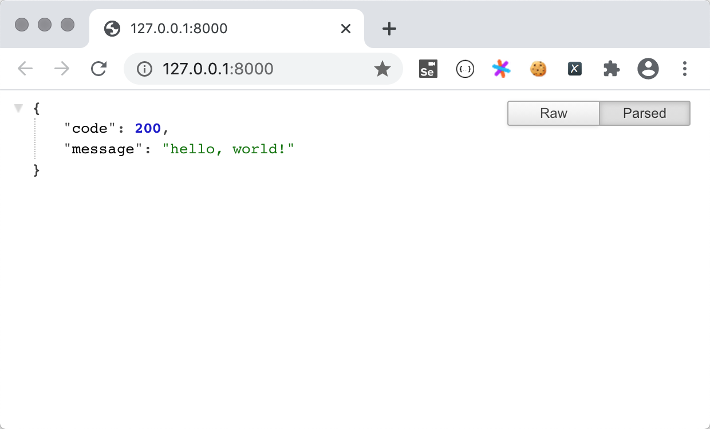

## 用FastAPI开发网络数据接口

FastAPI 是一个用于构建API（网络数据接口）的现代、高性能的Web框架，基于Python 3.6+，使用了Python中的类型提示进行类型检查，非常符合工程化开发的需求，在业界有非常好的口碑。下面，我们先用代码告诉大家FastAPI到底能做什么，然后再来讲解它的方方面面。

### FastAPI五分钟上手

1. 安装依赖库和ASGI服务器（支持异步I/O的Python服务器）。

    ```Bash
    pip install fastapi
    pip install uvicorn
    ```

2. 编写代码`main.py`。

    ```Python
    from fastapi import FastAPI
    
    app = FastAPI()
    
    
    @app.get('/')
    def say_hello():
        return {'code': 200, 'message': 'hello, world!'}
    ```

3. 运行服务。

    ```Bash
    uvicorn main:app --reload
    ```

    > **说明**：上面运行uvicorn时使用的`--reload`参数会在代码发生变更时自动重新加载新的内容，这个参数在开发阶段非常的有用。

4. 访问服务。

  

5. 查看文档。

    

    > **注意**：FastAPI会基于[Swagger UI](https://swagger.io/tools/swagger-ui/)自动为数据接口生成对应的文档。

### 请求和响应


### 接入关系型数据库

我们可以使用SQLAlchemy三方库来实现对关系型数据库的接入。SQLAlchemy是一个ORM（对象关系映射）框架，ORM框架可以解决Python程序的面向对象模型和关系型数据库的关系模型并不匹配的问题，使得我们可以用面向对象的方式实现数据的CRUD操作。

### 依赖注入


### 中间件


### 异步化


### 虚拟化部署（Docker）


### 项目实战：车辆违章查询

