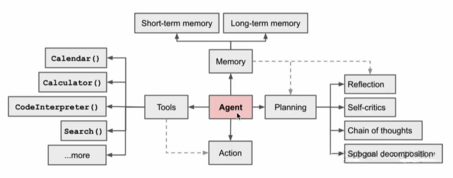
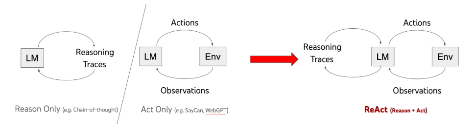

## agent的认知与原理分析

### agent基础

#### 定义

大语言模型可以接受输入，可以分析&推理、可以输出文字、代码、媒体。然而，其无法像人类一样，拥有规划思考能力、运用各种工具与物理世界互动，以及拥有人类的记忆能力。

AlAgents是基于LLM的能够自主理解、自主规划决策、执行复杂任务的智能体。

Agent的设计目的是为了处理那些简单的语言模型可能无法直接解决的问题，尤其是当这些任务涉及到多个步骤或者需要外部数据源的情况。

1. LLM:接受输入、思考、输出
2. 人类:LLM(接受输入、思考、输出)+记忆+工具+规划------>Agents

#### 流程图

1. 规划(Planning):

   智能体会把大型任务分解为子任务，并规划执行任务的流程;智能体会对任务执行的过程进行思考和反思，从而决定是继续执行任务，或判断任务究结并终止运行。

2. 记忆(Memory):

   短期记忆，是指在执行任务的过程中的上下文，会在子任务的执行过程产生和暂存，在任务完结后被清空。长期记忆是长时间保留的信息，一般是指外部知识库，通常用向量数据库来存储和检索。

3. 工具使用(Tools):

   为智能体配备工具 AP1，比如:计算器、授索工具、代码执行器、数据库查询工具等。有了这些工具AP)，智能体就可以是物理世界交互，解决实际的问、

4. 执行(Action):

   根据规划和记忆来实施具体行动，这可能会涉及到与外部世界的互动或通过工具来完成任务。

### 详细解释

#### 规划

规划，可以为理解观察和思考。如果用人类来类耻，当我们接到一个任务，我们的思维模式可能会像下面这样:

1. 首先会思考怎么完成这个任务。
2. 然后会审视手头上所拥有的工具，以及如何使用这些工具高效地达成目的。
3. 再会把任务拆分成子任务。(就像咱们做思维导图一样。)
4. 在执行任务的时候，我们会对执行过程进行反思和完善，吸取教训以完善未来的步骤。
5. 执行过程中思考任务何时可以终止。

这是人类的规划能力，我们希望智能体也拥有这样的思维横式，因此可以通过LLM 提示工程，为智能体赋予这样的思维横式。在智能体中，最重要的是让 LLM 具备这以下两个能力:

##### 子任务分解

通过LLM使得智能体可以把大型任务分解为更小的、更可控的子任务，从而能够有效完成复杂的任务。

1. 思维链(Chain of Thoughts, CoT)

   **思维链已经是一种比较标准的提示技术**，能显著提升LLM完成复杂任务的效果。当我们对LLM 这样要求「thinkstepbystep!，会发现 LLM 会把问题分解成多个步骤，一步-步思考和解决，能使得输出的结果更加准确。这是一种线性的思维方式。

2. 思维树(Tree-of-thought,ToT)

   对CoT的进一步扩展，在思维链的每一步，推理出多个分支，拓扑展开成一棵思维树。使用启发式方法评估每个推理分支对问题解决的贡献。选择授索算法，使用**广度优先搜案(BFS)或深度优先搜索(DFS)**等算法来探索思维树，并进行前和回溯

1. 第一种，直接输入输出
2. 第二种，思维链
3. 第三种，自洽型(多条思维链，取方差最小的那条)
4. 第四种，思维树

##### 反思与改进

Agent对过去的行动进行自我批评和反思，从错误中学习并改进未来的步骤，从而提高最终结果的质量在实际任务中，试错是不可避免的，而自我反思在这个过程中起着至关重要的作用。它允许 Agent 通过改进过去的行动决策和纠正以前的错误来进行选代改进,。反思是 Agent 对事情进行更高层次、更抽众思考的结果。反思是周期性生成的，当gent感知到的最新事件的重要性评分之和超过一定阔值时，就会生成反思。这可以类比为我们常用的成语“三思而后行”，做重大决策的时候，我们会反思自己先前的决策。

##### ReAct框架

《ReAct:Synergizing Reasoning and Acting in Language Models》这论文提出一种用于增强大型语言模型的方法，它通过结合推理(Reasoning)和行动(Acting)来增强推理和决策的效果。
参考:https://react-lm.github.io/

1. *标准(Standard)
   直接给出错误的答案--iPod。没有提供任何推理过程或外部交互，直接给出答案

   错误的答案:iPod

2. 仅推理(Reason only):
   尝试通过逐步推理来解决问题，但没有与外部环境交互来验证信息。错误地推断出答案是iPhone、iPad 1Pod Touch

   错误的答案:Phone、iPad、iPod、Touch

3. 仅行动(Actonly):

   通过与外部环境(如维基百科)的一系列交互来获取信息，尝试多次援索(搜索“Apple Remole”，“fron Row"等)，但缺乏推理支持，未能综合这些观察结果后得出正确答案,认 为需要结束搜索。

   错误的决策:结束搜索

4. ReAct:

   组合推理和行动。首先通过推理确定搜索 Apple Remote(苹果通控器)，并从外部环境中观察结果。随着推理的深入，识别出需要搜索 Front Row(软件)。在几轮交互后，通过进一步推理，准确得出答案”键盘功能键”

   正确的答案:键盘功能键

##### 为什么结合推理和行动，就会有效增强 LLM 完成任务的能力?

1. 仅推理(Reasoning Ony):

   LLM仅仅基于已有的知识进行推理，生成答案回答这个问题。很显然，如果LLM本身不具备这些知识，可能会出现幻觉，胡乱回答一通。

2. 仅行动(ActingOnly):

   大模型不加以推理，仅使用工具(比如援索引擎)搜索这个问题，得出来的将会是海量的资料，不能直接回到这个问题。

3. 推理+行动(Reasoning and Acting):

   LLM 首先会基于已有的知识，并审视拥有的工具。当发现已有的知识不足以回答这个问题，则会调用工具，比如:搜索工具、生成报告等，然后得到新的信息，基于新的信息重复进行推理和行动，直到完成这个任务。

### agent决策

#### 决策流程图

#### 应用场景举例

**场景**:假设我们有一个智能家居系统,它的任务是根据家庭成员的需求调节室内环境，比如温度和灯光。

1. **感知(Perception)**:

   1. 家庭成员通过语音助手说:“我感觉有点冷，能不能把温度调高一些?”
   2. 智能家居系统通过语音识别和情感分析技术“感知"到用户觉得房间温度太低，需要提高温度

2. **规划(Planning)**:

   系统根据用户的需求，规划出下一步的行动，决定如何调节房间温度系统

   可能会制定以下计划:

   1. 检查当前的室内温度。
   2. 根据用户的偏好和当前温度决定升高几度合适。
   3. 调整温度设置，并告知用户。

3. **行动(Action)**:

   系统执行计划的行动，首先检查当前温度，例如发现室温是20°C

   根据用户的偏好，将温度调高到23°C，并通过语音助手反馈给用户:“我已经将温度调高到23°C，请您稍等，温度将逐渐上升。”

4. **观察(bservation)**:

   系统观察房间温度的变化，以及用户的反馈。如果用户在几分钟后再次说“现在温度刚刚好，系统会感知到环境调节成功

   如果用户还觉得冷，系统可能会调整计划，进一步调高温度

5. **循环:**

   在每个阶段，智能家居系统都可能根据环境变化和用户反馈调整操作。例如，如果调高温度后用户依然觉得冷，系统会重新规划，进一步调整温度设置。

   通过这一系列的感知、规划、行动和观察，智能家居系统能够动态响应家庭成员的需求，不断调整室内环境，直到用户感觉舒适为止。

### 记忆

#### 生活中的记忆机制

1. 感觉记忆(SensoryMemory):这是记忆的最早阶段，提供在原始刺激结束后保留感官信息(视觉、听觉等)的印象的能力。感觉记忆通常只持续几秒钟。
2. 短期记忆(或工作记忆):这是一种持续时间较短的记忆，能够暂时存储和处理有限数量的信息。例如，记住一个电话号码直到拨打完毕。
3. 长期记忆:这是一种持续村间较长的记忆，可以存储大量信息，从几分钟到一生。长期记忆可以进一步分为显性记忆和隐性记忆。显性记忆，可以有意识地回忆和表达的信息，显性记忆又可以分为情景记忆(个人经历的具体事件)和语义记忆(一般知识和概念)。隐性记忆，这种记忆通常是无意识的，涉及技能和习惯，如骑自行车或打字。

#### 智能体中的记忆机制

1. 形成记忆:大模型在大量包含世界知识的数据集上进行预训练。在预训练中，大模型通过调整神经元的权重来学习理解和生成人类语言，这可以被视为“记忆"的形成过程。通过使用深度学习和梯度下降等技术，大模可以不断提高基于预测或生产文本的能力，进而形成世界记忆或长期记忆
2. 短期记忆:在当前任务执行过程中所产生的信息，比如某个工具或某个子任务执行的结果，会写入短期记忆中。记忆在当前任务过程中产生和暂存，在任务完结后被清空
3. 长期记忆:长期记忆是长时间保留的信息。一般是指外部知识库，通常用向量数据库来存储和检索。

### 工具的使用

1. Agent可以通过学习调用外部AP1来获取模型权重中所缺少的额外信息，这些信息包括当前信息、代码执行能力和访问专有信息源等。这对于预训练后难以修改的模型权重来说是非常重要的。
2. 掌握使用工具是人类最独特和重要的特质之一。我们通过创造、修改和利用外部工具来突破我们身体和认知的限制。同样地，我们也可以为语言模型(LLM)提供外部工具来显著提升其能力。

## agent认知框架

### Plan-and-Execute

1. 计划与执行(Plan-and-Epcute)框架侧重于先规划一系列的行动，然后执行。这个框架可以使大模型能够先综合考虑任务的多个方面，然后按照计划进行行动。应用在比较复杂的项目管理中或者需要多步决策的场景下会比较合适。

   

### Self-Ask

自问自答(Se-Ask)框架这个允许大横型对自己提出问题并回答，来增强对问题的理解以提高回答质量，这个框架在需要深入分析或者提供创造性解决方案下可以比较适合，例如创意写作。

### Thinking and Self-Refection

思考并自我反思(Thinking and Self-Refection)框架主要用于横拟和实现复杂决策过程，通过不断自我评估和调整，使系统能够学习并改进决策过程，从而在面对复杂问题是作出更加有效的决策。

### AgentExecutor运行机制

## agent技术框架

## agent策略分析与parer解读

## 单个agent系统与多个agent系统

## 个性化agent应用定制全流程

## agent的理论与策略分析

## 个性化定制agent