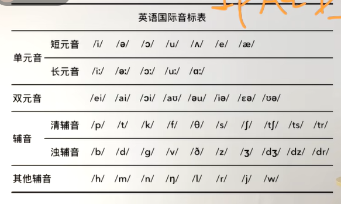

## 英语音标

### 单元音

#### 短元音

|      |      |      |      |      |      |      |
| ---- | ---- | ---- | ---- | ---- | ---- | ---- |
| /ɪ/  | /ə/  | /ɒ/  | /ʊ/  | /ʌ/  | /e/  | /æ/  |

#### 长元音

|      |      |      |      |      |
| ---- | ---- | ---- | ---- | ---- |
| [i:] | [ə:] | [ɔ:] | [u:] | [a:] |

### 双元音

|      |      |      |      |      |      |      |      |
| ---- | ---- | ---- | ---- | ---- | ---- | ---- | ---- |
| ‌[ei]‌ | ‌[ai]‌ | ‌[ɔi]‌ | ‌[au] | [əu]‌ | [iə]‌ | ‌[ɛə] | [uə] |

### 辅音

#### 清辅音

|      |      |      |      |      |      |      |      |      |      |
| ---- | ---- | ---- | ---- | ---- | ---- | ---- | ---- | ---- | ---- |
| [p]  | [t]  | [k]  | [f]  | [θ]  | [s]  | [ʃ]  | [tʃ] | [ts] | [tr] |

#### 浊辅音

|      |      |      |      |      |      |      |      |      |      |
| ---- | ---- | ---- | ---- | ---- | ---- | ---- | ---- | ---- | ---- |
| [b]  | [d]  | [g]  | [v]  | [ð]  | [z]  | [ʒ]  | [dʒ] | [dz] | [dr] |

### 其他辅音

|      |      |      |      |      |      |      |      |
| ---- | ---- | ---- | ---- | ---- | ---- | ---- | ---- |
| [h]  | [m]  | [n]  | [ŋ]  | [I]  | [r]  | [j]  | [w]  |

## 发音浊化

1. **在“s”后面的清辅音浊化**‌：当清辅音“p”、“t”、“k”出现在“s”之后，并且后面紧跟一个元音时，这些清辅音会浊化成对应的浊辅音“b”、“d”、“g”。例如，“spy”浊化成“sbiy”，“stop”浊化成“sdop”。
2. ‌**美式英语中的“t”浊化**‌：在美式英语中，“t”在单词中间时，尤其是在元音之后，经常浊化成“d”。例如，“writer”和“rider”的发音几乎相同，都是[ˈraɪdər]。
3. ‌**单词结尾的“t”浊化**‌：在某些情况下，单词结尾的“t”在元音之前也会浊化成“d”，尤其是在快速连读时。例如，“paint it”可能会被省略成“painit”。
4. ‌**同类爆破音的省略**‌：当两个相同的爆破音（如“t”和“d”）相邻时，第一个音可能会被省略，只发出后面的音。例如，“What do you think?”中的“t”在“do”前会被省略。
5. ‌**异类爆破音的省略**‌：当不同的爆破音（如“t”和“d”）相邻时，通常只发出后面的音。例如，“What would you like?”中的“t”在“would”前会被省略。