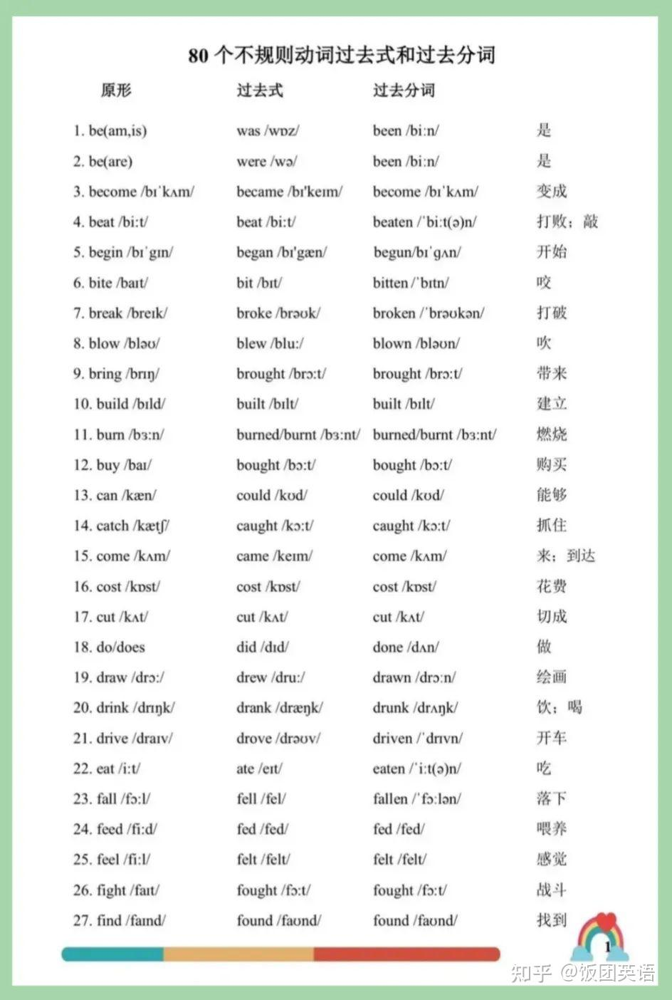
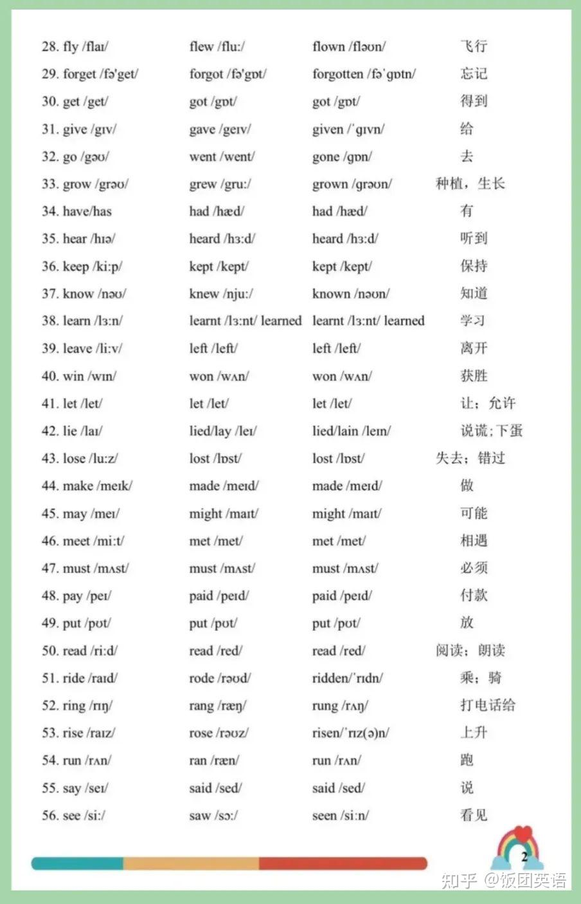
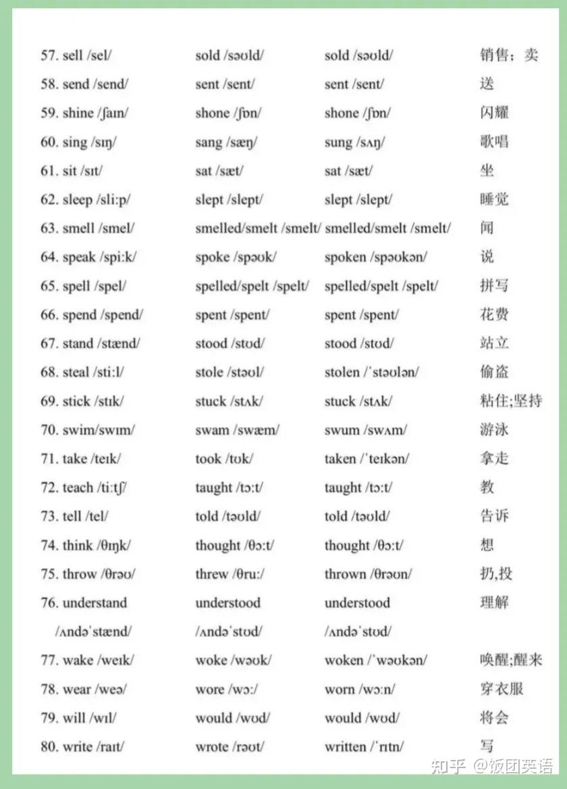

过去式&过去分词列表

## 名词变复数

### 变复数规则

英文中名词分可数名词和不可数名词。可数名词有单数和复数两种形式，指一个以上事物时用复数。
名词变复数规则：

1. 一般名词词尾加-s构成复数

   ```
   friend -> friends
   case -> cases
   ```

2. 以-s, -x, -ch, -sh和部分o结尾的词词尾加-es

   ```
   dress -> dresses
   box -> boxes
   ```

3. 以辅音字母+y结尾的单词，把y变i为再加-es

   ```
   baby -> babies
   city -> cities
   ```

   **注意：以元音字母+y结尾的单词复数加-s。**

   ```
   boy -> boys
   key -> keys
   ```

4. 以-f, -fe结尾的名词把-f, -fe变为v再加-es

   ```
   wife -> wives
   wolf -> wolves
   ```

5. man, woman及以其结尾的名词把man变为men, woman变为women

   ```
   policeman -> policemen
   policewoman -> policewomen
   ```

6. 不规则名词复数需单独记忆

   ```
   tooth -> teeth
   child -> children
   ```

### ==名词变复数发音==

1. 清辅音后发[s]

2. 元音

   1. 单元音

      [i:]  [i]  []

   2. 双元音

3. 辅音

4. 其他辅音

::: tip 简单记忆

清清， 浊浊， 元浊

:::

## 过去式和过去分词变化

### 规则动词变化

1. 一般情况下，动词词尾加 -ed ，如： play--played work --worked wanted--wanted
2. 以不发音的 -e 结尾动词，动词词尾加 -d，如：live--lived move--moved taste--tasted
3. 以辅音字母 + y结尾的动词，把-y变为-i 再加-ed，如：study--studied copy--copied cry--cried
4. 以一个辅音字母结尾的重读闭音节动词，双写词尾辅音字母，再加 -ed，如： stop --stopped admit--admitted prefer--preferred control--controlled

### 不规则动词变化







## 动名词

### 构成

1. 动词原形 + ing（具有动词特征的名词）

### 特点

1. 名词特征: 在句中可以充当主语, 宾语, 表语

   `Fishing` is my favorite sport. 主

   I like `fishing`. 动宾

   I am fond of ``fishing`. 介宾

   My favorite sport is `fishing`. 表

2. 动词特征: 可以跟宾语, 甚至可以用副词修饰

   I like `surfing` the Internet.

   `Driving` fast is very dangerous

   I often fish for hours.
   I don’t catch anything.
   ->  I often fish for hours `without catching anything`

   **一般来说, 动名词的逻辑主语应与主句主语统一。**

3. 若强调动名词的动作先发生, `则将 doing变为having done`

   He entered the room.
   He told me the news.
   -> `After entering the room`, he told me the news

   `After having entered the room`, he told me the news

   He apologized to me.
   He broke my favorite vase.
   ->  He apologized to me `for breaking my favorite vase`.

   ->  He apologized to me `for having broken my favorite vase`

4. `若动名词逻辑主语与主句主语不一致, 则必须保证没有任何歧义`

   He thanked me.
   I helped him.

   ->He thanked me `for helping him.`

### 常用搭配

1. avoid doing 避免做某事

   I crossed the street to avoid meeting him.

2. enjoy doing 喜欢做某事

   I enjoy studying English.

3. deny doing 否认做某事

   You can’t deny taking it.

4. fancy doing 真没想到会 …

   Fancy meeting you here.

5. It’s no use doing 做某事没用

   It’s no use arguing with him.

6. It’s not worth doing 做某事不值得

   It’s not worth arguing with him.

7. can’t stand (sb.) doing 不能忍受(某人)做某事

   He can’t stand working for this company.

   I can’t stand them interrupting me all the time

8. be busy doing 忙于做某事

   Jack is busy answering the phone.

9. mind doing 介意做某事

   Would you mind closing the door?

10. risk doing 冒险做某事

    I can’t risk losing my job.

11. escape doing 逃避做某事

    You can’t escape being punished.

12. finish doing 完成某事

    I haven’t finished reading the book yet

### 加逻辑主语

**动名词前可加形容词性物主代词指明逻辑主语。**

He insisted on `writing` the letter.

He insisted on `my writing` the letter.


`see / watch / hear / notice / feel / smell ... doing`


I `noticed` him `leaving` the house.

The girl `was heard singing` in the bathroom


1. `see / watch / hear / notice / feel / smell ... do`
2. `be seen / watched / heard / noticed / felt / smelt ... to do`
3. go doing 去做某事
4. come doing 来做某事
5. It is no use / no good doing 做某事没用
6. It is not worth doing做某事不值得
7. It is a waste of time doing做某事是浪费时间

`It is no use / no good / not worth / a waste of time` arguing with him.

There is no use / no point / no sense in doing 做某事没有用 / 没有意义 / 没有道理

There is no use / no point / no sense in arguing with him.

